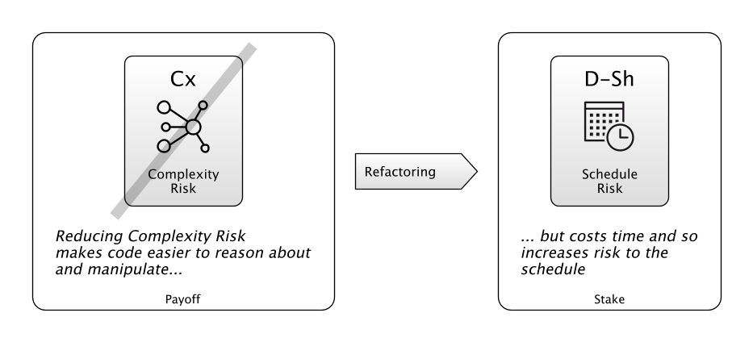
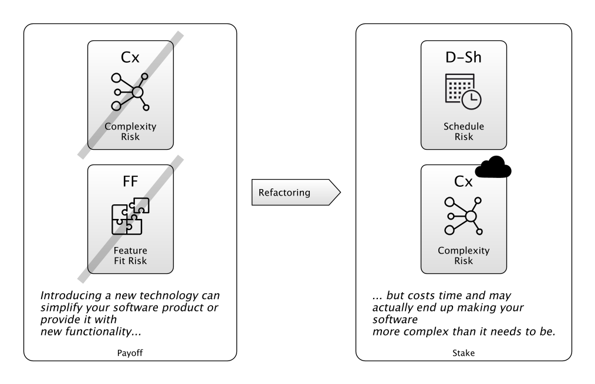
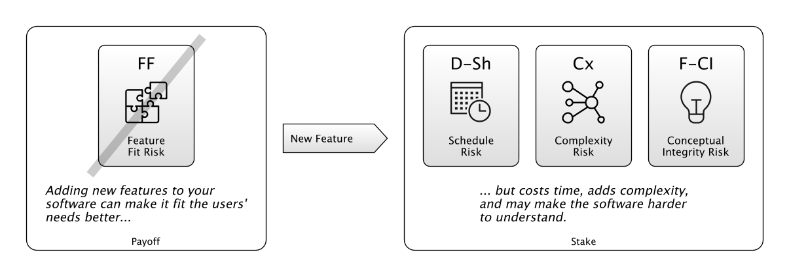
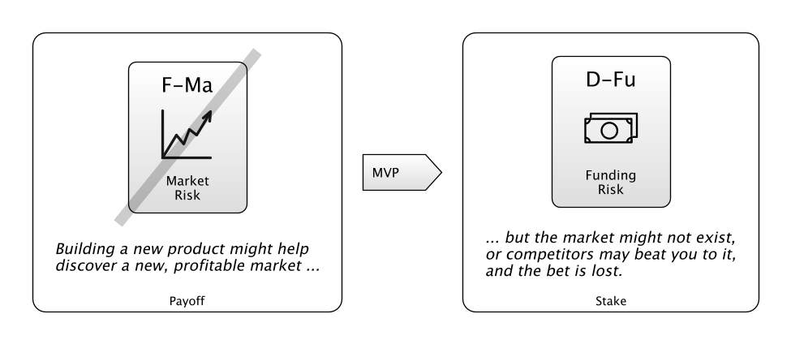

# Coding Bets

The argument here is:  Any time you start coding a new feature, accept a new task, or go hunting for a bug on a software project, you're actually making a bet.  

Let's look at some examples...

## Refactoring: The Technical Debt Bet

##### "Making our codebase easier to reason about is worth the outlay of time."

Technical Debt is excess complexity in your code.  It is a source of unnecessary [Complexity Risk](Complexity-Risk.md) (the weight of complexity in the codebase, and its resistance to change and comprehension).

Because _project agility_ is some function of [Complexity Risk](Complexity-Risk.md) and your team's talent,   
the bet here is that you can trade some time on the schedule to move to a place of lower [Complexity Risk](Complexity-Risk.md), making it easier for the developers to _get stuff done_ in the future.

To reduce technical debt there usually has to be some _simplifying realisation_:

> "We don't need this extra parameter to this function"

> "Class A and Class B are actually different implementations of the same functionality"

> "We can encapsulate more behaviour by introducing the command pattern".

It looks like this:

**When you win:**
 - The codebase is easier to think about.  
 
**When you lose:** 
- The [Complexity Risk](Complexity-Risk.md) improvement is less than you hoped,
- Or, it takes longer than expected, 
- Or the _simplifying realisation_ doesn't pan out and you've lost a week.

## Spike Solutions: The New Technology Bet

##### "This new technology is a better fit for our problem than the one we're currently using."

You might want to use a Spike Solution to swap out a badly-fitting technology for a more appropriate one.  That is, trying to solve a [Software Dependency Risk](Software-Dependency-Risk.md) issue.  For example:

> "Let's replace all this configuration with some [YAML]() files."

> "Let's use [ElasticSearch]() for searching instead of SQL Statements."

Alternatively, someone will suggest using an existing technology to eradicate lots of home-grown code.  Devoting parts of your code-base to solving problems that are already solved elsewhere is a source of [Complexity Risk](Complexity-Risk.md), because that code needs maintaining.

> "Let's throw away all these scripts and start using [Kubernetes]() to deploy our components."

> "Let's re-write these modules using [Clojure]()."

But will the new technology fit?  The answer is to try to "prove" the bet as quickly as possible using a time-boxed "Spike Solution":

**When you win:**
 - The spike solution demonstrates that the technology will fit for all of the use cases needed.
 - The spike solution demonstrates that the technology is definitely not a good fit, for clear reasons that weren't apparent before starting. 
 
**When you lose:** 
 - The developer can't get the spike solution working in the given time.  Does this prove that the technology is no good, or too complex, or that the developer needed more time, or that they're not skilled enough?
 - The developer gets the spike solution working for a specific use case, which is taken as success.  Later, though, other down-sides appear, and it's apparent that the solution is more trouble than it's worth.
 
**Reduce the stakes by:**

 - Searching the Internet for stories of teams who've made the same bet.
 - Tackling the hardest use-case first.
 - Skipping writing tests: if it doesn't work out, they're waste.

## New Feature Bets

##### "This new feature may be exactly what our users are looking for."

Often you get user-stories like these:

> "We need to provide an export-to-Excel function, as our competitors have one."

> "Users need to be able to customize the workflow, otherwise they'll go elsewhere."

> "We need a global search because people spend too much time menu-diving."

New features might help sell your software to new markets, and please existing power users.  But too many features confuse users, obscuring the essential purpose of the software.  This is [Conceptual Integrity Risk](Feature-Risk#conceptual-integrity-risk) - trying to please everyone means you please no-one.  

**When you win:**
 - Existing users welcome the change with open arms.  
 - New markets open up.
 
**When you lose:**  
 - The feature is a diversion from the main purpose of the project, and a waste of time.  
 - The feature doesn't make much impact, is used often enough to not be removed, but adds [Complexity Risk](Complexity-Risk.md) to the codebase.
 - The feature confuses the user-base, and leads to increased support costs and dissatisfaction.

**Reduce the stakes by:** 
 - Thoroughly triaging new features.
 - Building mock-ups.
 - Opening up channels of feedback.
 - Testing with trial populations.
 
## Releasing Code:  A Reliability Bet

##### "Every release carries risk.  

Even just releasing code into the wild is a risky business.

**When you win:**
 - 

**When you lose:**

**Reduce the stakes by:** 
 - Testing, testing, testing.
 - Developing feedback loops to let you know how well a release is doing.
 - Being able to back out fast.
 - Testing with trial populations.

## MVP: The New Market Bet

##### "Building a Minimum Viable Product is a bet on the market"

The idea of a [Minimum Viable Product]() (MVP) is to make a bet that a market exists for a certain product, _and that there's money to be made from it_. 

> "People will use the search engine and we can monetize it with advertising".

> "People will buy pet food online"

> "Bots are the future: let's write one for the insurance business"

**When you win:**
 - You start a new business
 
**When you lose:**  
 - Loss of credibility.
 - Funding dries up.
 

**Reduce the stakes by:** 
- Failing fast.  Implement the riskiest functionality first.
- Doing things that don't scale.  You can prove the market by doing a lot of processes manually.
- Relying on Dependencies:  for everything that isn't completely unique.

## Conclusion

We're used to the idea of entrepreneurs taking risks on new business ideas.   B

This was just a few examples, but this idea is _generally_ applicable.  Look at the next piece of code you're about to write:

 - What are the likely stakes?
 - What is the [Payoff](Glossary.md#payoff)?
 - Is the bet worth it?  Sometimes, the stakes and the payoff are _a given_, but the bet still isn't worth the time.
 
How can you maximize the stakes while minimizing pay-off?  How long will it take for the pay-off to be worthwhile?

Are you making a long bet, or lots of small short bets?  (Split work up, then do the riskiest part first)
 De-Risking

