\frontmatter

\newpage

This is part of the risk first series.


sdfds
f
sd
sd
f
sdf

\newpage
Published by.

On.

Stuff;
\newpage
Dedicated to blan
\newpage
\setcounter{tocdepth}{0}
\tableofcontents
\newpage
# Preface

Welcome to Risk-First

Scrum, Waterfall, Lean, Prince2:  what do they all have in common?  

One perspective is that they are individual [software methodologies](https://en.wikipedia.org/wiki/Software_development_process#Methodologies), offering different viewpoints on how to build software.

However, here, we are going to consider a second perspective:  that building software is all about _managing risk_, and that these methodologies are acknowledgements of this fact, and they differ because they have _different ideas_ about which are the most important _risks to manage_.

## Goal

Hopefully, after reading through some of the articles here, you'll come away with:

- An appreciation of how risk underpins everything we do as developers, whether we want it to or not.
- A framework for evaluating [software methodologies](https://en.wikipedia.org/wiki/Software_development_process#Methodologies) and choosing the right one for the task-at-hand.
- A recontextualization of the software process as being an exercise in mitigating different kinds of risk.
- The tools to help you decide when a methodology is _letting you down_, and the vocabulary to argue for when it's a good idea to deviate from it.

## What This is Not

This is not intended to be a rigorously scientific work: I don't believe it's possible to objectively analyze a field like software development in any meaningful, statistically significant way.  (For one, things just change [too fast](Silver-Bullets).) 

Neither is this site isn't going to be an exhaustive guide of every possible software development practice and methodology.  That would just be too long and tedious.  

Neither is this really a practitioner's guide to using any particular methodology:  If you've come here to learn the best way to do [Retrospectives](Review), then you're in the wrong place.  There are plenty of places you can find that information already.  Where possible, this site will link to or reference concepts on Wikipedia or the wider internet for further reading on each subject.

Lastly, although this is a [Wiki](https://en.wikipedia.org/wiki/Wiki), it's not meant to be an open-ended discussion of software techniques like [Ward's Wiki](http://wiki.c2.com).  In order to be concise and useful, discussions need to be carried out by [Opening an Issue](https://github.com/risk-first/website/issues).


\mainmatter
\part{Introduction}

\newpage
# A Simple Scenario
Hi.  

Welcome to the Risk-First Wiki.  

I've started this website because, on my career journey, I've noticed that the way I do things doesn't seem to match up with the way the books _say_ it should be done.  And, I found this odd and wanted to explore it further.   Hopefully, you, the reader, will find something of use in this.  

First up, I'm going to introduce a simple model for thinking about risk.

## A Simple Scenario

Lets for a moment forget about software completely, and think about _any endeavor at all_ in life.  It could be passing a test, mowing the lawn or going on holiday.  Choose something now.   I'll discuss from the point of view of "cooking a meal for some friends", but you can play along with your own example.  

### Goal In Mind

Now, in this endeavour, we want to be successful.  That is to say, we have a [Goal In Mind](Goal-In-Mind):  we want our friends to go home satisfied after a decent meal, and not to feel hungry.   As a bonus, we might also want to spend time talking with them before and during the meal.  So, now to achieve our [Goal In Mind](Goal-In-Mind) we *probably* have to do some tasks.  

If we do nothing, our friends will turn up and maybe there's nothing in the house for them to eat.   Or maybe, the thing that you're going to cook is going to take hours and they'll have to sit around and wait for you to cook it and they'll leave before it's ready.  Maybe you'll be some ingredients short, or maybe you're not confident of the steps to prepare the meal and you're worried about messing it all up.  

### Attendant Risk

These _nagging doubts_ that are going through your head I'll call the [Attendant Risks](Attendant-Risk):  they're the ones that will occur to you as you start to think about what will happen. 


When we go about preparing this wonderful evening, we can with these risks and try to mitigate them:  shop for the ingredients in advance, prepare parts of the meal, maybe practice the cooking in advance.  Or, we can wing it, and sometimes we'll get lucky.

How much effort we expend on mitigating [Attendant Risks](Attendant-Risk) depends on how great we think they are: for example, if you know it's a 24-hour shop, you'll probably not worry too much about getting the ingredients well in advance (although, the shop _could still be closed_).

### Hidden Risks

There are also hidden [Attendant Risks](Attendant-Risk) that you might not know about: if you're poaching eggs for dinner, you might know that fresh eggs poach best.    These are the "Unknown Unknowns" of [Rumsfeld's model](https://en.wikipedia.org/wiki/There_are_known_knowns).

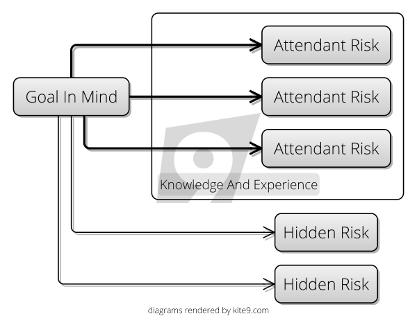

Different people will evaluate the risks differently.  (That is, worry about them more or less.)  They'll also _know_ about different risks.  They might have cooked the recipe before, or organised lots more dinner parties than you.   

How we evaluate the risks, and which ones we know about depends on our **knowledge** and **experience**, then.  And that varies from person to person (or team to team).  Lets call this our [Internal Model](Internal-Model), and it's something we build on and improve with experience (of organising dinner parties, amongst everything else).

### Model Meets Reality

As the dinner party gets closer, we make our preparations, and the inadequacies of the [Internal Model](Internal-Model) become apparent, and we learn what we didn't know.  The [Hidden Risks](Attendant-Risk) reveal themselves; things we were worried about may not materialise, things we thought would be minor risks turn out to be greater.   

Our model is forced into contact with reality, and the model changes.  

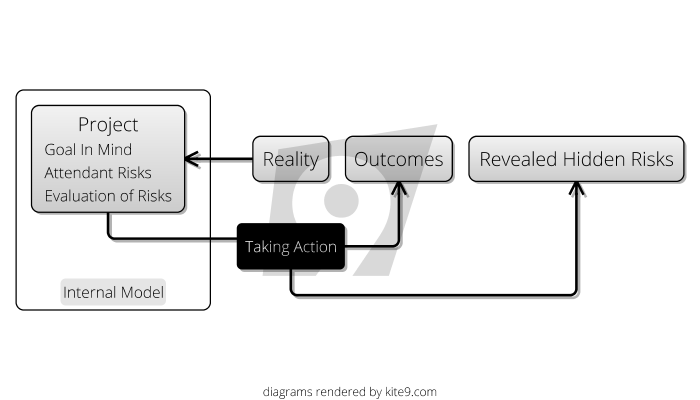

If we had a good model, and took the right actions, we should see positive outcomes.  If we failed to mitigate risks, or took inappropriate actions, we'll probably see negative outcomes.

## On To Software

In this website, we're going to look at the risks in the software process and how these are mitigated by the various methodologies you can choose from.  

Let's examine the scenario of a new software project, and expand on the simple model being outlined above:  instead of a single person, we are likely to have a team, and our model will not just exist in our heads, but in the code we write.  

On to [Development Process](Development-Process)
\newpage
# Development Process

In the [previous section](Introduction) we looked at a simple model for risks on any given activity.

Now, let's look at the everyday process of developing _a new feature_ on a software project, and see how our risk model informs it.

## An Example Process

Let's ignore for now the specifics of what methodology is being used - we'll come to that later.  Let's say your team have settled for a process something like the following:

1.  **Specification**: A new feature is requested somehow, and a business analyst works to specify it.
2.  **Code And Unit Test**: A developer writes some code, and some unit tests.
3.  **Integration**: They integrate their code into the code base.
4.  **UAT**: They put the code into a User Acceptance Test (UAT) environment, and user(s) test it.

... All being well, the code is released to production.

Now, it might be waterfall, it might be agile, we're not going to commit to specifics at this stage.  It's probably not perfect, but let's just assume that _it works for this project_ and everyone is reasonably happy with it.  

I'm not saying this is the _right_ process, or even a _good_ process: you could add code review, a pilot, integration testing, whatever.  We're just doing some analysis of _what process gives us_.  

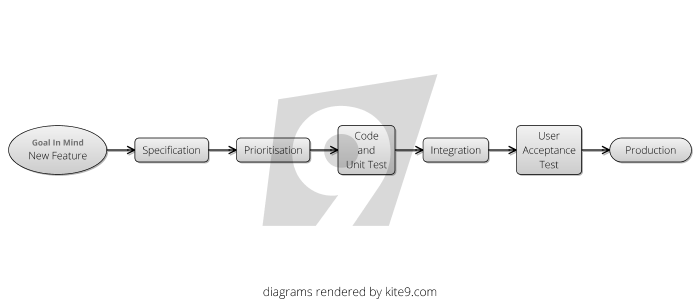

What's happening here?  Why these steps?  

## Minimizing Risks - Overview

I am going to argue that this entire process is _informed by software risk_:

1.  We have _a business analyst_ who talks to users and fleshes out the details of the feature properly.   This is to minimize the risk of **building the wrong thing**.
2.  We _write unit tests_ to minimize the risk that our code **isn't doing what we expected, and that it matches the specifications**.
3.  We _integrate our code_ to minimize the risk that it's **inconsistent with the other, existing code on the project**.  
4.  We have _acceptance testing_ and quality gates generally to **minimize the risk of breaking production**, somehow.

We could skip all those steps above and just do this: 

1.  Developer gets wind of new idea from user, logs onto production and changes some code directly.

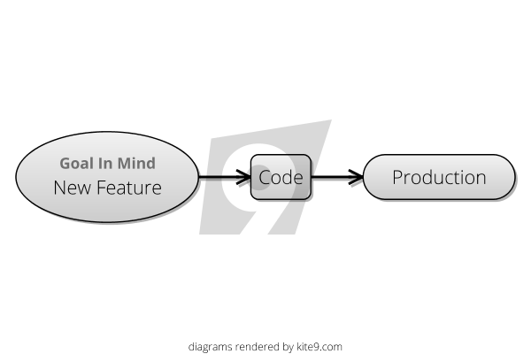

We can all see this would be a disaster, but why?

Two reasons: 

1.  You're meeting reality all-in-one-go:  all of these risks materialize at the same time, and you have to deal with them all at once.
2.  Because of this, at the point you put code into the hands of your users, your [Internal Model](Internal-Model) is at its least-developed.  All the [Hidden Risks](Attendant-Risk) now need to be dealt with at the same time, in production.

## Applying the Model

Let's look at how our process should act to prevent these risks materializing by considering an unhappy path, one where at the outset, we have lots of [Hidden Risks](Attendant-Risk) ready to materialize.  Let's say a particularly vocal user rings up someone in the office and asks for new **Feature X** to be added to the software.  It's logged as a new feature request, but:
  
- Unfortunately, this feature once programmed will break an existing **Feature Y**  
- Implementing the feature will use some api in a library, which contains bugs and have to be coded around.    
- It's going to get misunderstood by the developer too, who is new on the project and doesn't understand how the software is used.  
- Actually, this functionality is mainly served by **Feature Z**...
- which is already there but hard to find.

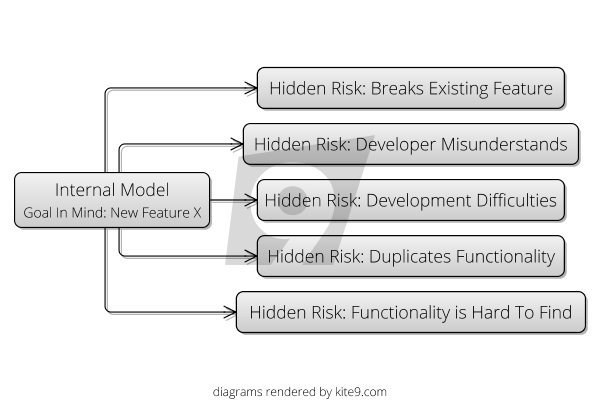

This is a slightly contrived example, as you'll see.  But let's follow our feature through the process and see how it meets reality slowly, and the hidden risks are discovered:

### Specification

The first stage of the journey for the feature is that it meets the Business Analyst (BA).  The _purpose_ of the BA is to examine new goals for the project and try to integrate them with _reality as they understands it_.  A good BA might take a feature request and vet it against the internal logic of the project, saying something like: 

- "This feature doesn't belong on the User screen, it belongs on the New Account screen"
- "90% of this functionality is already present in the Document Merge Process" 
- "We need a control on the form that allows the user to select between Internal and External projects"

In the process of doing this, the BA is turning the simple feature request _idea_ into a more consistent, well-explained _specification_ or _requirement_ which the developer can pick up.  But why is this a useful step in our simple methodology?  From the perspective of our [Internal Model](Internal-Model), we can say that the BA is responsible for:

- Trying to surface [Hidden Risks](Apparent-Risk)
- Trying to evaluate [Apparent Risk](Apparent-Risk) and make it clear to everyone on the project.

Hopefully, after this stage, our [Internal Model](Internal-Model) might look something like this:

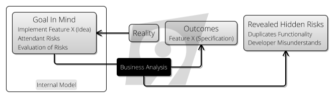

In surfacing these risks, there is another outcome:  while **Feature X** might be flawed as originally presented, the BA can "evolve" it into a specification, and tie it down sufficiently to reduce the risks.   The BA does all this by simply _thinking about it_, _talking to people_ and _writing stuff down_.

This process of evolving the feature request into a requirement is the BAs job.  From our risk-first perspective, it is _taking an idea and making it meet reality_.  Not the _full reality_ of production (yet), but something more limited.  After its brush with reality, the [goal in mind](Goal-In-Mind) has _evolved_ from being **Feature X (Idea)** to **Feature X (Specification)**.

### Code And Unit Test

The next stage for our feature, **Feature X (Specification)** is that it gets coded and some tests get written.  Let's look at how our [goal in mind](Goal-In-Mind) meets a new reality:   this time it's the reality of a pre-existing codebase, which has it's own internal logic.

As the developer begins coding the feature in the software, she will start with an [Internal Model](Internal-Model) of the software, and how the code fits into it.  But, in the process of implementing it, she is likely to learn about the codebase, and 
her [Internal Model](Internal-Model) will develop.  

To a large extent, this is the whole point of _type safety_:  to ensure that your [Internal Model](Internal-Model) stays consistent with the reality of the codebase.  If you add code that doesn't fit the reality of the codebase, you'll know about it with compile errors.

The same thing is true of writing unit tests:  again you are testing your [Internal Model](Internal-Model) against the reality of the system being built, running in your development environment.  Hopefully, this will surface some new hidden risks, and again,
because the [goal in mind](Goal-In-Mind) has met reality, it is changed, to **Feature X (Code)**.

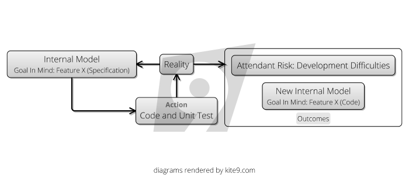

### Integration

Integration is where we run _all_ the tests on the project, and compile _all_ the code in a clean environment:  the "reality" of the development environment can vary from one developer's machine to another.  

So, this stage is about the developer's committed code meeting a new reality: the clean build.   

At this stage, we might discover the [Hidden Risk](Attendant-Risk) that we'd break **Feature Y**

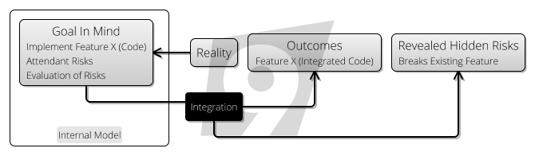

### UAT

Is where our feature meets another reality: _actual users_.   I think you can see how the process works by now.  We're just flushing out yet more [Hidden Risks](Attendant-Risk):

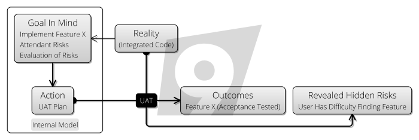

## Observations

A couple of things:

**First**, the people setting up the development process _didn't know_ about these _exact_ risks, but they knew the _shape that the risks take_.   The process builds "nets" for the different kinds of hidden risks without knowing exactly what they are.  Part of the purpose of this site is to help with this and try and provide a taxonomy for different types of risks.

**Second**, are these really risks, or are they _problems we just didn't know about_?  I am using the terms interchangeably, to a certain extent.  Even when you know you have a problem, it's still a risk to your deadline until it's solved.  So, when does a risk become a problem?  Is a problem still just a schedule-risk, or cost-risk?  It's pretty hard to draw a line and say exactly.

**Third**, the real take-away from this is that all these risks exist because we don't know 100% how reality is.  Risk exists because we don't (and can't) have a perfect view of the universe and how it'll develop.   Reality is reality, _the risks just exist in our head_.

**Fourth**, hopefully you can see from the above that really _all this work is risk management_, and _all work is testing ideas against reality_.   

## Conclusion?

Could it be that _everything_ you do on a software project is risk management?  This is an idea explored in [the next section](All-Risk-Management).


\newpage
# All Risk Management
In this section, I am going to introduce the idea that everything you do on a software project is Risk Management.

In the [last section](Development-Process), we observed that all the activities in a simple methodology had a part to play in exposing different risks.  They worked to manage risk prior to them creating bigger problems in production.

Here, we'll look at one of the tools in the Project Manager's toolbox, the [RAID Log](http://pmtips.net/blog-new/raid-logs-introduction), and observe how risk-centric it is.

## RAID Log

Many project managers will be familiar with the [RAID Log](http://pmtips.net/blog-new/raid-logs-introduction).  It's simply four columns on a spreadsheet:

 - Risks
 - Actions
 - Issues
 - Decisions
 
Let's try and put the following [Attendant Risk](Attendant-Risk) into the RAID Log:

> Debbie needs to visit the client to get them to choose the logo to use on the product, otherwise we can't size the screen areas exactly.

 - So, is this an **action**?   Certainly.  There's definitely something for Debbie to do here. 
 - Is it an **issue**?  Yes, because it's holding up the screen-areas sizing thing. 
 - Is it a **decision**?  Well, clearly, it's a decision for someone.
 - Is it a **risk**?  Probably:  Debbie might go to the client and they _still_ don't make a decision.  What then?

## Let's Go Again

This is a completely made-up example, deliberately chosen to be hard to categorize.  Normally, items are more one thing than another.  But often, you'll have to make a choice between two categories, if not all four.  

This hints at the fact that at some level it's All Risk:

### Every Action Mitigates Risk

The reason you are _taking_ an action is to mitigate a risk.  For example, if you're coing up new features in the software, this is mitigating [Feature Risk](Feature Risk).  If you're getting a business sign-off for something, this is mitigating a [Too Many Cooks](Too-Many-Cooks)-style _stakeholder risk_.  


### Every Action Carries Risk.  

- How do you know if the action will get completed?  
- Will it overrun on time?  
- Will it lead to yet more actions?

Consider _coding a feature_ (as we did in the earlier [Development Process](Development-Process) section).  We saw here how the whole process of coding was an exercise in learning what we didn't know about the world, uncovering problems and improving our [Internal Model](Internal-Model).  That is, flushing out the [Attendant Risk](Attendant-Risk) of the [Goal In Mind](Goal-In-Mind).

And, as we saw in the [Introduction](Introduction), even something _mundane_ like the Dinner Party had risks. 

### An Issue is Just A Type of Risk

- Because issues need to be solved...  
- And solving an issue is an action... 
- Which, as we just saw also carry risk.

One retort to this might be to say:  an issue is a problem I have now, whereas a risk is a problem that _might_ occur.  I am going to try and _break_ that mindset in the coming pages, but I'll just start with this:

- Do you know _exactly_ how much damage this issue will do?
- Can you be sure that the issue might not somehow go away?  

_Issues_ then, just seem more "definite" and "now" than _risks_, right?  This classification is arbitrary:  they're all just part of the same spectrum, so stop agonising over which column to put them in.

### Every Decision is a Risk.  

- By the very nature of having to make a decision, there's the risk you'll decide wrongly.
- And, there's the time it takes to make the decision.
- And what's the risk if the decision doesn't get made?

## What To Do?

It makes it much easier to tackle the RAID log if there's only one list:  all you do is pick the worst risk on the list, and deal with it.  (In [Risk Theory](Risk-Theory) we look at how to figure out which one that is).

OK, so maybe that _works_ for a RAID log (or a Risk log, since we've thrown out the others), but does it scale to a whole project?  

In the next section, [Software Project Scenario](Software-Project-Scenario) I will make a slightly stronger case for the idea that it does. 


 
\newpage
# Software Project Scenario
Where do the risks of the project lie?  

How do we decide what _needs to be done today_ on a software project?  

Let's look again at the simple risk framework from the [introduction](Introduction) and try to apply it at the level of the _entire project_.


## Goal In Mind

How should we decide how to spend our time today?  

What actions should we take?  (In [Scrum](Agile) terminology, what is our _Sprint Goal_?).

If we want to take the right actions, we need to have a good [Internal Model](Internal-Model).  

Sometimes, we will know that our model is deficient, and our time should be spend _improving_ it, perhaps by talking to our clients, or the support staff, or other developers, or reading.  

But let's say for example, today our [Goal In Mind](Goal-In-Mind) is to grow our user base.  

## Attendant Risks

What are the [Attendant Risks](Attendant-Risk) that come with that goal?  Here are some to get us started:

1. The users can’t access the system
2. The data gets lost, stolen. 
3. The data is wrong or corrupted
4. There are bugs that prevent the functionality working
5. The functionality isn’t there that the user needs ([Feature Risk](Feature-Risk)).
6. Our [Internal Model](Internal-Model) of the market is poor, and we could be building the wrong thing.

I'm sure you can think of some more. 

## Evaluating The Risks

Next, we can look at each of these risks and consider the threat they represent.  Usually, when [evaluating a risk](Risk-Theory) we consider both it's **impact** and **likelihood**.  

The same [Attendant Risks](Attendant-Risk) will be evaluated differently depending on the _nature of the project_ and the mitigations you already have in place.  For example:

* If they **can’t access it**, does that mean that they’re stuck unable to get on the train?  Or they can’t listen to music?  
* If the **data is lost**, does this mean that no one can get on the plane?  Or that the patients have to have their CAT scans done again?  Or that people’s private information is scattered around the Internet?
* If the **data is wrong**, does that mean that the wrong people get sent their parcels?  Do they receive the wrong orders?  Do they end up going to the wrong courses?
* If there are **bugs**, does it mean that their pictures don’t end up on the internet?  Does it mean that they have to restart the program?  Does it mean that they’ll waste time, or that they end up thinking they have insurance but haven’t?  
* If there is **missing functionality**, will they not buy the system?  Will they use a competitor’s product?  Will they waste time doing things a harder or less optimal way?
* If our **[Internal Model](Internal-Model) is wrong**, then is there a chance we are building something for a non-existent market?  Or annoying our customers?  Or leaving an opportunity for competitors?

## Outcomes

As part of evaluating the risks, we can also _predict_ the negative outcomes if these risks materialise and we don't take action.

* Losing Revenue
* Legal Culpability
* Losing Users
* Bad Reputation
* etc.

## A Single Attendant Risk:  Getting Hacked

Let's consider a single risk:  that the website gets hacked, and sensitive data is stolen.  How we evaluate this risk is going to depend on a number of factors:

* How many users we have
* The importance of the data
* How much revenue will be lost
* Risk of litigation
* etc.

#### Ashley Maddison

We've seen [in the example of hacks on LinkedIn and Ashley Maddison](https://www.acunetix.com/blog/articles/password-hashing-and-the-ashley-madison-hack/) that passwords were not held as hashes in the database.  (A practice which experienced developers mainly would see as negligent).  

How does our model explain what happened here?

- It's possible that _at the time of implementing the password storage_, hashing was considered, but the evaluation of the risk was low:  Perhaps, the risk of not shipping quickly was deemed greater.  And so they ignored this concern.
- It's also possible that for the developers in question this was a [Hidden Risk](Attendant-Risk), and they hadn't even considered it. 
- However, as the number of users of the sites increased, the risk increased too, but there was no re-evaluation of the risk otherwise they would have addressed it.  This was a costly _failure to update the [Internal Model](Internal-Model)_.

#### Possible Action

When exposing a service on the Internet, it's now a good idea to _look for trouble_:  you should go out and try and improve your [Internal Model](Internal-Model).   

Thankfully, this is what sites like [OWASP](https://www.owasp.org/index.php/Top_10-2017_Top_10) are for:  they _tell you about the [Attendant Risks](Attendant-Risk)_ and further, try to provide some evaluation of them to guide your actions.

## Actions

So, this gives us a guide for one potential action we could take _today_.  But on it's own, this isn't helpful:   we would need to consider this action against the actions we could take to mitigate the other risks.  Can we answer this question:

Which actions give us the biggest benefit in terms of mitigating the [Attendant Risks](Attendant-Risk)?

That is, we consider for each possible action:

- The Impact and Likelihood of the [Attendant Risks](Attendant-Risk) it mitigates
- The Cost of the Action

For example, it's worth considering that if we're just starting this project, risks 1-4 are _negligible_, and we're only going to spend time building functionality or improving our understanding of the market.  (Which makes sense, right?)

## Tacit and Explicit Modelling

As we saw in the example of the [Dinner Party](Introduction), creating an internal model is something _we just do_:  we have this functionality in our brains already.  When we scale this up to a whole project team, we can expect the individuals on the project to continue to do this, but we might also want to consider _explicitly_ creating a [risk register for the whole project](Risk-Theory).  

Whether we do this explicitly or not, we are still individually following this model.

In the next section, we're going to take a quick aside into looking at some [Risk Theory](Risk-Theory).
\newpage
# Risk Theory
Here, I am going to recap on some pre-existing knowledge about risk, generally, in order to set the scene for the next section on [Meeting Reality](Meeting-Reality).  

## Risk Registers

In the previous section [Software Project Scenario](Software-Project-Scenario) we saw how you try to look across the [Attendant Risks](Attendant-Risk) of the project, in order to decide what to do next.  

A [Risk Register](https://en.wikipedia.org/wiki/Risk_register) can help with this.  From Wikipedia:

> A typical risk register contains:
> 
> - A risk category to group similar risks
> - The risk breakdown structure identification number
> - A brief description or name of the risk to make the risk easy to discuss
> - The impact (or consequence) if event actually occurs rated on an integer scale
> - The probability or likelihood of its occurrence rated on an integer scale
> - The Risk Score (or Risk Rating) is the multiplication of Probability and Impact and is often used to rank the risks.
> - Common mitigation steps (e.g. within IT projects) are Identify, Analyze, Plan Response, Monitor and Control.

This is Wikipedia's example:

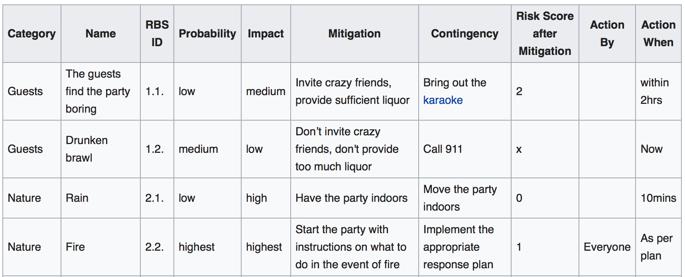

Some points about this description:

### This is a Bells-and-Whistles Description

Remember back to the Dinner Party example at the start: the Risk Register happened *entirely in your head*.  There is a continuum all the way from "in your head" to Wikipedia's Risk Register description.  Most of the time, it's going to be in your head, or in discussion with the team, rather than written down.   

Most of the value of the **Risk-First** approach is _in conversation_.  Later, we'll have an example to show how this can work out.

### Probability And Impact

Sometimes, it's better to skip these, and just figure out a Risk Score.  This is because if you think about "impact", it implies a definite, discrete event occurring, or not occurring, and asks you then to consider the probability of that occurring. 

**Risk-First** takes a view that risks are a continuous quantity, more like _money_ or _water_:  by taking an action before delivering a project you might add a degree of [Schedule Risk](Schedule-Risk), but decrease the [Production Risk](Production-Risk) later on by a greater amount.   


## Graphical Analysis

The [Wikipedia page](https://en.wikipedia.org/wiki/Risk_register) also includes this wonderful diagram showing you risks of a poorly run barbecue party:

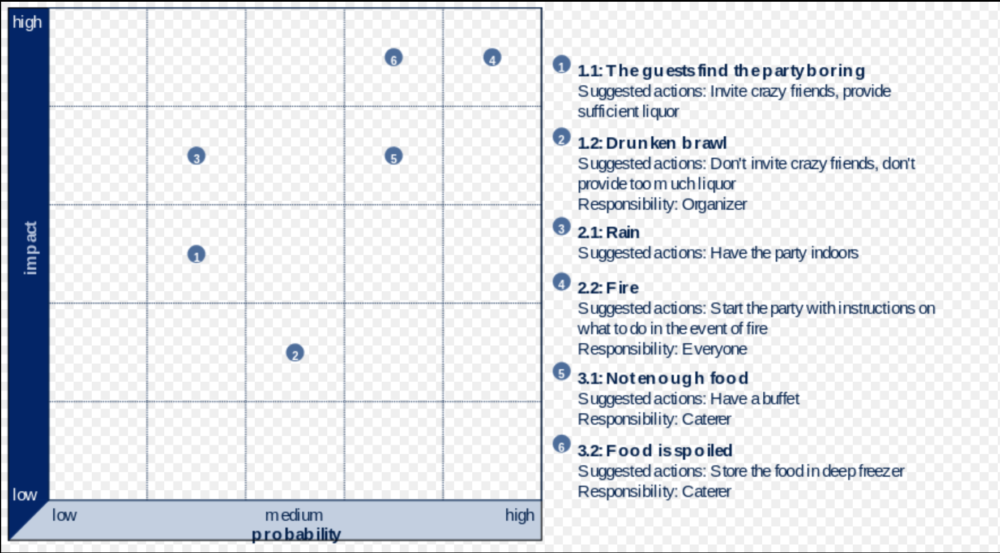

This type of graphic is _helpful_ in deciding what to do next, although personally I prefer to graph the overall **Risk Score** against the **Cost of Mitigation**:   easily mitigated, but expensive risks can therefore be dealt with first (hopefully).

## Unknown Unknowns

In Wikipedia's example, this ficticious BBQ has high fire risk, so one should begin mitigating there.  

But, does this feel right?  One of the criticisms of the Risk Register approach is that of [mistaking the map for the territory](Map-And-Territory).  That is, mistakenly believing that what's on the Risk Register _is all there is_.  

In the preceding discussions, I have been careful to point out the existence of [Hidden Risks](Attendant-Risk) for that very reason. Or, to put another way:

> What we don't know is what usually gets us killed 
>     - Petyr Baelish

Donald Rumsfeld's famous [Known Knowns](https://en.wikipedia.org/wiki/There_are_known_knowns) is also a helpful conceptualization.

## Risk And Uncertainty

Arguably, this site uses the term 'Risk' wrongly:  most literature suggests [risk can be measured](https://keydifferences.com/difference-between-risk-and-uncertainty.html) whereas uncertainty represents things that cannot.  

I am using **risk** everywhere because later we will talk about specific risks (e.g. [Executable Boundary Risk](Executable-Boundary-Risk) or [Technical Debt Risk](Technical-Debt)), and it doesn't feel grammatically correct to talk about those as **uncertainties**, especially given the pre-existing usage in Banking of terms like [Operational risk](https://en.wikipedia.org/wiki/Operational_risk) or [Reputational risk](https://www.investopedia.com/terms/r/reputational-risk.asp) which are also not really a-priori measurable.

## The Opposite Of Risk Management

Let's look at the classic description of Risk Management:

> Risk Management is the process of thinking out corrective actions before a problem occurs, while it's still an abstraction.  
> The opposite of risk management is crisis management, trying to figure out what to do about the problem after it happens.
> - Waltzing With Bears, Tom De Marco & Tim Lister

This is not how **Risk-First** sees it:  

First, we have the notion that Risks are discrete events, again.  Some risks _are_ (like gambling on a horse race), but most _aren't_.  In the [Dinner Party](Introduction), for example, bad preparation is going to mean a _worse_ time for everyone, but how good a time you're having is a spectrum, it doesn't divide neatly into just "good" or "bad".  

Second, the opposite of "Risk Management" (or trying to minimize the "Downside") is either "Upside Risk Management", (trying to maximise the good things happening), or it's trying to make as many bad things happen as possible.  Humans tend to be optimists (especially when there are lots of [Hidden Risks](Attendant-Risk)), hence our focus on Downside Risk.  Sometimes though, it's good to stand back and look at a scenario and think:  am I capturing all the Upside Risk here?

Finally, Crisis Management is _still just Risk Management_:  the crisis (Earthquake, whatever) has _happened_.  You can't manage it because it's in the past.   All you can do is Risk Manage the future (minimize further casualties and human suffering, for example).    

Yes, it's fine to say "we're in crisis", but to assume there is a different strategy for dealing with it is a mistake:  this is the [Fallacy of Sunk Costs](https://en.wikipedia.org/wiki/Sunk_costs). 

## Value

"Upside Risk" isn't a commonly used term:  industry tends to prefer "value", as in "Is this a value-add project?".  There is plenty of theory surrounding **Value**, such as Porter's [Value Chain]() and [Net Present Value]().  This is all fine so long as we remember:

 - **The pay-off is risky**: Since the **Value** is created in the future, we can't be certain about it happening - we should never consider it a done-deal.  **Future Value** is always at risk.  In finance, for example, we account for this in our future cash-flows by discounting them according to the risk of default.
 - **The pay-off amount is risky**:  Additionally, whereas in a financial transaction (like a loan, say), we might know the size of a future payment, in IT projects we can rarely be sure that they will deliver a certain return.  On some fixed-contract projects this sometimes is not true: there may be a date when the payment-for-delivery gets made, but mostly we'll be expecting an uncertain pay-off. 
 
## Time Value of Risk

In exactly th
 
 
## Urgency vs Importance 

--eisenhower's box
tbd


## Discounting the Future To Zero

- more pressure, heavier discounting
pooh bear procrastination

## Is This Scientific?

**Risk-First** is an attempt to provide a practical framework, rather than a scientifically rigorous analysis.  In fact, my view is that you should _give up_ on trying to compute risk numerically.  You _can't_ work out how long a software project will take based purely on an analysis of (say) _function points_.  (Whatever you define them to be).

- First, there isn't enough evidence for an approach like this.  We _can_ look at collected data about IT projects, but [techniques and tools change](Silver-Bullets).
- Second,  IT projects have too many confounding factors, such as experience of the teams, 
technologies used etc.  That is, the risks faced by IT projects are _too diverse_ and _hard to quantify_ to allow for meaningful comparison from one to the next.
- Third, as soon as you _publish a date_ it changes the expectations of the project (see [Student Syndrome](Schedule-Risk)).
- Fourth, metrics get first of all [misused](Map-And-Territory-Risk) and then [gamed](Agency-Risk).

Reality is messy.  Dressing it up with numbers doesn't change that and you risk [fooling yourself](Map-And-Territory).  If this is the case, is there any hope at all in what we're doing?  I would argue yes:   _forget precision_.  You should, with experience be able to hold up two separate risks and answer the question, "is this one bigger than this one?"  

Reality is Reality, [so let's meet it](Meeting-Reality). 

\newpage
# Meeting Reality
In this section, we will look at how exposing your [Internal Model](Internal-Model) to reality is in itself a good risk management technique.

## Revisiting the Model

In the [Introduction](Introduction), we looked at a basic model for how **Reality** and our [Internal Model](Internal-Model) interacted with each other:  we take action based on out [Internal Model](Internal-Model), hoping to **change Reality** with some positive outcome.

And, in [Development Process](Development-Process) we looked at how we can meet with reality in _different forms_:  Analysis, Testing, Integration and so on, and saw how the model could work in each stage of a project.

Finally, in [Software Project Scenario](Software-Project-Scenario) we looked at how we could use this model on a day-to-day basis to inform what we should do next.  

So, it should be no surprise to see that there is a _recursive_ nature about this:  

1.  The **actions we take** each day have consequences:  they **expose new [Hidden Risks](Attendant-Risk)**, which inform our [Internal Model](Internal-Model), and at the same time, they change reality in some way (otherwise, what would be the point of doing them?)
2.  The actions we take towards achieving a [Goal In Mind](Goal-In-Mind) each have their _own_ [Goal In Mind](Goal-In-Mind).  And because of this, when we take action, we have to consider and evaluate the [Hidden Risks](Attendant-Risk) exposed by that action.   That is, there are many ways to achieving a goal, and these different ways expose different [Hidden Risks](Attendant-Risk).

So, let's see how this kind of recursion looks on our model. Note that here, I am showing _just one possible action_, in reality, you'll have choices.

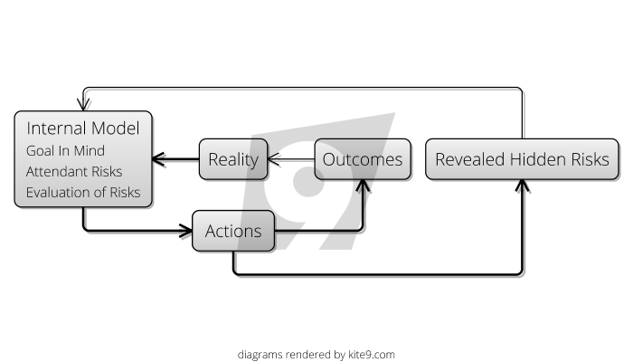.

Hopefully, if you've read along so far, this model shouldn't be too hard to understand.  But, how is it helpful?  

## "Navigating the [Risk Landscape](Risk-Landscape)"

So, we often have multiple ways of achieving a [Goal In Mind](Goal-In-Mind).  

What's the best way?  

I would argue that the best way is the one which accrues the _least risk_ to get it done:  each action you take in trying to achieve the overall [Goal In Mind](Goal-In-Mind) will have it's [Attendant Risks](Attendant-Risk), and it's the experience you bring to bear on these that will help you navigate through them smoothly.

Ideally, when you take an action, you are trading off a big risk for a smaller one.  Take Unit Testing for example.  Clearly, writing Unit Tests adds to the amount of development work, so on it's own, it adds [Schedule Risk](Schedule-Risk).   However, if you write _just enough_ of the right Unit Tests, you should be short-cutting the time spent finding issues in the User Acceptance Testing (UAT) stage, so you're hopefully trading off a larger [Schedule Risk](Schedule-Risk) from UAT and adding a smaller risk to **Development**.

Sometimes, in solving one problem, you can end up somewhere _worse_:  the actions you take to solve a higher-level [Attendant Risk](Attendant-Risk) will leave you with a worse [Attendant Risks](Attendant-Risk).  Almost certainly, this will have been a [Hidden Risk](Attendant-Risk) when you embarked on the action, otherwise you'd not have chosen it.  

### A Quick Example

On a recent project in a bank, we had a requirement to store a modest amount of data and we needed to be able to retrieve it fast.  The developer chose to use [MongoDB](https://www.mongodb.com) for this.  At the time, others pointed out that other teams in the bank had had lots of difficulty deploying MongoDB internally, due to licensing issues and other factors internal to the bank.

Other options were available, but the developer chose MongoDB because of their _existing familiarity_ with it:   therefore, they felt that the [Hidden Risks](Attendant-Risk) of MongoDB were _lower_ than the other options, and disregarded the others' opinions.

The data storage [Attendant Risk](Attendant-Risk) was mitigated easily with MongoDB.  However, the new [Attendant Risk](Attendant-Risk) of licensing bureacracy eventually proved too great, and MongoDB had to be abandoned after much investment of time.

This is not a criticism of MongoDB: it's simply a demonstration that sometimes, the cure is worse than the disease.  Successful projects are _always_ trying to _reduce_ [Attendant Risks](Attendant-Risk).  

## The Cost Of Meeting Reality

Meeting reality is _costly_, for example.  Going to production can look like this:

- Releasing software
- Training users
- Getting users to use your system
- Gathering feedback

All of these steps take a lot of effort and time.   But you don't have to meet the whole of reality in one go - sometimes that is expensive.  But we can meet it in "limited ways".  


In all, to de-risk, you should try and meet reality:

- **Sooner**, so you have time to mitigate the hidden risks it uncovers
- **More Frequently**: so the hidden risks don't hit you all at once
- **In Smaller Chunks**:


### YAGNI 

As a flavour of what's to come, let's look at [YAGNI](https://www.martinfowler.com/bliki/Yagni.html), an acronym for You Aren't Gonna Need It.   Martin Fowler says:

> Yagni originally is an acronym that stands for "You Aren't Gonna Need It". It is a mantra from ExtremeProgramming that's often used generally in agile software teams. It's a statement that some capability we presume our software needs in the future should not be built now because "you aren't gonna need it".

> This principle was first discussed and fleshed out on [Ward's Wiki](http://wiki.c2.com/?YouArentGonnaNeedIt)

The idea makes sense:  if you take on extra work that you don't need, _of course_ you'll be accreting [Attendant Risks](Attendant-Risk).

But, there is always the opposite opinion:  [You Are Gonna Need It](http://wiki.c2.com/?YouAreGonnaNeedIt).  As a simple example, we often add log statements in our code as we write it, though following YAGNI strictly says we should leave it out.  

#### Which is right?

Now, we can say:  do the work _if it mitigates your [Attendant Risks](Attendant-Risk)_.  

 - Logging statements are _good_, because otherwise, you're increasing the risk that in production, no one will be able to understand _how the software went wrong_.
 - However, adding them takes time, which might introduce [Schedule Risk](Schedule-Risk).
 
So, it's a trade-off: continue adding logging statements so long as you feel that overall, you're reducing risk.

### Do The Simplest Thing That Could Possibly Work

Another mantra from Kent Beck (originator of the [Extreme Programming](Agile) methodology, is "Do The Simplest Thing That Could Possibly Work", which is closely related to YAGNI and is about looking for solutions which are simple.  Our risk-centric view of this strategy would be:

- Every action you take on a project has it's own [Attendant Risks](Attendant-Risk).
- The bigger or more complex the action, the more [Attendant Risk](Attendant-Risk) it'll have.
- The reason you're taking action _at all_ is because you're trying to reduce risk elsewhere on the project 
- Therefore, the biggest payoff is whatever action _works_ to remove that risk, whilst simultaneously picking up the least amount of new [Attendant Risk](Attendant-Risk).

So, "Do The Simplest Thing That Could Possibly Work" is really a helpful guideline for Navigating the [Risk Landscape](Risk-Landscape).  

## Summary

So, here we've looked at Meeting Reality, which basically boils down to taking actions to manage risk and seeing how it turns out:

- Each Action you take is a step on the Risk Landscape
- Each Action is a cycle around our model.
- Each cycle, you'll expose new [Hidden Risks](Attendant-Risk), changing your [Internal Model](Internal-Model).
- Preferably, each cycle should reduce the overall [Attendant Risk](Attendant-Risk) of the [Goal](Goal-In-Mind)

Surely, the faster you can do this, the better?  [Let's investigate...](Cadence)


 
\newpage
# Cadence
Let's go back to the model again, introduced in [Meeting Reality](Meeting-Reality):


As you can see, it's an idealized **Feedback Loop**.  

How _fast_ should we go round this loop?  Is there a right answer?  The longer you leave your [goal in mind](Goal-In-Mind), the longer it'll be before you find out how it really stacks up against reality.  

Testing your [goals in mind](Goal-In-Mind) against reality early and safely is how you'll manage risk effectively, and to do this, you need to set up **Feedback Loops**. e.g.

 - **Bug Reports and Feature Requests** tell you how the users are getting on with the software.
 - [Monitoring Tools and Logs](Production-Risk) allow you to find out how your software is doing in reality.
 - **Dog-Fooding** i.e using the software you write yourself might be faster than talking to users.
 - [Continuous Delivery](DevOps) (CD) is about putting software into production as soon as it's written.   
 - **Integration Testing** is a faster way of meeting _some_ reality than continually deploying code and re-testing it manually.
 - **Unit Testing** is a faster feedback loop than Integration Testing. 
 - **Compilation** warns you about logical inconsistencies in your code.
 
.. and so on.

### Time / Reality Trade-Off

This list is arranged so that at the top, we have the most visceral, most _real_ feedback loop, but at the same time, the slowest.   

At the bottom, a good IDE can inform you about errors in your [Internal Model](Internal-Model) in real time, by way of highlighting compilation errors .  So, this is the fastest loop, but it's the most _limited_ reality.

Imagine for a second that you had a special time-travelling machine.  With it, you could make a change to your software, and get back a report from the future listing out all the issues people had faced using it over its lifetime, instantly.

That'd be neat, eh?  If you did have this, would there be any point at all in a compiler?   Probably not, right?  

The whole _reason_ we have tools like compilers is because they give us a short-cut way to get some limited experience of reality _faster_ than would otherwise be possible.  Because, cadence is really important:  the faster we test our ideas, the more quickly we'll find out if they're correct or not.

### Development Cycle Time

One thing that often astounds me is how developers can ignore the fast feedback loops at the bottom of the list, because the ones nearer the top _will do_.   In the worst cases, changing two lines of code, running the build script, deploying and then manually testing out a feature.  And then repeating.

If you're doing it over and over, this is a terrible waste of time.  And, you get none of the benefit of a permanent suite of tests to run again in the future.  

The [Testing Pyramid](http://www.agilenutshell.com/episodes/41-testing-pyramid) hints at this truth: 

- **Unit Tests** have a _fast feedback loop_, so have _lots of them_.
- **Integration Tests** have a slightly _slower feedback loop_, so have _few of them_.   Use them when you can't write unit tests (at the application boundaries).
- **Manual Tests** have a _very slow feedback loop_, so have _even fewer of them_.  Use them as a last resort.

### Production

You could take this section to mean that [Continuous Delivery](DevOps) (CD) is always and everywhere a good idea.  I _guess_ that's not a bad take-away, but it's clearly more nuanced than that.  

Yes, CD will give you faster feedback loops, but getting things into production is not the whole story:   the feedback loop isn't complete until people have used the code, and reported back to the development team.  

The right answer is to use the fastest feedback loop possible, _which actually does give you feed back_.

## Recap

Let's look at the journey so far:

 - In the [Introduction](Introduction) we looked at how risk pervades every goal we have in life, big or small.  We saw that risk stems from the fact that our [Internal Model](Internal-Model) of the world couldn't capture everything about reality, and so some things were down to chance.  
 
 - In the [Development Process](Development-Process) we looked at how common software engineering conventions like Unit Testing, User Acceptance Testing and Integration could help us manage the risk of taking an idea to production, by _gradually_ introducing it to reality in stages.
 
 - In [It's All Risk Management](All-Risk-Management) we took a leap of faith:  Could _everything_ we do just be risk management?  And we looked at the RAID log and thought that maybe it could be.   
 
 - Next, in [A Software Project Scenario](Software-Project-Scenario) we looked at how you could treat the project-as-a-whole as a risk management exercise, and treat the goals from one day to the next as activities to mitigate risk.
 
 - [Some Risk Theory](Risk-Theory) was an aside, looking at some terminology and the useful concept of a Risk Register.
 
 - Then, generalizing the lessons of the Development Process article, we examined the idea that [Meeting Reality](Meeting-Reality) frequently helps flush out [Hidden Risks](Attendant-Risk) and improve your [Internal Model](Internal-Model).
 
 - Finally, above, we looked at [Cadence](Cadence), and how feedback loops allow you Navigate the Risk Landscape more effectively, by showing you more quickly when you're going wrong.
 
What this has been building towards is supplying us with a vocabulary with which to communicate to our team-mates about which Risks are important to us, which actions we believe are the right ones, and which tools we should use.

Let's have a [look at an example](A-Conversation) of how this might work:
\newpage
# A Conversation
After so much theory, it seems like it's time to look at how we can apply these principles in the real world.

The following is based the summary of an issue from just a few weeks ago.  It's heavily edited and anonymized, and I've tried to add the **Risk-First** vocabulary along the way, but otherwise, it's real.

Some background:  **Synergy** is an online service with an app-store, and **Eve** and **Bob** are developers working for **Large Corporation LTD**, which wants to have an application accepted into Synergy's app-store.  

Synergy's release means that the app-store refresh will happen in a few weeks, so this is something of a hard deadline: if we miss it, the next release will be four months away.

## A Risk Conversation

**Eve**:  We've got a problem with the Synergy security review.  

**Bob**:  Tell me.

**Eve**:  Well, you know Synergy did their review and asked us to upgrade our Web Server to only allow TLS version 1.1 and greater?  

**Bob**:  Yes, I remember:   We discussed it as a team and thought the simplest thing would be to change the security settings on the Web Server, but we all felt it was pretty risky.  We decided that in order to flush out [Hidden Risk](Attendant-Risk), we'd upgrade our entire production site to use it _now_, rather than wait for the app launch.

**Eve**:  Right, and it _did_ flush out [Hidden Risk](Attendant-Risk): some people using Windows 7, downloading Excel spreadsheets on the site, couldn't download them:  for some reason, that combination didn't support anything greater than TLS version 1.0.  So, we had to back it out.

**Bob**:  Ok, well I guess it's good we found out _now_.  It would have been a disaster to discover this after the go-live.

**Eve**:  Yes.  So, what's our next-best action to mitigate this?  

**Bob**:  Well, we could go back to Synergy and ask them for a reprieve, but I think it'd be better to mitigate this risk now if we can... they'll definitely want it changed at some point.

**Eve**:  How about we run two web-servers?  One for the existing content, and one for our new Synergy app?  We'd have to get a new external IP address, handle DNS setup, change the firewalls, and then deploy a new version of the Web Server software on the production boxes.

**Bob**:  This feels like there'd be a lot of [Attendant Risk](Attendant-Risk):  and all of this needs to be handled by the Networking Team, so we're picking up a lot of [Bureaucratic Risk](Bureaucratic-Risk).  I'm also worried that there are too many steps here, and we're going to discover loads of [Hidden Risks](Attendant-Risk) as we go.

**Eve**:  Well, you're correct on the first one.  But, I've done this before not that long ago for a Chinese project, so I know the process - we shouldn't run into any new [Hidden Risk](Attendant-Risk).

**Bob**:  Ok, fair enough.  But isn't there something simpler we can do?  Maybe some settings in the Web Server?

**Eve**:  Well, if we were using Apache, yes, it would be easy to do this.  But, we're using Baroque Web Server, and it _might_ support it, but the documentation isn't very clear.

**Bob**:  Ok, and upgrading it is a _big_ risk, right?  We'd have to migrate all of our [configuration](Configuration-Riks)... 

**Eve**:  Yes, let's not go there.  But if we changing the settings on Baroque, we have the [Attendant Risk](Attendant-Risk) that it's not supported by the software and we're back where we started.  Also, if we isolate the Synergy app stuff now, we can mess around with it at any point in future, which is a big win in case there are other [Hidden Risks](Attendant-Risk) with the security changes that we don't know about yet.

**Bob**:  Ok, I can see that buys us something, but time is really short and we have holidays coming up.  

**Eve**:  Yes. How about for now, we go with the isolated server, and review next week?  If it's working out, then great, we continue with it.  Otherwise, if we're not making progress next week, then it'll be because our isolation solution is meeting more risk than we originally thought.   We can try the settings change in that case.

**Bob**:  Fair enough, it sounds like we're managing the risk properly, and because we can hand off a lot of this to the Networking Team, we can get on with mitigating our biggest risk on the project, the authentication problem, in the meantime.

**Eve**:  Right.  I'll check in with the Networking Team each day and make sure it doesn't get forgotten.

## Aftermath

Hopefully, this type of conversation will feel familiar.  It should.  There's nothing ground-breaking at all in what we've covered so far; it's more-or-less just Risk Management theory.  

If you can now apply it in conversation, like we did above, then that's one extra tool you have for delivering software.  

So with the groundwork out of the way, let's get on to Part 2 and investigate [The Risk Landscape](Risk-Landscape).  


 

\part{Risk}

\newpage
# Risk Landscape

Risk is messy.  It's not always easy to tease apart the different components of risk and look at them individually.  Let's look at a high-profile recent example to see why.

## Financial Crisis

In the [Financial Services](https://en.wikipedia.org/wiki/Financial_services) industry, lots of effort is spend calculating things like:
- [Market Risk](https://en.wikipedia.org/wiki/Market_risk):  the risk that the amount some asset you hold/borrow/have loaned is going to change in value.
- [Credit Risk](https://en.wikipedia.org/wiki/Credit_risk).  the risk that someone who owes you a payment at a specific point in time might not pay it back.

They get expressed in ways like this:  

> "we have a 95% chance that today we'll lose less than £100"

In the financial crisis, though, these models of risk didn't turn out to be much use.   Although there are lots of conflicting explanations of what happened, one way to look at it is this:
 - Liquidity difficulties (i.e. amount of cash you have for day-to-day running of the bank) caused some banks to not be able to cover their interest payments.
 - This caused credit defaults (the thing that **Credit Risk** measures were meant to guard against) even though the banks _technically_ were solvent.
 - That meant that, in time, banks got bailed out, share prices crashed and there was lots of [Quantitative Easing](https://en.wikipedia.org/wiki/Quantitative_easing).  
 - All of which had massive impacts on the markets in ways that none of the **Market Risk** models foresaw.

All the [Risks](Risk) were [correlated](https://www.investopedia.com/terms/c/correlation.asp).  That is, they were affected by the _same underlying events_, or _each other_.

## The Risk Landscape Again

It's like this with software risks, too, sadly.  

In [Meeting Reality](Meeting-Reality), we looked at the concept of the [Risk Landscape](Risk-Landscape), and how a software project tries to _navigate_ across this landscape, testing the way as it goes, and trying to get to a position of _more favourable risk_.

In this section, I am going to try and show you some of the geography of the [Risk Landscape](Risk-Landscape).  We know every project is different, so every [Risk Landscape](Risk-Landscape) is also different.  But, just as I can tell you that the landscape outside your window will probably will have some roads, trees, fields, forests, buildings, and that the buildings are likely to be joined together by roads, I can tell you some general things about risks too.

In fact, we're going to try and categorize the kinds of things we see on this risk landscape.  But, this isn't going to be perfect: 
 - One risk can "blend" into another just like sometimes a "field" is also a "car-park" or a building might contain some trees (but isn't a forest).   
 - There is _correlation_ between different risks:  one risk may cause another, or two risks may be due to the same underlying cause.  
 - As we saw in [Part 1](Introduction), mitigating one risk can give rise to another, so risks are often _inversely correlated_.

## Three Basic Areas Of Risk

_tbd; is this enough?_

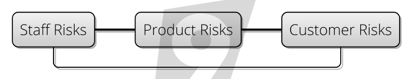

In general, you will definitely have at least 3 main **areas** of risk:

 - **Product Risks**:  Risks affecting the _product you're building_, such as [Feature Risk](Feature-Risk) and [Dependency Risk](Dependency-Risk)
 - **Staff Risks**:  Risks to do with the people or organisations _building the product_, such as [Coordination Risk](Coordination-Risk) and [Agency Risk](Agency-Risk)
 - **Customer Risks**: Risks to do with the _consumers_ of the product.

None of the risk categories we're going to look at fit _exactly_ into these areas, and some of them exist at the **intersection** of these types:
 - [Feature Risk](Feature-Risk) is about the **Customer** and **Product** fit.
 - [Complexity Risk](Complexity-Risk) is a problem between the **Staff** and the **Product** they are building.
 - [Communication Risk](Communication-Risk) occurs at the intersection of **Customer**, **Product** and **Staff**.
 


## Our Tour Itinerary

tbd

|Risk                                                |          Areas           |Description     |
|----------------------------------------------------|--------------------------|----------------|
|[Feature Risk](Feature-Risk)                        |Customer, Product         |tbd|  
|[Schedule Risk](Schedule-Risk)                      |Product, Staff            ||    
|[Complexity Risk](Complexity-Risk)                  |Product, Staff            ||        
|[Communication Risk](Communication-Risk)            |Customer, Product, Staff  | |             
|[Coordination Risk](Coordination-Risk)              |Staff                     ||       
|[Dependency Risk](Dependency-Risk)                  |Product, Customer, Staff  ||  
|[Boundary Risk](Boundary-Risk)                      |Product                   | |            
|[Production Risk](Production-Risk)                  |Customer, Product         |  |
|[Process Risk](Process-Risk)                        |Staff                     ||
|[Map And Territory Risk](Map-And-Territory-Risk)    |Staff                     | |  
|[Agency Risk](Agency-Risk)                          |Staff                     |  |
       
On each page we'll start by looking at the category of the risk _in general_, and then break this down into some specific subtypes.                                                          

Let's get started with [Feature Risk](Feature-Risk).
\newpage
# Feature Risk

**Feature Risk** is the category of risks to do with features that have to be in your software.   
You could also call it **Functionality Risk**.  

**Feature Risk** is the risk that you face by _not having features that your clients need_.  

Eventually, this will come down to lost money, business, acclaim, or whatever else reason you are doing your project for.

So, in a way, **Feature Risk** is very fundamental:  if there were _no_ feature risk, the job would be done already, either
by you, or by another product.  

As a simple example, if your needs are served perfectly by Microsoft Excel, then you don't have any **Feature Risk**.  

However, the day you find Microsoft Excel wanting, and decide to build an Add-On is the day when you first appreciate some **Feature Risk**.

## Variations

### Feature Not Present Risk

This is the one we've just discussed above: the feature that you (or your clients) want to use in the software _isn't there_.   Now, as usual, you could call this an issue, but we're calling it a [Risk](Risk) because it's not clear exactly _how many_ people are affected, or how badly. 

 - This might manifest itself as complete _absence_ of something you need, e.g "Where is the word count?"  
 - It could be that the implementation isn't complete enough, e.g "why can't I add really long numbers in this calculator?"

### Features Don't Work Properly

**Feature Risk** also includes things that don't work as expected: That is to say, [bugs](https://en.wikipedia.org/wiki/Software_bug).   Although the distinction between "a missing feature" and "a broken feature" might be worth making in the development team, we can consider these both the same kind of risk:  _the software doesn't do what the user expects_.

(At this point, it's worth pointing out that sometimes, _the user expects the wrong thing_.  This is a different but related risk, which could be down to [Training](Training) or [Documentation](Documentation) or simply [Poor User Interface](Communication-Risk) and we'll look at that more in [Communication Risk](Communication-Risk).)

### Regression Risk

**Regression Risk** is basically risk of breaking existing features in your software when you add new ones.  As with the previous risks, the eventual result is the same; customers don't have the features they expect.  This can become a problem as your code-base [gains Complexity](Complexity-Risk), as it becomes impossible to keep a complete [Internal Model](Internal-Model) of the whole thing.

Also, while delivering new features can delight your customers, breaking existing ones will annoy them.  This is something we'll come back to in [Reputation Risk](Production-Risk).

### Market Risk

On the [Risk Landscape](Risk-Landscape) page I introduced the idea of **Market Risk** as being the value that the market places on a particular asset.  Since the product you are building is your asset, it makes sense that you'll face **Market Risk** on it:

_The value that the market places on your asset is outside your control._

In the same way as I face market risk when I own some [Apple](http://apple.com) stock, you have **Market Risk** because you own your product.  [Apple's](http://apple.com)'s stock price will decline if a competitor brings out an amazing product, or if 

tbd.

### Conceptual Integrity Risk

Sometimes, users _swear blind_ that they need some feature or other, but it runs at odds with the design of the system, and plain _doesn't make sense_.   Often, the development team can spot this kind of conceptual failure as soon as it enters the [Backlog](Prioritisation), however, sometimes it's only during coding that this becomes apparent.  

Sometimes, it can go for a lot longer.  I once worked on some software that was built as a scoreboard within a chat application.  However, after we'd added much-asked-for commenting and reply features to our scoreboard, we realised we'd implemented a chat application _within a chat application_, and had wasted our time enormously.  

Which leads to [Greenspun's 10th Rule](https://en.wikipedia.org/wiki/Greenspun's_tenth_rule):

> Any sufficiently complicated C or Fortran program contains an ad-hoc, informally-specified, bug-ridden, slow implementation of half of Common Lisp.

This is a particularly pernicious kind of **Feature Risk** which can only be mitigated by good [Design](Design).  Human needs are fractal in nature: the more you examine them, the more differences you can find.  The aim of a product is to capture some needs at a *general* level:  you can't hope to "please all of the people all of the time".  

**Conceptual Integrity Risk** means that chasing features means that the product ends up making no sense, and therefore pleases no-one.   Therefore, [Design](Design) is partly about achieving balance between usability and features.  tbd.


### Feature Access Risk

Sometimes, features can work for some people and not others:  this could be down to [Accessibility](https://en.wikipedia.org/wiki/Accessibility) issues, language barriers or localization.   

You could argue that the choice of _platform_ is also going to limit access:  writing code for XBox-only leaves PlayStation owners out in the cold.   This is _largely_ Feature Access Risk, though [Dependency Risk](Dependency-Risk) is related here.

### Feature Drift Risk

**Feature Drift** is the tendency that the features people need _change over time_.   At one point in time, supporting IE6 was right up there for website developers, but it's not really relevant anymore.  Although that change took _many_ years to materialize, other changes are more rapid.    

The point is:  [Requirements captured](Requirements-Capture) _today_ might not make it to _tomorrow_, especially in the fast-paced world of IT.  

**Feature Drift Risk** is _not the same thing_ as **Requirements Drift**, which is the tendency projects have to expand in scope as they go along.  There are lots of reasons they do that, a key one being the [Hidden Risks](Risk) uncovered on the project as it progresses.

### Fashion

Fashion plays a big part in IT, as this [infographic on website design shows](https://designers.hubspot.com/blog/the-history-of-web-design-infographic).  True, websites have got easier to use as time has gone by, and users now expect this.  Also, bandwidth is greater now, which means we can afford more media and code on the client side.  However, _fashion_ has a part to play in this.  


By being _fashionable_, websites are communicating:   _this is a new thing_, _this is relevant_, _this is not terrible_:  all of which is mitigating a [Communication Risk](Communication-Risk).  Users are all-too-aware that the Internet is awash with terrible, abandon-ware sites that are going to waste their time.  How can you communicate that you're not one of them to your users?

### Delight

If this breakdown of **Feature Risk** seems reductive, then try not to think of it that way:  the aim _of course_ should be to delight users, and turn them into fans.  That's a laudable [Goal](Goal-In-Mind), but should be treated in the usual Risk-First way:  _pick the biggest risk you can mitigate next_.   

Consider **Feature Risk** from both the down-side and the up-side:  
 - What are we missing?
 - How can we be _even better_?

Hopefully, this has given you some ideas about what **Feature Risk** involves.   Hopefully, you might be able to identify a few more specific varieties.  But, it's time to move on and look at how time affects our projects, in [Schedule Risk](Schedule-Risk).
 
\newpage
# Schedule Risk
**Schedule Risk** is the fundamental risk you face because of _lack of time_.  

You could also call this **Chronological Risk** or just **Time Risk** if you wanted to.

**Schedule Risk** is very pervasive, and really underlies _everything_ we do.  People _want_ things, but they _want them at a certain time_.   We need to eat and drink every day, for example.  We might value having a great meal, but not if we have to wait three weeks for it.  

And let's go completely philosophical for a second:  If you were completely immortal, you'd probably not feel the need to buy _anything_.  You'd clearly have no _needs_, and anything you wanted, you could create yourself within your infinite time-budget.  Rocks don't need money, after all.

Let's look at some specific kinds of **Schedule Risk**.

## Opportunity Risk

**Opportunity Risk** is really the concern that whatever we do, we have to do it _in time_.  If we wait too long, we'll miss the [Window Of Opportunity](https://en.wikipedia.org/wiki/Window_of_opportunity) for our product or service.   

Any product idea is necessarily of it's time:  the [Goal In Mind](Goal-In-Mind) will be based on observations from a particular [Internal Model](Internal-Model), reflecting a view on reality at a specific _point in time_.  

How long will that remain true for?  This is your _opportunity_:  it exists apart from any deadlines you set yourself, or funding deadlines.  It's purely, "how long will this idea be worth doing?"  

With any luck, decisions around _funding_ your project will be tied into this, but it's not always the case.   It's very easy to undershoot or overshoot the market completely and miss the window of opportunity.  

### The iPad

For example, let's look at the [iPad](https://en.wikipedia.org/wiki/History_of_tablet_computers), which was introduced in 2010 and was hugely successful.  

This was not the first tablet computer.  Apple had already tried to introduce the [Newton](https://en.wikipedia.org/wiki/Apple_Newton) in 1989, and Microsoft had released the [Tablet PC](https://en.wikipedia.org/wiki/Microsoft_Tablet_PC) in 1999.  But somehow, they both missed the [Window Of Opportunity](https://en.wikipedia.org/wiki/Window_of_opportunity).  Possibly, the window existed because Apple had changed changed the market with their release of the iPhone, which left people open to the idea of a tablet being "just a bigger iPhone".

But maybe now, the iPad's window is closing?   We have more _wearable computers_ like the Apple Watch, and voice-controlled devices like Alexa, Cortana and (cough) Siri.  Peak iPad was in 2014, according to [this graph](https://www.statista.com/statistics/269915/global-apple-ipad-sales-since-q3-2010/).

So, it seems Apple timed the iPad to hit the peak of the Window of Opportunity.  

But, even if you time the Window Of Opportunity correctly, you might still have the rug pulled from under your feet due to a different kind of **Schedule Risk**.

## Deadline Risk

Often when running a software project, you're given a team of people and told to get something delivered by a certain date.  i.e. you have an artificially-imposed **Deadline** on delivery.

What happens if you miss the deadline?  It could be:
 - The funding on the project runs out, and it gets cancelled.
 - You have to go back to a budgeting committee, and get more money.
 - The team gets replaced, because of lack of faith.
 
.. or something else.

Deadlines can be set by an authority in order to _sharpen focus_ and reduce [Coordination Risk](Coordination-Risk).  This is how we arrive at tools like [SMART Objectives](https://en.wikipedia.org/wiki/SMART_criteria) and [KPI's (Key Performance Indicators)](https://en.wikipedia.org/wiki/Performance_indicator).  Time scales change the way we evaluate goals, and the solutions we choose.  In JFK's quote:

> "First, I believe that this nation should commit itself to achieving the goal, before this decade is out, of landing a man on the moon and returning him safely to the Earth." -  John F. Kennedy, 1961

The 9-year timespan came from an authority figure (the president) and helped a huge team of people coordinate their efforts and arrive at a solution that would work within a given time-frame.  Compare with this quote:  

> “I love deadlines. I love the whooshing noise they make as they go by.” - Douglas Adams

As a successful author, Douglas Adams _didn't really care_ about the deadlines his publisher's gave him.  The **Deadline Risk** was minimal for him, because the publisher wouldn't be able to give his project to someone else to complete. 

Sometimes, deadlines are set in order to _coordinate work between teams_.  The classic example being in a battle, to coordinate attacks.   When our deadlines are for this purpose, we're heading towards [Coordination Risk](Coordination-Risk) territory.

## Funding Risk

On a lot of software projects, you are "handed down" deadlines from above, and told to deliver by a certain date or face the consequences.  But sometimes you're given a budget instead, which really just adds another layer of abstraction to the **Schedule Risk**:   That is, do I have enough funds to cover the team for as long as I need them?

This grants you some leeway as now you have two variables to play with: the _size_ of the team, and _how long_ you can run it for.  The larger the team, the shorter the time you can afford to pay for it.

In startup circles, this "amount of time you can afford it" is called the "runway":  you have to get the product to "take-off" before the runway ends.  So you could term this component as **Runway Risk**.

Startups often spend a lot of time courting investors in order to get funding and mitigate this type of **Schedule Risk**.  But, this activity comes at the expense of **Opportunity Risk** and [Feature Risk](Feature-Risk), as usually the same people are trying to raise funds as build the project itself.  

## Staff Risk / Turnover Risk

If a startup has a **Runway**, then the chances are that the founders and staff do too, as this article [explores](https://www.entrepreneur.com/article/223135).  It identifies the following risks:

  - Company Cash:  The **Runway** of the startup itself
  - Founder Cash:  The **Runway** for a founder, before they run out of money and can't afford their rent.
  - Team Cash:  The **Runway** for team members, who may not have the same appetite for risk as the founders do.
  
You need to consider how long your staff are going to be around, especially if you have [Key Man Risk](Coordination-Risk) on some of them.  You also can't rely on getting the [best staff for failing projects](Agency-Risk).

## Student Syndrome

[Student Syndrome](https://en.wikipedia.org/wiki/Student_syndrome) is, according to Wikipedia:

> "Student syndrome refers to planned procrastination, when, for example, a student will only start to apply themselves to an assignment at the last possible moment before its deadline."   - _[Wikipedia](https://en.wikipedia.org/wiki/Student_syndrome)_

Arguably, there is good psychological, evolutionary and risk-based reasoning behind procrastination:  the further in the future the **Deadline Risk** is, the more we discount it.  If we're only ever mitigating our _biggest risks_, then deadlines in the future don't matter so much, do they?  And, putting efforts into mitigating future risks that _might not arise_ is wasted effort.

Or at least, that's the argument.  If you're [Discounting the Future To Zero](Risk-Theory) then you'll be pulling all-nighters in order to deliver any assignment.   

So, the problem with **Student Syndrome** is that the _very mitigation_ for **Schedule Risk** (allowing more time) is an [attendant risk](Risk) that _causes_ **Schedule Risk**:   you'll work towards the new, generous deadline more slowly, and you'll end up revealing [Hidden Risk](Hidden-Risk) _later_ than you would have with the original, pressing deadline ... and you end up being late because of them.

We'll look at mitigations for this in [Prioritisation](Prioritisation).

## Red-Queen Risk

A more specific formulation of **Schedule Risk** is **Red Queen Risk**, which is that whatever you build at the start of the project will go slowly more-and-more out of date as the project goes on.  

This is named after the Red Queen quote from Alice in Wonderland:  

> “My dear, here we must run as fast as we can, just to stay in place. And if you wish to go anywhere you must run twice as fast as that.”  - [Lewis Carroll, _Alice in Wonderland_](https://www.goodreads.com/quotes/458856-my-dear-here-we-must-run-as-fast-as-we)

The problem with software projects is that tools and techniques change _really fast_.  In 2011, 3DRealms released Duke Nukem Forever after [15 years in development](https://en.wikipedia.org/wiki/Duke_Nukem_Forever), to negative reviews:  

> "... most of the criticism directed towards the game's long loading times, clunky controls, offensive humor, and overall aging and dated design. " - _[Duke Nukem Forever, Wikipedia](https://en.wikipedia.org/wiki/Duke_Nukem_Forever)_

Now, they didn't _deliberately_ take 15 years to build this game (lots of things went wrong).  But, the longer it took, the more their existing design and code-base were a liability rather than an asset. 

Personally, I have suffered the pain on project teams where we've had to cope with legacy code and databases because the cost of changing them was too high.  And any team who is stuck using [Visual Basic 6.0](https://en.wikipedia.org/wiki/Visual_Basic) is here.   It's possible to ignore **Red Queen Risk** for a time, but this is just another form of [Technical Debt](Complexity-Risk) which eventually comes due.

## Schedule Risk and Feature Risk

In the section on [Feature Risk](Feature-Risk) we looked at [Market Risk](Feature-Risk), the idea that the value of your product is itself at risk from the morés of the market, share prices being the obvious example of that effect.  In Finance, we measure this using _money_, and we can put together probability models based on how much money you might make or lose.

With **Schedule Risk**, the underlying measure is _time_:  
 - "If I implement feature X, I'm picking up something like 5 days of **Schedule Risk**."
 - "If John goes travelling that's going to hit us with lots of **Schedule Risk** while we train up Anne."
 
... and so on.  Clearly, in the same way as you don't know exactly how much money you might lose or gain on the stock-exchange, you can't put precise numbers on **Schedule Risk** either.

Having looked at both Time and Money components of risk, let's look at something equally fundamental, [Complexity Risk](Complexity-Risk).

 


\newpage
# Complexity Risk

**Complexity Risk** are the risks to your project due to its underlying complexity.  In the next few sections, we'll break this idea down, looking at [Dependency Risk](Dependency-Risk) and [Boundary Risk](Boundary-Risk) as two particular sub-types of **Complexity Risk**.  However, here, we're going to be specifically focusing on _code you write_: the size of your code-base, the number of modules, the interconnectedness of the modules and how well-factored the code is.  

You could think of this as **Codebase Risk**, and we'll look, three separate measures of complexity and talk about **Technical Debt**, and look at places in which **Codebase Risk** is at it's greatest.

complexity is different to entropy, but related


1.  Cyclomatic complexity - number of routes through a program  (and, abstraction). A1, A2, B1, B2, A3,A4,B3,B4.. nothing about (long process with a small difference) and (another long process with a small difference - but kc does).
2.  Kolmogorov complexity - program size (minimum)
3.  Graph complexity
4.  Reliability 
5.  Dependency Injection / Ioc

What is complexity risk?   

 - Inertia
 - Technical Debt
 - Refactoring
 
Encapsulation:  why is it useful?  (it turns a problem of cc i*o into i+o)  also from a psychollogical perspective.   plus, city walls.


## Kolmogorov Complexity

The standard Computer-Science definition of complexity, is [Kolmogorov Complexity](https://en.wikipedia.org/wiki/Kolmogorov_complexity).  This is:

>  "...is the length of the shortest computer program (in a predetermined programming language) that produces the object as output." - [Kolmogorov Complexity, Wikipedia](https://en.wikipedia.org/wiki/Kolmogorov_complexity)

This is a fairly handy definition for us, as it means that to in writing software to solve a problem, there is a lower bound on the size of the software we write.  In practice, this is pretty much impossible to quantify.  But that doesn't really matter:  the techniques for _moving in that direction_ are all that we are interested in, and this basically amounts to compression.

Let's say we wanted to write a javascript program to output this string:

```
abcdabcdabcdabcdabcdabcdabcdabcdabcdabcd
```

We might choose this representation:

```javascript
 
function out() {                                             (7 symbols)
    return "abcdabcdabcdabcdabcdabcdabcdabcdabcdabcd"        (45 symbols)
}                                                            (1 symbol)
```

... which contains **53** symbols, if you count `function`, `out` and `return` as one symbol each.

But, if we write it like this:

```javascript
const ABCD="ABCD";                                           (11 symbols)

function out() {                                             (7 symbols)
    return ABCD+ABCD+ABCD+ABCD+ABCD+ABCD+ABCD+ABCD+ABCD+ABCD (21 symbols)
}                                                            (1 symbol)
```

With this version, we now have **40** symbols.  And with this version:

```javascript
const ABCD="ABCD";                                           (11 symbols)

function out() {                                             (7 symbols)
    return ABCD.repeat(10)                                   (7 symbols)
}                                                            (1 symbol)
```

... we have **26** symbols.  

By applying techniques such as abstraction, we can improve in the direction of the Kolmogorov limit.  By allowing ourselves to say that _symbols_ are worth one complexity point, we've allowed that we can be descriptive in our `function` name and `const`.  

But we could go further down into [Code Golf](https://en.wikipedia.org/wiki/Code_golf) territory.  This javascript program plays [FizzBuzz](https://en.wikipedia.org/wiki/Fizz_buzz) up to 100, but is less readable than you might hope:

```javascript
for(i=0;i<100;)document.write(((++i%3?'':'Fizz')+
(i%5?'':'Buzz')||i)+"<br>")                                  (66 symbols)
```

So there is at some point a trade-off to be made between **Complexity Risk** and [Communication Risk](Communication-Risk).  This is a topic we'll address more in that section.   But for now, it should be said that [Communication Risk](Communication-Risk) is about _understanding_:  The more complex a piece of software is, the more difficulty users will have understanding it, and the more difficulty developers will have changing it.  

## Connectivity

A second, useful measure of complexity comes from graph theory, and that is the connectivity of a graph:

> "...the minimum number of elements (nodes or edges) that need to be removed to disconnect the remaining nodes from each other" - [Connectivity, _Wikipedia_](https://en.wikipedia.org/wiki/Connectivity_(graph_theory))

To see this in action, have a look at the below graph:

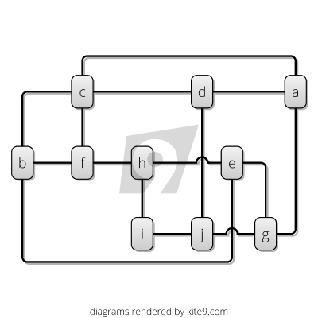

It has 10 vertices, labelled **a** to **j**, and it has 15 edges (or links) connecting the vertices together.  If any single edge were removed from this diagram, the 10 vertices would still be linked together.   Because of this, we can say that the graph is _2-connected_.   That is, to disconnect any single vertex, you'd have to remove _at least_ two edges.

Let's remove some of those extra links:

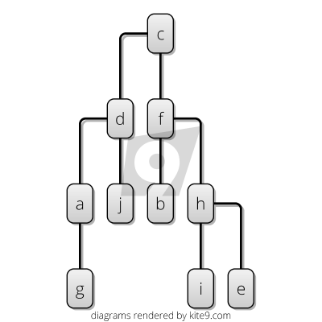

In this graph, I've removed 6 of the edges.  Now, we're in a situation where if any single edge is removed, the graph becomes _unconnected_.  That is, it's broken into distinct chunks.  So, it's _1-connected_.

Also, it's I've arranged it as a hierarchy, which I can do now that it's only 1-connected.  For 10 vertices, we need 9 edges to connect everything up: it's always:

```
  edges = vertices - 1
```

Note that I could pick any hierarchy here:  I don't have to start at **c** (although it has the nice property that it has two roughly even sub-trees attached to it).

### Space and Time Complexity

So far, we've looked at a couple of definitions of complexity in terms of the _structure_ of software.  However, in Computer Science there is a whole branch of complexity theory devoted to how the software _runs_, namely [Big O Complexity](https://en.wikipedia.org/wiki/Big_O_notation).  

Once running, an algorithm or data structure will consume space or runtime dependent on it's characteristics.  As with Garbage Collectors, these characteristics can introduce [Performance Risk](Production-Risk) which can easily catch out the unwary.  By and large, using off-the-shelf components helps, but you still need to know their performance characteristics. 

The [Big O Cheatsheet](http://bigocheatsheet.com) is a wonderful resource to investigate this further.  

A third measure of complexity.  ( Start calling these out).

Depth-first search complexity with N and E.

## Hierarchies and Modularization

How does this help us?   Imagine if **a** - **j** were modules of a software system, and the edges of the graph showed communications between the different sub-systems.  In the first graph, we're in a worse position:  who's in charge?  What deals with what?  Can I isolate a component and change it safely?  What happens if one component disappears?  But, in the second graph, it's easier to reason about, because of the reduced number of connections and the new heirarchy of organisation.  

On the downside, perhaps our messages have farther to go now:  in the original **i** could send a message straight to **j**, but now we have to go all the way via **c**.   But this is the basis of [Modularization](https://en.wikipedia.org/wiki/Modular_programming) and [Hierarchy](https://en.wikipedia.org/wiki/Hierarchy).

As a tool to battle complexity, we don't just see this in software, but everywhere in our lives and in nature too:  
 - **Organelles** - such as [Mitochondria](https://en.wikipedia.org/wiki/Mitochondrion).
 - **Cells** - such as blood cells, nerve cells, skin cells in the [Human Body](https://en.wikipedia.org/wiki/List_of_distinct_cell_types_in_the_adult_human_body).
 - **Organs** - like hearts livers, brains etc.
 - **Organisms** - like you and me.
 
## Depth-First Complexity

tbd.  bring in stuff about algorithmic complexity here. 
 
## Cyclomatic Complexity

It would be nice to be able to measure, somehow, the complexity of our graphs in order to say how much simpler our second graph is.  

In Computer Science, we can measure this property as [Cyclomatic Complexity](https://en.wikipedia.org/wiki/Cyclomatic_complexity).  This is:

```
Cyclomatic Complexity = edges − vertices + 2P,
```

Where **P** is the number of **Connected Components** (i.e. distinct parts of the graph that aren't connected to one another by any edges).

So, our first graph had a **Cyclomatic Complexity** of 7. `(15 - 10 + 2)`, while our second was 1. `(9 - 10 + 2)`.

## Abstraction

Although we ended up with our second graph having a **Cyclomatic Complexity** of 1 (the minimum), we can go further through abstraction, because this representation isn't minimal from a **Kolmogorov Complexity** point-of-view.  For example, we might observe that there are further similarities in the graph that we can "draw out":

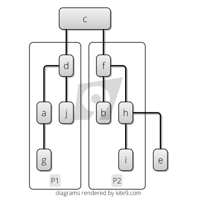

Here, we've spotted that the structure of subgraphs **P1** and **P2** are the same:  we can have the same functions there to assemble those.  Noticing and exploiting patterns of repetition is one of the fundamental tools we have in the fight against complexity, and our programming languages support this through [Abstraction](https://en.wikipedia.org/wiki/Abstraction_(software_engineering)).

## Complexity As Mass / Inertia

So, we've looked at some measures of software structure complexity, in order that we can say "this is more complex than this".  However, we've not really said why complexity entails [Risk](Risk).  So let's address that now by looking at two analogies, **Inertia** and **Technical Debt**.  

The first way to look at complexity is as **Inertia** or **Mass**:  a software project with more complexity has greater **Inertia** or **Mass** than one with less complexity.

Newton's Second Law states:

> F = _m_**a**,    ( Force = Mass x Acceleration )

That is, in order to move your project _somewhere new_, and make it do new things, you need to give it a push, and the more **Mass** it has, the more **Force** you'll need to move (accelerate) it.  

**Inertia** and **Mass** are equivalent concepts in physics:

> "mass is the quantitative or numerical measure of a body’s inertia, that is of its resistance to being accelerated".  - [Inertia, _Wikipedia_](https://en.wikipedia.org/wiki/Inertia#Mass_and_inertia)

You could stop here and say that the more lines of code a project contains, the higher it's mass.  And, that makes sense, because in order to get it to do something new, you're likely to need to change more lines.  

But there is actually some underlying sense in which _this is real_, as discussed in this [Veritasium](https://www.youtube.com/user/1veritasium) video:

[](https://www.youtube.com/watch?annotation_id=annotation_3771848421&feature=iv&src_vid=Xo232kyTsO0&v=Ztc6QPNUqls)

To paraphrase:

> "Most of your mass you owe due to E=mc², you owe to the fact that your mass is packed with energy, because of the interactions between these quarks and gluon fluctuations in the gluon field... what we think of as ordinarily empty space... that turns out to be the thing that gives us most of our mass." - [Veritasium](https://www.youtube.com/watch?annotation_id=annotation_3771848421&feature=iv&src_vid=Xo232kyTsO0&v=Ztc6QPNUqls)

I'm not an expert in physics, _at all_, and so there is every chance that I am pushing this analogy too hard.  But, substituting quarks and gluons for pieces of software we can (in a very handwaving-y way) say that more complex software has more _interactions_ going on, and therefore has more mass than simple software. 

The reason I am labouring this analogy is to try and make the point that **Complexity Risk** is really as fundamental as [Feature Risk](Feature-Risk) or [Schedule Risk](Schedule-Risk):

 - [Feature Risk](Feature-Risk):  like **money**.
 - [Schedule Risk](Schedule-Risk): like **time**.
 - [Complexity Risk](Complexity-Risk): like **mass**.
 
At a basic level, **Complexity Risk** heavily impacts on [Schedule Risk](Schedule-Risk):  more complexity means you need more force to get things done, which takes longer.

## Technical Debt

The most common way we talk about unnecessary complexity in software is as **Technical Debt**:

> "Shipping first time code is like going into debt. A little debt speeds development so long as it is paid back promptly with a rewrite... The danger occurs when the debt is not repaid. Every minute spent on not-quite-right code counts as interest on that debt. Entire engineering organizations can be brought to a stand-still under the debt load of an unconsolidated implementation, object-oriented or otherwise." -- [Ward Cunningham, 1992](https://en.wikipedia.org/wiki/Technical_debt)

Building a perfectly-architected first-time solution is a waste, because you're going to take longer to mitigate the [Conceptual Integrity Risk](Feature-Risk) than you would if you put together a quick-and-dirty, complex first pass.  You're taking on more attendant [Schedule Risk](Schedule-Risk) than necessary and [Meeting Reality](Meeting-Reality) more slowly than you could.

Building a first-time, quick-and-dirty, over-complex implementation mitigates the same [Conceptual Integrity Risk](Feature-Risk) and allows you to put things in front of users to [Meet Reality](Meeting-Reality) as fast as possible (see [Prototyping](Coding)).  

But, having mitigated that risk, though, you are now carrying more **Complexity Risk** than you necessarily need, and it's time to think about how to [Refactor](Coding) the software to reduce this risk again.

## Kitchen Analogy

It’s often hard to make the case for minimising technical debt: it often feels that there are more important priorities, especially when technical debt can be “swept under the carpet” and forgotten about until later.  

One helpful analogy I have found is to suggest your code-base is a kitchen.   After preparing a meal (i.e. delivering the first implementation), _you need to tidy up the kitchen_.  This is just something everyone does as a matter of _basic sanitation_.

Now of course, you could carry on with the messy kitchen.  When tomorrow comes and you need to make another meal, you find yourself needing to wash up saucepans as you go, or working around the mess by using different surfaces to chop on.  

It's not long before someone comes down with food poisoning.   

We wouldn't tolerate this behaviour in a restaurant kitchen, so why put up with it in a software project?

## Feature Creep Risk

In Brooks' essay "No Silver Bullet – Essence and Accident in Software Engineering", a distinction is made between:

> - **Essence**  _the difficulties inherent in the nature of the software._
> - **Accident**: _those difficulties that attend its production but are not inherent._
>     [- Fred Brooks, _No Silver Bullet_](https://en.wikipedia.org/wiki/No_Silver_Bullet)

The problem with this definition is that we are accepting features of our software as _essential_.  

The **Risk-First** approach is that if you want to mitigate some [Feature Risk](Feature-Risk) then you have to pick up **Complexity Risk** as a result.  But, that's a _choice you get to make_.  

Therefore, [Feature Creep](https://en.wikipedia.org/wiki/Feature_creep) (or [Gold Plating](https://en.wikipedia.org/wiki/Gold_plating_(software_engineering))) is a failure to observe this basic equation:  instead of considering this trade off, you're building every feature possible.  This has an impact on **Complexity Risk**, which in turn impacts [Communication Risk](Communication-Risk) and also [Schedule Risk](Schedule-Risk).

Sometimes, feature-creep happens because either managers feel they need to keep their staff busy, or the staff decide on their own that they need to [keep themselves busy](Agency-Risk).  But now, we can see that basically this boils down to bad risk management.  

> "Perfection is Achieved Not When There Is Nothing More to Add, But When There Is Nothing Left to Take Away" - Antoine de Saint-Exupery

## Dead-End Risk

**Dead-End Risk** is where you build functionality that you _think_ is useful, only to find out later that actually, it was 
a dead-end, and is superceded by something else.

For example, let's say that the Accounting sub-system needed password access (so you built this).  Then the team realised that you needed a way to _change the password_ (so you built that).   Then, that you needed to have more than one user of the Accounting system so they would all need passwords (ok, fine).  

Finally, the team realises that actually logging-in would be something that all the sub-systems would need, and that it had already been implemented more thoroughly by the Approvals sub-system.   

At this point, you realise you're in a **Dead End**:  
 - **Option 1**: You carry on making minor incremental improvements to the accounting password system (carrying the extra **Complexity Risk** of the duplicated functionality).
 - **Option 2**: You rip out the accounting password system, and merge in the Approvals system, surfacing new, hidden **Complexity Risk** in the process, due to the difficulty in migrating users from the old to new way of working.
 - **Option 3**: You start again, trying to take into account both sets of requirements at the same time, again, possibly surfacing new hidden **Complexity Risk** due to the combined approach.
 
Sometimes, the path from your starting point to your goal on the [Risk Landscape](Risk-Landscape) will take you to dead ends:  places where the only way towards your destination is to lose something, and do it again another way.  

This is because you surface new [Hidden Risk](Risk) along the way.  And the source of a lot of this hidden risk will be unexpected **Complexity Risk** in the solutions you choose.  This happens a lot. 

tbd.  split this out into a section.  there's so much more here.

source control mitigates dead end risk a bit, becuase you can go back and chnage things.  mistakes are dead end risk.
backups etc.  help with this.

Is it a known unknown?  You know you might be going the wrong way.

Muneer building the extractor, using ASP.net.. turned out we don't deploy .net/ASP only Java


## The Re-Write

**Option 3**, Rewriting code or a whole project can seem like a way to mitigate **Complexity Risk**, but it usually doesn't work out too well.  As Joel Spolksky says:

> There’s a subtle reason that programmers always want to throw away the code and start over. The reason is that they think the old code is a mess. And here is the interesting observation: they are probably wrong. The reason that they think the old code is a mess is because of a cardinal, fundamental law of programming:  
> _It’s harder to read code than to write it._    - [Joel Spolsky](https://www.joelonsoftware.com/2000/04/06/things-you-should-never-do-part-i/)

The problem that Joel is outlining here is that the developer mistakes [Communication Risk](Communication-Risk) for unnecessary **Complexity Risk**.  Also, perhaps there is [Agency Risk](Agency-Risk) because the developer is doing something that is more useful to him than the project.  

But (generally speaking), **Dead-End Risk** isn't caused by **Complexity Risk**, it's caused by [Conceptual Integrity Risk](Feature-Risk): if you've ended up in a dead-end because of **Complexity Risk**, the solution is much more likely to be to take **Option 2** and [Refactor out of it](Coding).

## Where Complexity Hides

Complexity isn't spread evenly within a software project.  Some problems, some areas, have more than their fair share of issues.   We're going to cover a few of these now, but be warned, this is not a complete list by any means:

 - Memory Management
 - Protocols / Types
 - Algorithmic (Space and Time) Complexity
 - Concurrency / Mutability
 - Networks / Security

### Memory Management

Memory Management is another place where **Complexity Risk** hides:

> "Memory leaks are a common error in programming, especially when using languages that have no built in automatic garbage collection, such as C and C++." - [Memory Leak, _Wikipedia_](https://en.wikipedia.org/wiki/Memory_leak)

Garbage Collectors (as found in Javascript or Java) offer you the deal that they will mitigate the [Complexity Risk](Complexity-Risk) of you having to manage your own memory, but in return perhaps give you fewer guarantees about the _performance_ of your software.  Again, there are times when you can't accommodate this [Performance Risk](Production-Risk), but these are rare and usually only affect a small portion of an entire software-system.  
 
 
### Protocols / Types

tbd - this is a [Boundary Risk](Boundary-Risk)  Although we discuss this hard in Communication Risk/Protocol Risk

Whenever two components of a software system need to interact, they have to establish a protocol for doing so.  There are lots of different ways this can work, but the simplest example I can think of is where some component **a** calls some function **b**.  e.g: 

```javascript
function b(a, b, c) {
    return "whatever" // do something here.
}

function a() {
	var bOut = b("one", "two", "three");
	return "something "+bOut;	
}
```

If component **b** then changes in some backwards-incompatible way, say:

```javascript
function b(a, b, c, d /* new parameter */) {
    return "whatever" // do something here.
}
```

Then, we can say that the protocol has changed.  This problem is so common, so endemic to computing that we've had compilers that check function arguments [since the 1960's](https://en.wikipedia.org/wiki/Compiler).  The point being is that it's totally possible for the compiler to warn you about when a protocol within the program has changed.  

The same is basically true of [Data Types](https://en.wikipedia.org/wiki/Data_type):  whenever we change the **Data Type**, we need to correct the usages of that type.  Note above, I've given the `javascript` example, but I'm going to switch to `typescript` now:

```typescript
interface BInput {
    a: string,
    b: string, 
    c: string,
    d: string
}

function b(in: BInput): string {
    return "whatever" // do something here.
}
```

Now, of course, there is a tradeoff:  we _mitigate_ [Complexity Risk](Complexity-Risk), because we define the protocols / types _once only_ in the program, and ensure that usages all match the specification.  But the tradeoff is (as we can see in the `typescript` code) more _finger-typing_, which some people argue counts as [Schedule Risk](Schedule-Risk).  

Nevertheless, compilers and type-checking are so prevalent in software that clearly, you have to accept that in most cases, the trade-off has been worth it: Even languages like [Clojure](https://clojure.org) have been retro-fitted with [type checkers](https://github.com/clojure/core.typed/wiki/User-Guide).

tbd.  languages are their own worlds

### Concurrency / Mutability

Although modern languages include plenty of concurrency primitives, (such as the [java.util.concurrent](https://docs.oracle.com/javase/9/docs/api/java/util/concurrent/package-summary.html) libraries), concurrency is _still_ hard to get right.  

[Race conditions](https://en.wikipedia.org/wiki/Race_condition) and [Deadlocks](https://en.wikipedia.org/wiki/Deadlock) _thrive_ in over-complicated concurrency designs:  complexity issues are magnified by concurrency concerns, and are also hard to test and debug.  

Recently, languages such as [Clojure](https://clojure.org) have introduced [persistent collections](https://en.wikipedia.org/wiki/Persistent_data_structure) to circumvent concurrency issues.  The basic premise is that any time you want to _change_ the contents of a collection, you get given back a _new collection_.  So, any collection instance is immutable once created.   

The tradeoff is again attendant [Performance Risk](Production-Risk) to mitigate **Complexity Risk**.
 
### Networking / Security

The last area I want to touch on here is networking.  There are plenty of **Complexity Risk** perils in _anything_ to do with networked code, chief amongst them being error handling and (again) protocol evolution.  

In the case of security considerations, exploits _thrive_ on the complexity of your code, and the weaknesses that occur because of it.  In particular, Schneier's Law says, never implement your own crypto scheme:

> "Anyone, from the most clueless amateur to the best cryptographer, can create an algorithm that he himself can't break. It's not even hard. What is hard is creating an algorithm that no one else can break, even after years of analysis." - [Bruce Schneier, 1998](https://en.wikipedia.org/wiki/Bruce_Schneier#Cryptography) 

Luckily, most good languages include crypto libraries that you can include to mitigate these **Complexity Risks** from your own code-base.  

This is a strong argument for the use of libraries.  

But, when should you use a library and when should you implement yourself?  This is the subject of [Dependency Risk](Dependency-Risk) which we will look at next.


WE NEED TO TALK ABOUT ALTERNATIVES, AND COMBINATION EXPLOSION

Let's say you have two ways to do X (x1,x2), and two ways to do Y (y1, y2).  But there are incompatbilities.  There are 6 ways to use the system, and it breaks down like this:

|     |x1   |x2   |
|-----|-----|-----|
|y1   |1    |2, 3 |
|y2   |4, 5 |6    |
|-----|-----|-----|

Both x1, and x2 are used 3 times each.  Both y1 and y2 are used 3 times each.


What would our running software need to tell us for this to happen?

Containment

Organising at higher levels than object.

Part of the problem might be that we don’t really have programming language abstractions that properly include containment.  

Does containment actually exist?  It makes sense to me to say that some software is running inside a JVM on a particular box.  And that the JVM process is contained on that box.  There seems to be a hierarchy of containment here, much like you’d get with geneos.  

Principle Of Locality

Networks and computers break locality. They allow anything to happen anywhere.  But, the human brain (and possibly the universe as a whole) are founded on this principle.  So, abstracting it away means that it becomes an unknowable quantity.  And, lack of observability might follow from this.

Common Taxonomy

This is something you see in the TOM:  the desire to end up with a single way of describing features.  Essentially, we really need a database that explains our software processes.  Building the model of the processes is basically building a database.  But, is there a fixed schema for this, or do you let people figure it out as they go?

schema: could also refer to an XML schema, which obviously, is also a database format.  What happened to XML databases, anyway?

What would this even mean?

Programming languages fail us because they encourage us to build software that is unknowable.  Could we invent a language that fixes this problem?

In the same way as we made Java a language without memory leaks, could we make a language for describing software in a way that makes it eminently knowable?

So far, I have not come across anything that does this.  But that doesn’t mean it’s impossible - just that it hasn’t even been attempted before.


\newpage
# Dependency Risk
**Dependency Risk** is the risk you take on whenever you have a dependency on something else.   One simple example could be that the software service you write might depend on a server to run on.  If the server goes down, the service goes down too.  In turn, the server depends on electricity from a supplier, as well as a network connection from a provider.  If either of these dependencies aren't met, the service is out of commission.

Dependencies can be on _events_, _people_, _teams_, _software_, _services_  and so on.   Dependencies add risk to any project because the reliability of the project itself is now a function involving the reliability of the dependency.  

## Reliability

Reliability of an overall system is constrained by the reliability

## Events 

The simplest type of **Dependency Risk** is around events.   For example, "I can't start shopping until the supermarket opens at 9am", or "I must catch my bus to work at 7:30am".  In the first example, you can't _start_ something until a particular event happens.  In the latter example, you must _be ready_ for an event at a particular time.

When we have a dependency on an event, we depend on the reliability of that event occurring when it says it will occur.  We pick up [Schedule Risk](Schedule-Risk) when it doesn't.  

Both of these types of risk can be mitigated with _slack_.  That is, ensuring that the exact time of the event isn't critical to your plans:   Don't build into your plans a _need_ to start shopping at 9am.  Arrive at the bus-stop _early_ in order to mitigate your own [Schedule Risk](Schedule-Risk). 

[Schedule Risk](Schedule-Risk) becomes very hard to manage when you have to coordinate actions  with lots of tightly-constrained events.  Rehearsal?

Sometimes, events are a mitigation for [Coordination Risk](Coordination-Risk).   Having a fixed time for doing something mitigates [Coordination Risk](Coordination-Risk) by turning it into [Schedule Risk](Schedule-Risk).  Agreeing a date for a product launch, for example, allows lots of teams to coordinate their activities.  


## People and Teams

Often, events are outside of our control, and we just have to plan around them.  But usually events occur at certain times because people have chosen them to, in order to manage [Coordination Risk](Coordination-Risk).


## Dependencies On Libraries

In the previous section on [Codebase Risk](Complexity-Risk) we tackled Kolmogorov Complexity, and the idea that your codebase had some kind of minimal level of complexity based on the output it was trying to create.  This is a neat idea, but in a way, we cheated.  Let's look at how.

We were trying to figure out the shortest (Javascript) program to generate this output:

```
abcdabcdabcdabcdabcdabcdabcdabcdabcdabcd
```

And we came up with this:

```javascript
const ABCD="ABCD";                                           (11 symbols)

function out() {                                             (7 symbols)
    return ABCD.repeat(10)                                   (7 symbols)
}                                                            (1 symbol)
```

Which had **26** symbols in it.  

Now, here's the cheat:  The `repeat()` function was built into Javascript in 2015 in [ECMAScript 6.0](http://www.ecma-international.org/ecma-262/6.0/).  If we'd had to program it ourselves, we might have added this:

```javascript
function repeat(s,n) {                                       (10 symbols)
    var a=[];                                                (7 symbols)
    while(a.length<n){                                       (9 symbols)  
        a.push(s)                                            (6 symbols)
    }                                                        (1 symbol)
    return a.join('');                                       (10 symbols)
}                                                            (1 symbol)
```
... which would be an extra **44** symbols (in total **70**), and push us completely over the original string encoding of **53** symbols.   So, encoding language is important.   

Conversely, if ECMAScript 6.0 had introduced a function called `abcdRepeater(n)` we'd have been able to do this:

```javascript
function out() {                                             (7 symbols)
    return abcdRepeater(10)                                  (6 symbols)
}                                                            (1 symbol)
``` 

.. and re-encode to **14** symbols.  Now, clearly there are some problems with all this:

1.  Clearly, _language matters_:  the Kolmogorov complexity is dependent on the language, and the features the language has built in.  
2.  The exact Kolmogorov complexity is uncomputable anyway.  It's just a fairly abstract idea, so we shouldn't get too hung up on this.  There is no function to be able to say, "what's the Kolmogorov complexity of string X"
3.  What is this new library function we've created?   Is `abcdRepeater` going to be part of _every_ Javascript?  If so, then we've shifted [Codebase Risk](Complexity-Risk) away from ourselves, but we've pushed [Communication Risk](Communication-Risk) and [Dependency Risk](Dependency-Risk) onto every _other_ user of Javascript.
4.  Are there equivalent functions for every single other string?  If so, then compilation is no longer a tractable problem: is `return abcdRepeater(10)` correct code?  Well, now we have an infinite list of different `XXXRepeater` functions to check against to see if it is...  So, what we _lose_ in [Kolmogorov Complexity](Complexity-Risk) we gain in [Big-O Complexity](Complexity-Risk).  

tbd.  something fishy here.


## Types Of Dependencies

We're going to consider 3 basic types of dependencies in this section:  
 - **Our own**: write some code ourselves to meet the dependency.
 - **Libraries**:  importing code from the internet, and using it in our project
 - **Services**: calling a service on the internet, (probably via `http`)
 
All 3 approaches involve a different risk-profile.  Initially, writing our own code was the only game in town:  when I started programming with a Commodore 64, you had a user guide, BASIC and that was pretty much it.  Tool support was very thin-on-the-ground.  Even now, there's always the opportunity cost of depending on our own code, which may well be more appropriate and expedient for whatever is required.  

Using library code offers a [Schedule Risk](Schedule-Risk) shortcut:  Consider [npmjs](http://npmjs.com), which is the most popular package manager for the Javascript ecosystem.  It currently boasts of having over 650,000 different libraries, so although we're unlikely to find an `abcdRepeater` function this suggests that we can "win" against Kolmogorov complexity by using them.  But actually, this is really a problem with the metric itself.  

In reality, using libraries allows us a "Kolmogorov tradeoff": our [Codebase Risk](Complexity-Risk) for other kinds of risk instead.

To be fair to Andrey Kolmogorov, who first published on the subject in 1963, reusable libraries were not really a thing back then, or was the Internet, where I can quickly search for a library that serves my purposes.  And sadly, since he died in 1987, he missed out on seeing the concept of "web services" (dependencies served via the Internet).  

For example, there's a service called [Fill Murray](http://www.fillmurray.com) where  can ask for random, sized images of Bill Murray (to use as placeholders for web design purposes, obviously).  

Today, choosing libraries looks like a "bounded rationality"-type process:

> "Bounded rationality is the idea that when individuals make decisions, their rationality is limited by the tractability of the decision problem, the cognitive limitations of their minds, and the time available to make the decision. " - [Bounded Rationality, _Wikipedia_](https://en.wikipedia.org/wiki/Bounded_rationality)

We're going to dig down into some of the risks associated with this, in order to build a model of what this decision making process should involve.

## Types Of Dependency Risk

So, let's look at the different kinds of **Dependency Risk** we meet.  Luckily, we've actually already come across most of this stuff before: there's a lot of overlap between the risks due to dependencies, and the risks we've already seen.   It looks something like this:

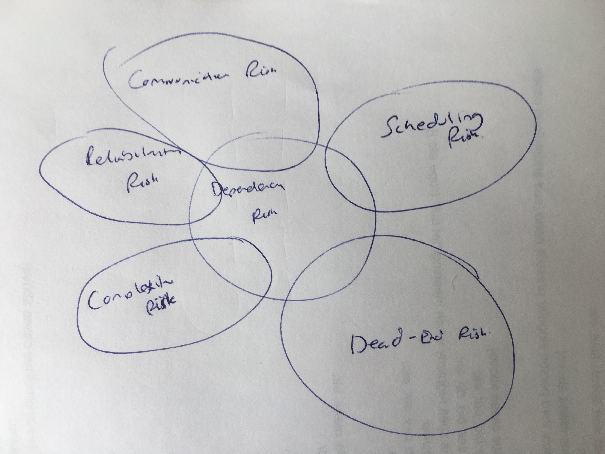

So, we're going to focus on [Dependency Risk] from 5 different perspectives:

 - **Reliability Risk**
 - [Communication Risk](Communication-Risk)
 - [Scheduling Risk](Scheduling-Risk)
 - [Complexity Risk](Complexity-Risk)
 - [Dead-End Risk](Complexity-Risk)
 
**Reliability Risk** is the new one here, so let's look at that first.

### Reliability Risk

 - If a component **A** uses component **B**, unless there is some extra redundancy around **B**, then **A** _can't be more reliable than **B**. 
 
 - Are there bugs in **B** that are going to prevent it working correclty in all circumstances?
 
(This might sound unlikely, but I've made several career decisions off the back of this)

Dependency and reliability

Pinto
https://en.wikipedia.org/wiki/Reliability_engineering

FECMA FEMA https://en.wikipedia.org/wiki/Failure_mode_and_effects_analysis

Diagram of a distributed software system - where can failures hide?

SPOFs.


### Communication Risk

We've already looked at communication risk... tbd.

 - The concept that there is a module **D** which solves my problem isn't something I'd even considered.    
 - I'd like to have a dependency on some module **D**, but I don't even know what to search for.  
 - I'd like to have a dependency on some module **D**, but there are multiple candidates for this dependency, and I don't know the "best" one.
 - Or, I know **D**, but I can't figure out how to solve my problem in it.
 - Or, given that I've chosen **D**, I now need to persuade my team that **D** is the correct solution...
 - ... and then they also need to understand **D** to do their job too.
 
(But:  is understanding **D** more trouble than understanding <yourcode>?)  

I didn't even know I was missing Redux until I'd heard of it.

### Scheduling Risk

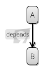

If a component **A** of our project _depends_ on **B** for some kind of processing, you can't really complete **A** before writing **B**.   This makes _scheduling_ the project harder, and if component **A** is a risky part of the project, then the chances are you'll want to mitigate risk there first.  There are a couple of ways to do this:

- **Standards**:  If component **B** is a database, a queue, mail gateway or something else with a standard interface, then you're in luck.   Write **A** to those standards, and find a cheap, simple implementation to test with.  This gives you time to sort out exactly what implementation of **B** you're going for.  This is not a great long-term solution, because obviously, you're not using the _real_ dependency- you might get surprised when the behaviour of the real component is subtly different.  But it can reduce [Schedule Risk](Schedule-Risk) in the short-term.
- **Coding To Interfaces**:  If standards aren't an option, but the surface area of **B** that **A** uses is quite small and obvious, you can write a small interface for it, and work behind that, using a [Mock](https://en.wikipedia.org/wiki/Mock_object) for **B** while you're waiting for finished component.  Write the interface to cover only what **A** _needs_, rather than everything that **B** _does_ in order to minimize the risk of [Leaky Abstractions](https://en.wikipedia.org/wiki/Leaky_abstraction).
- **Do The Homework**:  Accept that **B** is going to bite you and try to make the decision now.  Pick the best 3rd-party component you can find (preferably on a trial basis), whilst being aware that you might get it wrong and need to change later.   Write [Tests](Testing) to alleviate [Communication Risk](Communication-Risk) now, and then to use to evaluate alternatives if need be.
 
### Dead-End Risk

First, when you choose a new component to depend on, you can't be certain that it's going to work out in your favour.  There's [Dead End Risk](Complexity Risk] that you've chosen the wrong thing.  You can mitigate this somewhat by searching resources online like [StackOverflow]() to find other people using the dependency in the same way as you, or alternatively by  [Prototyping](Prototyping) hard in order to uncover as much of the [Hidden Risk](Risk) as possible.

Second, you can't always be sure that a dependency now will always have the same guarantees in the future: 
- **Ownership changes** (e.g. [Oracle](http://oracle.com) buys [Sun](http://sun.com) who own [Java](https://en.wikipedia.org/wiki/Java_%28programming_language%29) for example)
- **Licensing changes**.  (e.g. [Oracle](http://oracle.com) buys **Tangosol** who make [Coherence](https://en.wikipedia.org/wiki/Oracle_Coherence) for example)
- Security updates not applied.
- **Better alternatives become available**:  As a real example of this, I began a project in 2016 using [Apache Solr]().  However, in 2018, I would probably use [ElasticSearch](https://en.wikipedia.org/wiki/Elasticsearch).  In the past, I've built websites using [Drupal]() and then later converted them to use [Wordpress]().

Some predictors:
 

 
 - Or they produce a new version which is incompatible with your old version, forcing you to upgrade?  (libraries, webservices)
 
 - Dependency Change - REST endpoints, etc.   Semantic versioning .  Hickey


### Complexity Risk

I don't know whether a library is actually going to reduce my [Codebase Risk](Complexity-Risk) or make it worse. 

Although 

These stem from  
 
 - Jar hell:  are you bringing in more stuff than is helping you?   Are you really overall decreasing complexity on the project or making it worse?  [Versioning Risk](
 (testing jars vs runtime jars.  how integrated is the jar in question?  Is it everywhere, or is it behind an interface?
 
 - Shipped size complexity - Spring.  Sometimes, you just end up with a ton of jars, even when they don't collide on version numbers. (Kolmogorov Complexity?)

 - Big O Complexity Again (Complexity-Risk)


Example

In a project at work, coming across use of Hazlecast to cache the session IDs.   But, the app is only used once every month, and session IDs can be obtained in milliseconds.   Why cache them?  By doing this, you have introduced extra dependency risk, cache invalidation risks, networking risks, synchronisation risks and so on, for actually no benefit at all.  Unless, it’s CV building.  


Sometimes, the amount of code and complexity _goes up_:  Spring Templates example:  really hard to debug, more code.  But, better?  No chance of injection attacks.


## Choosing And Using A Library

m&t risk, obvs.  but
1.  Is it alive?
2.  Is it open source?
3.  Well trafficked
4.  Namespace
5.  Look at the source
6.  Alternatives available?
7.  Traction (vs. expected traction)


Trying things out usually has a low Dead end Risk vs coding yourself, and you can usually try several

- number of dependencies it has

Write as little code as possible.


-- we don't use bounded rationality.


how to choose libraries

-- the dependency you already have (e.g. spring)

## Choosing Libraries

- 3rd party contractors

dependencies between teams
 
dependencies between modules

gantt charts


Silo thinking 


counterparty risk
insurance


dependency ijection - invisibile dependencies

reliability risk
\newpage
# Boundary Risk
**Boundary Risk** is an emergent risk, which exists at the intersection of [Complexity Risk](Complexity-Risk), [Dependency Risk](Dependency-Risk) and [Communication Protocol Risk](Communication-Risk).  Because of that, it's going to take a bit of time to pick it apart and understand it, so we're going to build up to this in stages.

## Hand Tools

Have a look at some physical tools, like a hammer, or spanner.  To look at them, they are probably _simple_ objects, obvious, strong and dependable.  Their entire behaviour is encapsulated in their form.  Now, if you have a drill or sander to hand, look at the design of this too.  From the outside, it is simple, perhaps with only one or two controls.  Inside, it is complex and contains a motor, perhaps a transformer, and is maybe made of a hundred different components.

But outside, the form is simple, and designed for humans to use.   This is [ergonomics]:

tbd

## Software Tools

Software is not constrained by physical ergonomics in the same way as a tool is.  But ideally, it should have conceptual ergonomics:  ideally, complexity is hidden away from the user.  This is the familiar concept of [Abstraction] we've already looked at.  

That is, the tool should be as simple to use and understand as possible.  This is the **Principal Of Least Surprise**:

tbd.

In the same way as with a hand-tool, the bulk of the complexity of a software tool is hidden behind it's abstraction (or interface).  But, the more complex the _purpose_ of the tool, the more complex the interface will be.

The interface of a system expands when you ask it to do a wide variety of things.   A drill does one thing well: it turns drill-bits at useful levels of torque for drilling holes and sinking screws.  But if you wanted it to also operate as a lathe, a sander or a strimmer (all basically mechanical things going round) you would have to sacrifice the ergonomic simplicity for a more complex interface, probably including adapters, extensions, handles and so on.

So, we now have two types of complexity:
 - The inner complexity of the tool (how it works internally).
 - The complexity of the interface that we use.
 
We care about the former from the perspective of minimizing [Complexity Risk](Complexity-Risk) in our own codebase.  However, we care about the latter when we are using someone else's code as a [Dependency](Dependency-Risk) in our project.
 
## Integration And Translation

If we are going to use a software tool as a dependency, we have to use it's [API]():

tbd

Essentially, the API is a [protocol](Communication-Risk):  it's the language that the tool understands.  If you want to work with it, you have to use it's protocol, it won't come to you.   This is where **Boundary Risk** really starts.

Let's take a look at a hypothetical project structure:

tbd.

In this design, we have included 3 dependencies, `a`, `b`, `c`.  As you can see, `Our Code` is orchestrating the flow of information between them:
 - First, it receives something from `a`, using the [Protocol] of `a`.
 - Then, it **Translates** this into the [Protocol] of `b`, retrieving something back from `b`.
 - Then, it **Translates** that into the [Protocol] of `c`.
 
You could say we are doing **Integration** of the different dependencies, or **Translation** between those dependencies.  Since we are talking about **Translation**, we are clearly talking about [Communication Risk](Communication-Risk) again:  our task in **Integrating** all of these components is _to get them to talk to each other_.

From a [Cyclomatic Complexity] point of view, this is a very simple structure, with low [Complexity Risk](Complexity-Risk).  But each of these systems presents us with **Boundary Risk**, because we don't know that we'll be able to make them _talk to each other_ properly:
 - Maybe `a` outputs dates, in a strange calendar format that `b` won't understand.
 - Maybe `b` works on some streaming API basis, that is incompatible with `a`.
 - Maybe `c` runs on Windows, whereas `a` and `b` run on Linux.

## Boundary Risk Defined

Wherever we integrate complex dependencies, we have **Boundary Risk**.  The more complex the systems being integrated, the higher the risk.  When we choose software tools or libraries to help us build our systems, we are trading [Complexity Risk](Complexity-Risk) for **Boundary Risk**.  

We can mitigate attendant **Boundary Risk** by trying to choose the simplest dependencies for any job, and also the smallest number of dependencies.  Let's look at some examples:

- `mkdirp` is an `npm` module defining a single function.  This function takes a single string parameter and recursively creating directories.  Because the [protocol](Communication-Risk) is so simple, there is almost no **Boundary Risk**.
- Using a database with a standard JDBC driver comes with _some_ **Boundary Risk**:  but the boundary is specified by a standard.  Although the standard doesn't cover every aspect of the behaviour of the database, it does minimize risk, because if you are familiar with one JDBC driver, you'll be familiar with them all, and swapping one for another is relatively easy.
- Using a framework like [Spring](), [Redux]() or [Angular]() comes with higher boundary risk:  you are expected to yield to the framework's way of behaving throughout your application.  You cannot separate the concern easily, and swapping out the framework for another is likely to leave you with a whole new set of assumptions and interfaces to deal with.

So **Boundary Risk** is the attendant [Complexity](Complexity-Risk) required to integrate [Dependencies](Dependency-Risk).  Let's look at some examples.

## Examples

### Drupal and WordPress

On the face of it, [WordPress] and [Drupal] should be very similar:
 - They are both [Content Management Systems]
 - They both use a [LAMP (Linux, Apache, MySql, PHP) Stack]
 - They were both started around the same time.
 - They are both Open-Source, and have a wide variety of plugins.

However, in practice, they are very different.  This could be put down to different _design goals_:  it seems that [WordPress] was focused much more on usability, and an easy learning curve, whereas [Drupal] supported plugins for building things with complex data formats.  It could also be down to the _design decisions_:  although they both support [Plugins], they do it in very different ways.  

Alternatively, I could have picked on Team City and Jenkins here, or Maven and Gradle.  In all cases, the choice of plugins I have is dependent on the platform I've chosen, despite the fact that the platforms are solving pretty much the same problem.  If I want to 

This is a crucial determinant of **Boundary Risk**:  given the same problems, people will approach them and solve them in different ways.  And, this will impact the 'shape' of the abstractions, and the APIs that you end up with.  **Boundary Risk** emerges from the solution, as the solution gets more complex and opinionated.

In all these cases, 

Nowadays, the [WordPress] user base is huge:  approximately tbd 30% of all websites are hosted with [WordPress].  For [Drupal] it's tbd.  Because [WordPress] is so popular, it has attracted an [ecosystem] of plugin developers, who have bent the platform to more purposes, and expanded the boundary of it's functionality.  The [WordPress] APIs are now much more complex than they were originally, in order to support this vast ecosystem of plugins.

### Java 

When a tool or platform is popular, it is under pressure to increase in complexity.  This is because people are attracted to something useful, and want to extend it to new purposes.  This is known as _The Peter Principle_:  

 (the Peter Principle tbd).  
 
Java is a very popular platform.  Let's look at how the number of public classes (a good proxy for the boundary) has increased with each release:


Why does this happen?  
 - More and more people are using Java for more and more things.  It's popularity begets more popularity.  
 - Human needs are _fractal_ in complexity.  You can always find ways to make an API _better_.
 - There is [Red Queen Risk](Feature-Risk):  our requirements evolve with time.   [Android Apps] weren't even a thing when Java 3 came out, for example, yet they are all written with this.  
 - The art of good design is to afford the greatest increase in functionality with the smallest increase in boundary possible, and this usually means [Refactoring](Coding).  But, this is at odds with [Backward Compatibility](Communication-Risk)

Each new version has a larger boundary than the one before, and this increases the API [Complexity Risk](Complexity-Risk) as there is more functionality to deal with.  But, on the plus side, this increased **Boundary Risk** is offset by the decrease in the [Complexity Risk] in programs depending on it:  all that extra functionality should mean you have less code to write, right?


Encapsulation is the main


## Boundary-Crossing

Sometimes, technology comes along that allows us to cross boundaries effectivey, and there are a number of ways that this can happen:

### [ASCII]

[ASCII] fixed the different-character-sets boundary risk by being a standard that others could adopt.   [UTF] continues this work to ensure we don't have to worry about **Translation** from one encoding to another.  This mitigates **Boundary Risk** by standards.

### Maven / Semver

Maven is a Java build tool in which you can specify a project declaratively, including details of all its dependencies.   Maven will then manage the downloading of these dependencies at compile time.   [Semantic Versioning] is a technique for ameliorating the problems of different dependencies being on different version numbers.

### C

The C programming language provided a way to get the same programs compiled against different architectures, therefore providing some _portability_ to code.  This essentially reduced the **Boundary Risk** of the system architectures (although this was a leaky abstraction)

### Java

Java provided something similar to C: instead of a _compile anywhere_ ethos, it was a _run anywhere_ ethos.  Java code could run anywhere where there was a [Java Virtual Machine] installed.   Again, this _abstracted_ away the details of the lower level architecture.

### Microservices

Microservices:  using HTTP as the boundary.


### Virtualization / Docker


## Complex Boundaries


.   - many of the concepts are the same, but it's a nightmare to map between the two.

However, sometimes, tech comes along to bridge the gap: C, Java, Containerization (Docker)

Vendor Lock-In

Trying to create a complex, fractal surface.  User requirements are fractal in nature.


Executable Boundary Risk


- protocols issue - this is boundary risk too.


Add configuration risk

Should this be called contextual risk?

deployment risk

long command line

Testing in Production

platforms - compiling code for different platofrms, the jvm.  javascript, other languages

protocol risk


One of the ways to sort boundary risk is with abstraction, but this doesn't work with languages - is the surface of a langauge too large?

- some languages compile back ot javascript

C# and Java, for example.

They deliberately are different in order to accentuate boundary risk/

Boundary risk moves on. e.g. the JVM abstracted away _platform_.  IP protocol abstracted away a lot of different network types.

we used to worry about disks, and file formats and even ASCII wasn't a common format, everyone used something different.

Now, the boundary is AWS/Azuretc .  Databases are still different _a bit_, but you're foolish for using the weird features.  Tom's argument
for using Oracle  features.

Should I abstract away a technology?  Does this gain anything


Boundary risk - filesystems and databases.

SQL, Linux, Java, Bash, Servlets, Junit, Gradle, Maven, Team City, HTML, CSS, Browsers, Javascript, SVN, GIT..

Why this?

It's like a fitness landscape.  We're evolving 

Evolution of dependencies

Red Queen Risk again

boundary risk is also like dead-end risk.. consider the point from the risk landscape

But originally, boundary risk referred to the fact that the boundaries were around the software.  

this kind of made sense: running on your pc would be different than running on an xbox, linode etc.


So what exactly is boundary risk?

The incompatibilities of different worlds... that can't be spanned.

phantomjs / chrome headless etc.

the boundary can be too complex to overcome

java/scala

Sometimes the boundary is simple, other times complex
sometimes its complexity is hidden

Clojure can interop with Java because the complexity of the boundary is _simple_:  all that needs to be provided is a way to call methods on java
objects and get return values.

Scala and Java have a complex relationship because Scala creates it's own complex boundary, and so does Java.  It's _almost_ impossible
for interop here.  Why is one so different from the other?


The boundaries really exist:  building things in a java-only world means less boundary risk
Emacs is entirely written in lisp, and your extensions to it are also lisp.   This means less boundary risk, which in turn makes some 
tasks easier to do


Stuck In the Middle Pattern - Scala / Raj.

machine publishers 


Boundary Risk Defined
 - Exists at confluence of Dependency Risk, Complexity Risk and Protocol Risk
 - 
 - Complexity Of the Abstraction (abstractions still are complex).  
 - Translation and Integration
 - Boundary Risk Defined: boundaries that exist due to the dependencies' requirements.
 - Emergent Boundary Risk (discussion of surface areas)
 
Some Examples
 - Wordpress / Drupal:  boundary around each ecosystem
 - Team City / Jenkins:  
 - Java API Surface Area 
   - C#
 - AWS / Azure Etc. (Vendor Lock-In)
   - How Containerization mitigates boundary risk
   - Tom's Argument for using Oracle features
 
Boundary Risk Mitigated
 - Standards and Common Protocols (JDBC, ASCII, XML, JSON, HTTP (Microservices))
 - New Abstractions (Maven, Languages: C, Java)
 - Translation Services (Docker, Virtualization)
 
Wicked Problems In Boundary Risk
 - Scala (type system)
 - Browser Testing (then, testing generally)
 - Testing Across Boundaries In General
 

- Object relational impedance mismatch

\newpage
# Production Risk


stuff that can go wrong in production

changing stuff in production is harder than changing it in test, as you have to _migrate_.

all the costs of breaking stuff, and damaging the running of the business.


reputation damage
(you only get one chance to make a first impression)


 - You don't know all the ways the software will get used in production.
 - Different browsers, versions of code, accessiblilty.


- CAn you support all the users?  IS there enough kit?  WIll you know?


Upgrades ( tell story of Research upgrade that went wrong because we were upgrading at the same time as an outage)

Production Risk
  Overview: 	
    - Overall definition: anything that can go wrong with the production system.  Loss of data, hacking, poor user experience.
    - In general, meeting reality when there are things at stake.
    - Ideally, move production risks _forward_, and deal with them before they are production.
    - Tension:  you can only make a first impression once, vs.  gilding the lilly, perfectionism.
    - Consider risk.
    - Measuring Impact (affected users, losses in currency etc).
    
  Specifics:
    - Operational Risk:
      - Single points of failure.
        - Poor monitoring, visibility risk meets operational risk (otherwise, it doesn't matter - good example here)
        - Correlation  (need a good example here)
        - Contingency Planning 
        - Disaster Recovery
        - Datacentres (Aws etc)
        - Performance Degradation / Runaway processes
        - Monitoring Tools and Logs
    - Reputational Risk:
      - Support (trade off - promptness vs ability)
    - Security Risk
      - Hacking
      - Denial Of Service 
    - Feedback Loops
       - Bug reports, feedback
       - Quality of feedback
       - Internal Controls
         - Agency Risk meets Production Risk (bad actors, controls)
  


\newpage
# Process Risk
**Process Risk**, as we will see, is the risk you take on whenever you embark on a process.  But what exactly is a process?    

tbd.  definition

In the software development world, and the business world generally, processes usually involve _forms_.  If you're filling out a form (whether on paper or on a computer) then you're involved in a process of some sort, whether an "Account Registration" process, "Loan Application" process or "Consumer Satisfaction Survey" process.  

Later in this section we'll look at 

## The Purpose Of Processes


PLan

Introduction:

 - What are processes?  (Wikipedia definition)
   Processes and Forms: business processes usually involve forms.  (Unless they are real-time) 
 - The Purpose Of Processes.   ( To Mitigate Risk)
	 - Coordination:   Example:  signing up to a mailing list.  Allows you to get the news at the same time as everyone else.  Production Line.
	 - Conformity:  Example:  Applying for a loan.  The company has the same information about you as everyone else.  Building a car.
	 - Risk Avoidance:   By following a process, you absolve yourself of risk.   The process can be to blame for bad outcomes.  (cf. Operational Risk) 
	 - Resource Management:  Ticket Sales, Server provisioning, voting.  Having a process that everyone follows makes things "fair".
	 - Representing Dependency Risk:  A happens before B in the process.  
  - Evolution Of Process
    - Examples
      - Release Process  (par, passwords, builds, sign-offs.. evolve?)
      - 
    - Parkinson's Law / Bureaucratic Risk
  - Definition Of Process Risk:  Where does all this risk end up ?  In the process.	 
     - Human Factors: forgetting, nudging, (cloud as a reaction to human provisioning services)
     - visibility: Go all the way to the end of the process, so you know how long it is.  (signoffs)
     - process mismatch  (Dead End Risk)
    	 
	


  


Example evolution:

1.  Person B in a company starts doing A.  
2.  A is really useful.   B gets busy.  No one cares.
3.  B goes on holiday.  A doesn't get done, and people care.  
4.  Either, B co-opts other people to help, gets given a team (T), or someone else forms a team T containing B to get the job done "properly".
5.  T has control of a scarce resource: A.  However, it needs to supply the company with this resource reliably and responsibly, otherwise there will be problems.  They can't simply sit on the resource and do nothing, but at the same time, letting everyone use it willy-nilly will be both harmful to them if it gets misused, and too much work.  So. T organises bureaucratically, so that there is a controlled process (P) by which A can get done.  Like a cell, they have arranged a protective barrier around themselves, the strength of which depends on the power conferred to them by control of A.  P probably involves filling in a form.
6.  There are abuses of A: people either misuse it, or use it too much.  Poeple do things in the wrong order.
7.  T reacts and sets up sign-off, authorization or monetary barriers around B, increasing the bureauratic load involved in using A.  But, also by requiring these things, they move risk *out of* their team.   (This is the real process happening)
8.  There are further abuses of A:  bureaucratic load increases.
9.  Person C, who has experience working with team T acts as a middleman for customers requiring some variant of A.  They are able to help navigate the bureaucratic process (deal with Visibility Risk).  This is a reaction to [Conceptual Integrity Risk]()

There is a "food chain" around the use of A: people can make a living off "helping" other people use A.

So, what is process risk?   Process risk is the hidden complexity of following any process.  It involves coordination risk, invisibility risk, communication risk, agency risk, but most of all, Hidden risk:  "A" has been thoroughly submerged beneath a layer of bureaucracy, either to protect the organisation from misuse of A, to help in the use of A.

Hold on, but why?  Because A represents a capability, _but_ the capability doesn't exactly match the feature required, so it gets buried in a layeror bureaucracy to protect the organisation from misuse of the feature, and adapt its interface to what the organisation requires.

But, bureaucracy is self-serving too:  by creating the barrier, you take away risk internally, and make it external.  


Is Support A Process?  Is driving a car a process?

In each of these, there is a tight feedback loop, where you are examining instrumentation.  I think you might have a process for dealing with an incident.  Is the rota a process?  It involves coordination.  So, somewhat?

Is driving a car a process?  Yes, I guess, in certain parts.  You have to observe what the road and instruments are telling you and respond accordingly.
  

- There might be systems to monitor


What about a release process?

 - Conformity


Finding problems in the process, fixing it quickly, how to do this.

knowing what a process is - you have to go round it to find out.

- Human error
- auditing process
- process is slow. (.e.g build process)

Does not releasing often enough count as process risk?

Processes used rarely work less well.

Repeatability.

## BUreaucracy Risk
operational risk
guides


.. and also


passwords?

keeping track

bigger the organisation, the more risk that you don't know what's happening outside it


Bureaucracy is self-serving.

- how to manage this? PLan ahead.. expect it to happen.  expect that sign-offs will get bogged down in it.

- understand why it's there 

### See Also

[Map And Territory Risk]
   
  
Process risk and project management.. dependency risk.


\newpage
# Coordination Risk
**Coordination Risk** is the risk that, despite a group of people (or processes) having the same [Goal In Mind]() they can fail to coordinate on a way to meet this goal and end up making things worse.  **Coordination Risk** is embodied in the phrase "Too Many Cooks Spoil The Broth":  more people, opinions or actors often make results worse.

In this section, we're going to work on the assumption that everyone has a common [Goal](), but in reality, people often have their own agendas.  We'll come to that in the section on [Agency Risk](Agency-Risk) later.

## More Communication Risk?

You might think that this is just another type of [Communication Risk](Communication-Risk) problem, and that's often a part of it, but even with synchronized [Internal Models](Internal-Model), coordination risk can occur.  Imagine the example of people all trying to madly leave a burning building.  They all have the same information (the building is on fire).  If they coordinate, and leave in an orderly fashion, they might all get out.  If they don't, and there's a scramble for the door, more people might die.

Alternatively, even with a cluster of stateless server processes, some coordination is required to decide which server processes which request. 

But generally, [Coordination Risk]() occurs most commonly where people have different ideas about how to achieve a goal, and they have different ideas because they have different evaluations of the [Attendant Risk](Risk).  As we saw in the section on [Communication Risk](Communication-Risk), we can only hope to synchronize [Internal Models]() if there are high-bandwidth [Channels]() available for communication.  

## Decision Making

So **Coordination Risk** is worse on projects with more members, and worse in organizations with more staff.  If you are engaged in a solo project, do you suffer from **Coordination Risk** at all?  Maybe:  sometimes, you can feel "conflicted" about the best way to solve a problem.  And weirdly, usually _not thinking about it_ helps.  Sleeping too.  (Rich Hickey calls this "[Hammock Based Development]()").  This is probably because, unbeknownst to you, your subconscious is furiously communicating internally, trying to resolve these conflicts itself, and will let you know when it's come to a resolution.  

So, **Coordination Risk** is at it's core about resolving [Internal Model]() conflicts, and arriving at consensus.

[Vroom and Yetton]() introduced a model of group decision making which looks something like this:

!image tbd

On the left, you have the _least_ consultative styles, and on the right, the _most_.   On the left, decisions are made with just the leader's [Internal Model]() but moving right, the [Internal Models]() of the rest of the team are increasingly brought into play.  

The decisions on the left are faster, but don't do much for mitigating **Coordination Risk**.  The ones on the right take longer, (incurring [Schedule Risk](Schedule-Risk)) but mitigate more **Coordination Risk**.   Group decision-making inevitably involves everyone _learning_, and improving their [Internal Models]().

The trick is to be able to tell which approach is suitable at which time.   Everyone is expected to make decisions _within their realm of expertise_: you can't have developers continually calling meetings to discuss whether they should be using an [Abstract Factory]() or a [Factory Method], this would waste time.  The critical question is therefore, "what's the biggest risk?"
 - Is the **Coordination Risk** greater?   Are we going to suffer [Dead End Risk](Complexity-Risk) if the decision is made wrongly?  What if people don't agree with it?  Poor leadership has an impact on [Morale](Agency-Risk) too.
 - Is the **Schedule Risk** greater?  If you have a 1-hour meeting with eight people to decide a decision, that's _one man day_ gone right there:  group decision making is _expensive_.
 
### With Processes 
 
Almost the same model can be used with software processes.  
 
tbd:  use bitcoin as an example here. 

## Specialization / Abstraction Risk

One common way groups and larger organizations aim to mitigate **Coordination Risk** is via [Abstraction](Communication-Risk):  teams and organizations can be arranged along functional lines, with _interfaces_ between their different parts.  This means the different functions can _use_ each other without _understanding_ each other.  

On a team level, this might mean that you have one developer doing "UI", another working on "billing" and so on.  In a larger organisation you might have a "marketing" team or "accounts" team, or divisions by product.

As we saw before [Abstraction brings it's own risks](Communication-Risk).  A key one being that if team members are specialized, you can end up with "bottlenecks" in an organisation (see [Critical Chain](Analysis)).  This is covered in more detail in the [Dependency Risk](Dependency-Risk) section.

Bottlenecks in one part of a team mean that other members will be under-utilised.  This is the trade-off between **Fungibility** (people are jack-of-all-trades) and **Specialization** (people understand one small area well).   Specialism pays off except in highly dynamic situations, where it becomes necessary for people to re-skill, with attendant [Learning Curve Risk](Communication-Risk).  But software is _often_ highly dynamic:  [Extreme Programming]() avoids specialization with it's insistence on [Pair Programming](), for example.

Specialization is a type of complexity too:  a homogeneous team of people presents fewer [Scheduling](Schedule-Risk) problems, and 

Another advantage to specialization is that people have domains of responsibility, which makes the **Decision Making** approach easier to choose.   Individuals and teams generally know when a decision can't be made at their level, and that they need to escalate. 

## Staff Risk

If **Coordination Risk** is about trying to mitigate differences in [Internal Models](Internal-Model), then it's worth considering how varied people's models can be:
 - Different skill levels
 - Different experiences
 - Expertise in different areas
 - Preferences
 - Personalities
 
The job of harmonzing this on a project would seem to fall to the team leader, but actually people are self-organising to some extent.  This process is called [Team Development](), after [Tuckman](), and can be encouraged with orthogonal practices such as [Team Building exercises]() (generally, submitting everyone to extreme experiences in order to bond them together).  

With enough communication bandwidth and entente, a team motivated will self-organise code reviews, information exchange and improve their practices.  But **Staff Risks** sometimes cannot be resolved without escalation:

 - People leave, taking their [Internal Models]() and expertise with them [Key Man Risk]().
 - People often require external training, to understand new tools and techniques [Learning-Curve Risk](Communciation-Risk)
 - People can get protective about their knowledge in order to protect their jobs [Agency Risk](Agency-Risk). 
 - Where there are mixed ability levels, senior developers might not help juniors as it "slows them down"
 - People don't get on. 
 
... and so on.

Experiments showed that rather than t


split brain
 
 People change their minds when they have evidence of new information, and quickly forget what they _previously thought_ about things.
 
 geographic risk
 
large organisation risks?
 
\newpage
# Communication Risk
**Communication Risk** is the risk of communication between entities _going wrong_, due to loss or misunderstanding.
Consider this: if we all had identical knowledge, there would be no need to do any communicating at all, and therefore and also no [Communication Risk](Communication-Risk).  

But, people are not all-knowing oracles.  We rely on our _senses_ to improve our [Internal Models](Internal-Model) of the world. There is **Communication Risk** here - we might overlook something vital (like an oncoming truck) or mistake something someone says (like "Don't cut the green wire").  

**Information Risk** isn't just for people; it's fundamental.   Therefore, the computer systems we build share the same flaws and have the same constraints.

## A Model Of Communication

In 1948, Claude Shannon proposed this definition of communication:

> "The fundamental problem of communication is that of reproducing at one point, either exactly or approximately, a message selected at another point." - [A Mathematical Theory Of Communication, _Claude Shannon_](https://en.wikipedia.org/wiki/A_Mathematical_Theory_of_Communication)

And from this same paper, we get the following (slightly adapted) model:

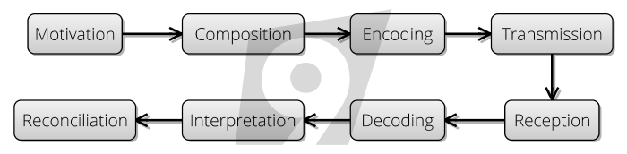

We move from top-left ("I want to send a message to someone") to bottom left, clockwise, where we hope the message has been understood and believed.  (I've added this last box to Shannon's original diagram.)

One of the chief concerns in Shannon's paper is the step between **Transmission** and **Reception**:  he creates a theory of information (measured in **bits**), the upper-bounds of information that can be communicated over a channel and ways in which **Communication Risk** between these processes can be mitigated by clever **Encoding** and **Decoding** steps.

But it's not just transmission.  **Communication Risk** exists at each of these steps.  Let's imagine a short exchange where**T** is trying to send a message to **R**:

-**T** might be **motivated** to send a message to tell **R** something, only to find out that _they already knew it_, or it wasn't useful information for them.
- In the **composition** stage,**T** might mess up the _intent_ of the message: instead of "Please buy chips" they might say, "Please buy chops".
- In the **encoding** stage,**T** might not speak clearly enough to be understood, and 
- In the **transmission** stage,**T** might not say it loudly enough for **R** to 
- **receive** the message clearly (maybe there is background noise).
- Having heard**T** say something, can **R** **decode** what was said into a meaningful sentence?
- And, assuming that, will they **interpret** correctly which type of chips (or chops)**T** was talking about?  Does "Please buy chips" convey all the information they need?
- Finally, assuming _everything else_, will **R** believe the message?  Will they **reconcile** the information into their [Internal Model](Internal-Model) and act on it?  Perhaps not, if **R** thinks that there are chips at home already.

## Approach To Communication Risk

There is a symmetry about the steps going on in Shannon's diagram, and we're going to exploit this in order to break down **Communication Risk** into it's main types.  

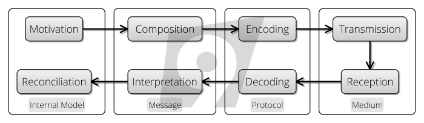

To get inside **Communication Risk**, we need to understand **Communication** itself, whether between _machines_, _people_ or _products_:   we'll look at each in turn.  In order to do that, we're going to examine four basic concepts in each of these settings: 
 - [Channels](https://en.wikipedia.org/wiki/Communication_channel), the medium via which the communication is happening.
 - [Protocols](https://en.wikipedia.org/wiki/Communication_protocol) -  the systems of rules that allow two or more entities of a communications system to transmit information.
 - [Messages](https://en.wikipedia.org/wiki/Message): The information we want to convey.
 - [Internal Models](Internal-Model): the sources and destinations for the messages.  Updating internal models (whether in our heads or machines) is the reason why we're communicating.
 
And, as we look at these four areas, we'll consider the attendant risks of each.

## Channels

There are lots of different types of channel for communicating (e.g. TV, Radio, DVD, Talking, Posters, Books, Phones, The Internet, etc. ) and they all have different characteristics.   Some obvious ones are cost, utilisation, number of people reached, simplex or duplex (parties can transmit and receive at the same time), persistence (a play vs a book, say), latency (how long messages take to arrive) and bandwidth (the amount of information that can be transmitted in a period of time).

Channel characteristics are important:  in a high-bandwidth, low-latency situation,**T** and **R** can _check_ with each other that the meaning was transferred correctly.  They can discuss what to buy, they can agree that**T** wasn't lying or playing a joke.  

The channel characteristics also imply suitability for certain _kinds_ of messages.  A documentary might be a great way of explaining some economic concept, whereas an opera might not be.

## Channel Risk

Shannon discusses that no channel is perfect:  there is always the **risk of noise** corrupting the signal.  A key outcome from Shannon's paper is that there is a tradeoff:  within the capacity of the channel (the **Bandwidth**), you can either send lots of information with _higher_ risk that it is wrong, or less information with _lower_ risk of errors.  And, rather like the [Kolgomorov complexity](Complexity-Risk) result, the more _randomness_ in the signal, the less compressible it is, and therefore the more _bits_ it will take to transmit.  

But channel risk goes wider than just this mathematical example:  messages might be delayed or delivered in the wrong order, or not be acknowledged when they do arrive.  Sometimes, a channel is just an inappropriate way of communicating.  When you work in a different timezone to someone else on your team, there is _automatic_ **Channel Risk**, because instantaneous communication is only available for a few hours' a day. 

When channels are **poor-quality**, less communication occurs.  People will try to communicate just the most important information.  But, it's often impossible to know apriori what this information is.   This is why [Extreme Programming](Extreme-Programming) recommends the practice of [Pair Programming](Coding) and siting all the developers together: although you don't know whether useful communication will happen, you are mitigating **Channel Risk** by ensuring high-quality communication channels are in place.

At other times, channels can contain so much information that we can't hope to receive all the messages.  In these cases, we don't even observe the whole channel, just parts of it.  For example, you might have a few YouTube channels that you subscribe to, but hundreds of hours of video are being posted on YouTube every second, so there is no way you can keep up with all of it.

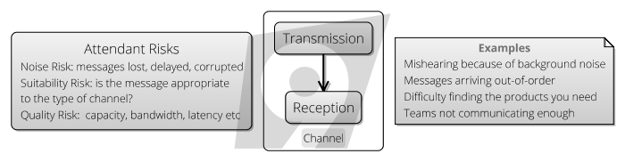

#### Marketing Communications

When we are talking about a product or a brand, mitigating **Channel Risk** is the domain of [Marketing Communications](https://en.wikipedia.org/wiki/Marketing_communications).   How do you ensure that the information about your (useful) project makes it to the right people?  How do you address the right channels? 

This works both ways.  Let's looks at some of the **Channel Risks** from the point of view of a hypothetical product, **D**, which would really useful in my software: 

 - The concept that there is such a thing as **D** which solves my problem isn't something I'd even considered.    
 - I'd like to use something like **D**, but how do I find it?  
 - There are multiple implementations of **D**, which is the best one for the task?
 - I know **D**, but I can't figure out how to solve my problem in it.
 - I've chosen **D**, I now need to persuade my team that **D** is the correct solution...
 - ... and then they also need to understand **D** to do their job too.

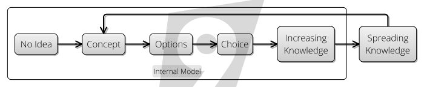

[Internal Models](Internal-Model) don't magically get populated with the information they need:  they fill up gradually, as shown in this diagram.  Popular products and ideas _spread_, by word-of-mouth or other means.  Part of the job of being a good technologist is to keep track of new **Ideas**, **Concepts** and **Options** as widely as possible, so as to use them as [Dependencies](Dependency) when needed.

## Protocols

In this section, I want to examine the concept of [Communication Protocols](https://en.wikipedia.org/wiki/Communication_protocol) and how they relate to [Abstraction](Complexity-Risk).  

So, to do this, let's look in a bit of detail at how web pages are loaded.   When considering this, we need to broaden our terminology.  Although so far we've talked about **Senders** and **Receivers**, we now need to talk from the point of view of who-depends-on-who.  If you're _depended on_, then you're a "Server", whereas if you require communication with something else, you're a "Client".   Thus, clients depend on servers in order to load pages.

This is going to involve (at least) six separate protocols, the top-most one being the HTTP Protocol.   As far as the [http protocol](https://en.wikipedia.org/wiki/Hypertext_Transfer_Protocol) is concerned, a _client_ makes an `HTTP Request` at a specific URL and the `HTTP Response` is returned in a predictable format that the browser can understand. 

Let's have a quick look at how that works with a `curl` command, which allows me to load a web page from the command line.   We're going to try and load Google's preferences page, and see what happens.  If I type:


```bash
> curl -v http://google.com/preferences      # -v indicates verbose
```

### 1. DNS - Domain Name System

Then, the first thing that happens is this:

```
* Rebuilt URL to: http://google.com/
*   Trying 216.58.204.78...
```

At this point, curl has used [DNS](https://en.wikipedia.org/wiki/Domain_Name_System) to _resolve_ the address "google.com" to an IP address.  This is some [Abstraction](Complexity-Risk):  instead of using the machine's [IP Address](https://en.wikipedia.org/wiki/IP_address) on the network, `216.58.204.78`, I can use a human-readable address, `google.com`.   The address `google.com` doesn't necessarily resolve to that same address each time:  _They have multiple IP addresses for `google.com`_.   But, for the rest of the `curl` request, I'm now set to just use this one.

### 2. IP - Internet Protocol

But this hints at what is beneath the abstraction:  although I'm loading a web-page, the communication to the Google server happens by [IP Protocol](https://en.wikipedia.org/wiki/Internet_Protocol) - it's a bunch of discrete "packets" (streams of binary digits).  You can think of a packet as being like a real-world parcel or letter.

Each packet consists of two things:  
- An address, which tells the network components (such as routers and gateways) where to send the packet, much like you'd write the address on the outside of a parcel.
- The _payload_, the stream of bytes for processing at the destination.   Like the contents of the parcel.

But, even this concept of "packets" is an [Abstraction](Complexity-Risk).  Although all the components of the network interoperate with this protocol, we might be using Wired Ethernet, or WiFi, 4G or _something else_.

### 3. 802.11 - WiFi Protocol

I ran this at home, using WiFi, which uses [IEEE 802.11 Protocol](https://en.wikipedia.org/wiki/IEEE_802.11), which allows my laptop to communicate with the router wirelessly, again using an agreed, standard protocol.  But even _this_ isn't the bottom, because this is actually probably specifying something like [MIMO-OFDM](https://en.wikipedia.org/wiki/MIMO-OFDM), giving specifications about frequencies of microwave radiation, antennas, multiplexing, error-correction codes and so on.  And WiFi is just the first hop:  after the WiFi receiver, there will be protocols for delivering the packets via the telephony system.

### 4. TCP - Transmission Control Protocol

Anyway, the next thing that happens is this:

```
* TCP_NODELAY set
* Connected to google.com (216.58.204.78) port 80 (#0)
```

The second obvious [Abstraction](Complexity-Risk) going on here is that `curl` now believes it has a [TCP](https://en.wikipedia.org/wiki/Transmission_Control_Protocol) connection.   The TCP connection abstraction gives us the surety that the packets get delivered in the right order, and retried if they go missing.  Effectively it _guarantees_ these things, or that it will have a connection failure if it can't make the guarantees. 

But, this is a fiction - TCP is built on the IP protocol, packets of data on the network.  So there are lots of packets floating around which say "this connection is still alive" and "I'm message 5 in the sequence" and so on in order to maintain this fiction.  But that means that the HTTP protocol can forget about this complexity and work with the fiction of a connection.

### 5. HTTP - Hypertext Transfer Protocol

Next, we see this:

```
> GET /preferences HTTP/1.1     (1)
> Host: google.com              (2)
> User-Agent: curl/7.54.0       (3)
> Accept: */*                   (4)
>                               (5)
```

This is now the HTTP protocol proper, and these 5 lines are sending information _over the connection_ to the Google server.  Line (1) says what version of HTTP we are using, and the path we're loading (`/preferences` in this case).   Lines `(2)` to `(4)` are _headers_.  They are name-value pairs, separated with a colon.   The HTTP protocol specifies a bunch of these names, and later versions of the protocol might introduce newer ones.  Line (5) is an empty line, which indicates that we're done with the headers, please give us the response.  And it does:

```
< HTTP/1.1 301 Moved Permanently                                      
< Location: http://www.google.com/preferences
< Content-Type: text/html; charset=UTF-8
< Date: Sun, 08 Apr 2018 10:24:34 GMT
< Expires: Tue, 08 May 2018 10:24:34 GMT
< Cache-Control: public, max-age=2592000
< Server: gws
< Content-Length: 230
< X-XSS-Protection: 1; mode=block
< X-Frame-Options: SAMEORIGIN
< 
<HTML><HEAD><meta http-equiv="content-type" content="text/html;charset=utf-8">
<TITLE>301 Moved</TITLE></HEAD><BODY>
<H1>301 Moved</H1>
The document has moved
</BODY></HTML>
* Connection #0 to host google.com left intact
```

There's a lot going on here, but we can break it down really easily into 3 chunks:
- The first line is the [HTTP Status Code](https://en.wikipedia.org/wiki/List_of_HTTP_status_codes).  `301` is a code meaning that the page has moved.
- The next 9 lines are HTTP headers again (name-value pairs).   The `Location:` directive tells us where the page has moved to.  Instead of trying `http://google.com/preferences`, we should have used `http://www.google.com/preferences`. 
- The lines starting `<HTML>` are now some HTML to display on the screen to tell the user that the page has moved.  

### 6. HTML - Hypertext Markup Language
 
Although [HTML]() is a language, a language is also a protocol.  (After all, language is what we use to encode our ideas for transmission as speech.)   In the example we gave, this was a very simple page telling the client that it's looking in the wrong place.  In most browsers, you don't get to see this:  the browser will understand the meaning of the `301` error and redirect you to the location.  

Let's look at all the protocols we saw here:

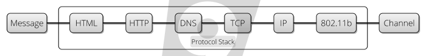 

Each protocol "passes on" to the next one in the chain.  On the left, we have the representation most suitable for the _messages_:  HTTP is designed for browsers to use to ask for and receive web pages.  As we move right, we are converting the message more and more into a form suitable for the [Channel]: in this case, microwave transmission.   

By having a stack of protocols, we are able to apply [Separation Of Concerns](), each protocol handling just a few concerns:

 - `HTML` Abstraction: A language for describing the contents of a web-page.
 - `HTTP` Abstraction: Name-Value pairs, agreed on by both `curl` and Google, URLs and error codes.
 - `DNS` Abstraction:  Names of servers to IP Addresses.
 - `TCP` Abstraction:  The concept of a "connection" with guarantees about ordering and delivery.
 - `IP` Abstraction:  "Packets" with addresses and payloads.
 - `WiFi` Abstraction:  "Networks", 802.11 flavours.
 - Transmitters, Antennas, error correction codes, etc.
 
HTTP "stands on the shoulders of giants".  Not only does it get to use pre-existing protocols like TCP and DNS to make it's life easier, it got 802.11 "for free" when this came along and plugged into the existing IP protocol.  This is the key value of abstraction:  you get to piggy-back on _existing_ patterns, and use them yourself. 

The protocol mediates between the message and the channel.  Where this goes wrong, we have **Protocol Risk**.  This is a really common issue for IT systems, but also sometimes for human communication too.

## Protocol Risk

Generally, anytime where you have different parts of a system communicating with each other, and one part can change incompatibly with another you have **Protocol Risk**.

Locally, (within our own project), where we have control, we can mitigate this risk using compile-time checking (as discussed already in [Complexity Risk]()), which essentially forces all senders and receivers to agree on protocol.  But, the wider the group that you are communicating with, the less control you have and the more chance there is of **Protocol Risk**.   Let's look at some types of **Protocol Risk**:
 
### Protocol Incompatibility Risk

The people you find it _easiest_ to communicate with are your friends and family, those closest to you.  That's because you're all familiar with the same protocols.  Someone from a foreign country, speaking a different language and having a different culture, will essentially have a completely incompatible protocol for spoken communication to you.

Within software, there are also _competing_, incompatible protocols for the same things, which is maddening when your protocol isn't supported.   Although the world seems to be standardizing, there used to be _hundreds_ of different image formats.  Photographs often use [TIFF], [RAW] or [JPEG], whilst we also have [SVG] for vector graphics, [GIF] for images and animations and [PNG]() for other bitmap graphics.   

### Protocol Versioning Risk

Even when systems are talking the same protocol, there can be problems.  When we have multiple, different systems owned by different parties, on their own upgrade cycles, we have **Protocol Versioning Risk**: the risk that either client or server could start talking in a version of the protocol that the other side hasn't learnt yet.  There are various mitigating strategies for this.  We'll look at two now: **Backwards Compatibility** and **Forwards Compatibility**.

#### Backward Compatibility

Backwards compatibility mitigates **Protocol Versioning Risk**.  Quite simply, this means, supporting the old format until it falls out of use.  If a server is pushing for a change in protocol it either must ensure that it is backwards compatible with the clients it is communicating with, or make sure they are upgraded first.  When building [web services](), for example, it's common practice to version all apis so that you can manage the migration.  Something like this:

 - Server publishes `/api/v1/something`.
 - Clients use `/api/v1/something`.
 - Server publishes `/api/v2/something`.
 - Clients start using `/api/v2/something`.
 - Clients (eventually) stop using `/api/v2/something`.
 - Server retires `/api/v2/something` API. 

#### Forward Compatibility

HTML and CSS provide "graceful failure" to mitigate **Protocol Risk**:  while its expected that all clients can parse the syntax of HTML and CSS, it's not necessary for them to be able to handle all of the tags, attributes and rules they see.  The specification for both these languages (and the HTTP headers we saw earlier) is that if you don't understand something, ignore it.  Designing with this in mind means that old clients can always at least cope with new features, but it's not always possible.  

JavaScript _can't_ support this:  because the meaning of the next instruction will often depend on the result of the previous one.  

Does human language support this?  To some extent!  New words are added to our languages all the time.  When we come across a new word, we can either ignore it, guess the meaning, ask or look it up.  In this way, human language has **Forward Compatibility** features built in.

### Protocol Implementation Risk

A second aspect of **Protocol Risk** exists in heterogenous computing environments, where protocols have been independently implemented based on standards.  For example, there are now so many different browsers, all supporting different levels of HTTP, HTML, Javascript and CSS so it becomes impossible to test comprehensively over all the different versions.  To mitigate as much **Protocol Risk** as possible, generally we run tests in a subset of browsers, and use a lowest-common-denominator approach to choosing protocol and language features.

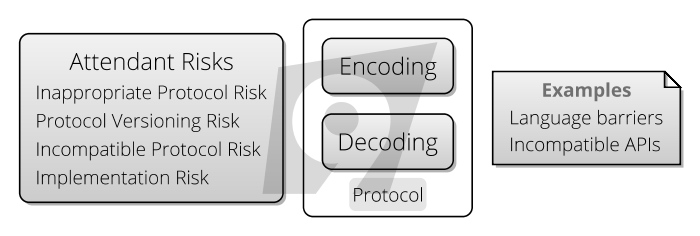

## Messages

Although Shannon's Communication Theory is about transmitting **Messages**, messages are really encoded **ideas** and **Concepts**, from one **Internal Model**.

### Internal Model Assumption Risk

When we construct messages in a conversation, we have to make judgements about what the other person already knows.  When talking to children, it's often hard work because they _assume_ that you have knowledge of everything they do.  This is called [Theory Of Mind](): the appreciation that your knowledge is different to other people's, and adjusting you messages accordingly.

When teaching, this is called [The Curse Of Knowledge]():  teachers have difficulty understanding students' problems _because they already understand the subject_.  For example, if I want to tell you about a new [JDBC Driver](), this pre-assumes that you know what JDBC is:  the message has a dependency on prior knowledge.

### Message Dependency Risk  

A second, related problem is actually [Dependency Risk](Dependency-Risk), which is covered more thoroughly in the next section.  Often, messages assume that you have followed everything up to that point already, otherwise again, your [Internal Model](Internal-Model) will not be rich enough to understand the new messages.

This happens when messages get missed, or delivered out of order.  In the past, TV shows were only aired once a week at a particular time.  So writers were constrained plot-wise by not knowing whether their audience would have seen the previous week's episode.  Therefore, often the state of the show would "reset" week-to-week, allowing you to watch it in _any_ order.

The same **Message Dependency Risk** exists for computer software:  if there is replication going on between instances of an application, and one of the instances misses some messages, you end up with a "[Split Brain]" scenario, where later messages can't be processed because they refer to an application state that doesn't exist.  For example, a message saying:

```
Update user 53's surname to 'Jones'
```

only makes sense if the application has previously had the message 

```
Create user 53 with surname 'Smith'
```

### Abstraction Risk & Misinterpretation Risk

People don't rely on rigorous implementations of abstractions like computers do; we make do with fuzzy definitions of concepts and ideas.  We rely on **Abstraction** to move between the name of a thing and the _idea of a thing_.

While machines only process _information_, people's brains run on concepts and ideas.  For people, abstraction is critical: nothing exists unless we have a name for it.  Our world is just atoms, but we don't think like this.  _The name is the thing_.  

> "The famous pipe. How people reproached me for it! And yet, could you stuff my pipe? No, it's just a representation, is it not? So if I had written on my picture “This is a pipe”, I'd have been lying!" - [Rene Magritte, of _The Treachery of Images_](https://en.wikipedia.org/wiki/The_Treachery_of_Images)

This brings about it's own **Communication Risk**: names are not _precise_, and concepts mean different things to different people.  We can't be sure that people have the same meaning for concepts that we have.  

### Invisibility Risk

Abstraction is a massively powerful technique.  As we saw above, it allows things like the Internet to happen.  However, the price of Abstraction is **Invisibility Risk**: function hides behind layers of abstraction and becomes invisible.  

We try to mitigate this type of **Communication Risk** via (for the most part) documentation.  This is a terrible deal:  because we can't understand the original, (un-abstracted) implementation, we now need to write some simpler documentation, which _explains_ the abstraction, in terms of further abstractions, and this is where things start to get murky.

**Invisibility Risk** is risk due to information not sent.  Because humans don't need a complete understanding of a concept to use it, we can cope with some **Invisibility Risk** in communication.

- people assume invisibility risk on projects/people that don't communicate much
- that can also lead to 

For people though, **Abstraction** is a tool that we can use to refer to other concepts, without necessarily knowing how the concepts work.  This divorcing of "what" from "how" is the essence of abstraction.  

As soon as you create a function, you are doing abstraction.  You are saying:  “I now have this operation. The details, I won’t mention again, but from now on, it’s called _f_.”  And suddenly, “_f_” hides.  It is working invisibly.  Things go on in _f_ that people don’t necessarily need to understand.   There may be some documentation, or tacit knowledge around what _f_ is, and what it does, but it’s not necessarily right.  Referring to _f_ is a much simpler job than understanding _f_.

**Invisibility Risk** is mainly [Hidden Risk](Risk):  you don't know what you don't know.  But you can easily _hide things from yourself_ with software.  
 - Adding a thread to an application that doesn't report whether it's worked or failed, or is running out of control and consuming all the cycles of the CPU.
 - Load balancing can increase reliability, but only if you find and fix failed servers quickly.   Otherwise, you only see problems when the last server fails.
 - When building a webservice, can you assume that it's working for the users in the way you want it to?
 
Software brings tbd   
  

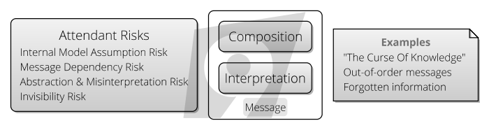

## Internal Models

So finally, we are coming to the root of the problem:  communication is about transferring ideas and concepts from one [Internal Model](Internal-Model) to another. 

As we've seen already, this is fraught with risk on many levels, but even at this last level there are risks.

### Trust Risk & Belief Risk

Although protocols can sometimes handle security features of communication (such as proof-of-identity and preventing man-in-the-middle attacks), trust goes further than this, intersecting with [Agency Risk]():  can you be sure that the other party in the communication is acting in your best interests?
 
Even if the receiver trusts the communicator, they may not trust the message.  Let's look at some reasons for that:
 - [Weltanschauung (World View)](https://en.wikipedia.org/wiki/World_view): The ethics, values and beliefs in the receiver's [Internal Model]() may be incompatible to those from the sender.  
 - [Relativism]() is the concept that there are no universal truths.  Every truth is from a frame of reference.  For example, what constitutes _offensive language_ is dependent on the listener.
 - [Psycholinguistics]() is the study of humans aquire languages.  Just as there are different languages and dialects, and _industry dialects_: we all 
 - Internalizing
  
From the point-of-view of [Marketing Communications]() choosing the right message is part of the battle.  You are trying to communicate your idea in such a way as to mitigate **Belief Risk** and **Trust Risk**.

### Learning Curve Risk

If the messages we are receiving force us to update our [Internal Mode](Internal-Model) too much, we can suffer from the problem of "too steep a [Learning Curve]()" or "[Information Overload]", where the messages force us to adapt our [Internal Model](Internal-Model) too quickly for our brains to keep up.  

Commonly, the easiest option is just to ignore the information channel completely in these cases.

### Reading Code

It's often been said that code is [harder to read than to write]().  By now it should be clear that it's going to be _both_ quite hard to read and write:  the protocol of code is actually designed for the purpose of machines communicating, not primarily for people to understand.  Simultanously making code human readable is a subordinate concern to making it machine readable.

But now we should be able to see the reasons it's harder to read than write too:  
 - When reading code, you are having to shift your [Internal Model](Internal-Model) to wherever the code is, accepting decisions that you might not agree with and accepting counter-intuitive logical leaps.  This is **Information Overload Risk**, cf. [Principle of Least Surprise](). 
 - There is no [Feedback Loop](Feedback-Loop) between your [Internal Model](Internal-Model) and the [Reality](Meet-Reality) of the code, opening you up to **Misinterpretation Risk**.  When you write code, your compiler and tests give you this.
 - While reading code _takes less time_ than writing it, this also means the [Learning Curve]() is steeper.

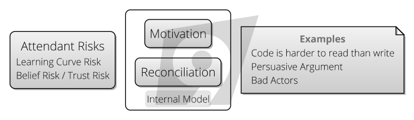

## Communication Risk Wrap Up

So, here's a summary of where we've arrived with our model of communication risk:

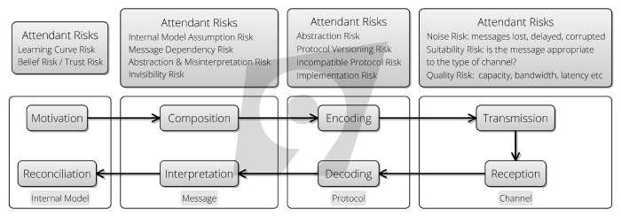

The purpose of Communication is to _coordinate_ our actions, so next it's time to look at [Coordination Risk](Coordination-Risk).
\newpage
# Map And Territory Risk
As we discussed in the section on [Abstraction Risk](Communication Risk), our understanding of the world is entirely informed by the names we give things and the abstractions we create.  

**Map And Territory Risk** is the recognition that there is a danger that we come to believe the abstractions are more real than reality itself.  It comes from the expression "Confusing the Map for the Territory".  That is believing the abstraction is reality, instead of reality itself.

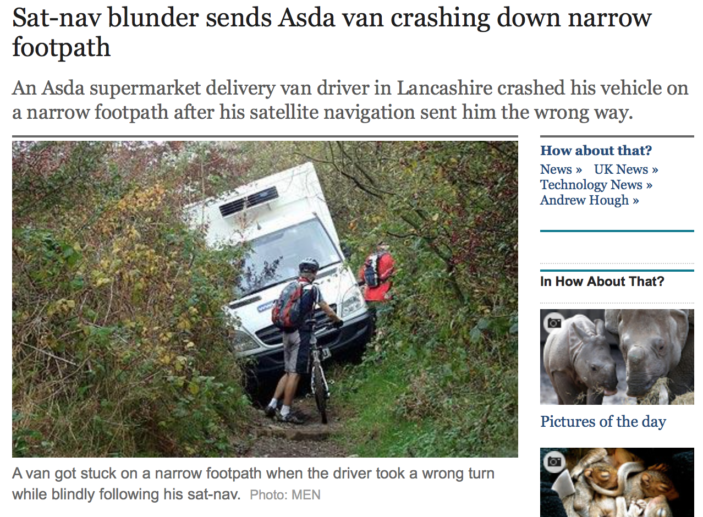

In the picture shown here, the driver _trusted_ the SatNav to such an extent that he didn't pay attention to the road-signs around him, and ended up getting stuck.

This wasn't borne of stupidity, but experience:  _so many times_ the SatNav had been right, that the driver stopped questioning its fallibility.  But SatNavs are pretty reliable, this is kind of excusable.  People are happy to make this mistake with far less reliable systems because often it's a shortcut to having to do any real thinking.

## Metrics

The simplest type of **Map And Territory Risk** occurs like this:  someone finds a useful new metric that helps in evaluating performance. It might be:

- **SLOC (Source Lines Of Code)**: i.e. the number of lines of code each developer writes per day/week whatever.
- **Function Points**: the number of function points a person on the team completes, each sprint.
- **Code Coverage**: the number of lines of code exercised by unit tests
- **Response Time**: the time it takes to respond to an emergency call, say
- **Release cadence**:  number of releases a team performs, per month, say.

With some skill, they may be able to _correlate_ this metric against some other more abstract measure of success.  For example:
- "quality is correlated with more releases" 
- "user-satisfaction is correlated with SLOC"
- "response time is correlated with revenue"

Because the _thing on the left_ being is immediate and easier to measure than _the thing on the right_, it becomes used as a proxy (or, Map) for the thing they are really interested in (the Territory).  

But _correlation_ doesn't imply _causation_.  The cause might be different:  
 - quality and number of releases might both be down to the simplicity of the product.
 - user satisfaction and SLOC might both be down to the calibre of the developers.
 - response time and revenue might both be down to clever team planning.
 
When you have easy go-to metrics based on accidental or incidental correlations, [Hidden Risk]() mounts up.  By relying on the metrics, you're not really _seeing_ the reality.  The devil is in the detail. 

## Drinking The Kool-Aid

The next problem comes when metrics start being used for more than just indicators, but as measures of performance or targets:
  - If a team is _told_ to do lots of releases, they will perform lots of releases *at the expense of something else*.
  - If team members are promoted according to SLOC, they will make sure their code takes up as many lines as possible.
  - In the UK, when ambulances were asked to respond to all emergency calls within a short window, cars and bicycles were employed as ambulances too [tbd].
  
You are probably nodding your head at these examples.  _Of course_ SLOC is a terrible measure performance!  We're not that stupid anymore.  The problem is, it's not so much the _choice_ of metric, but the fact that _all_ metrics merely approximate reality with a few numbers.  

The map is _always_ simpler than the territory, therefore there can be no perfect metrics.

## The Onion Of Bullshit

**Map-And-Territory Risk** "trickles down" through an organisation, in what I term "The Onion Of Bullshit".  In which successive layers of the organisational heirarchy imposed worse and worse.    Here's how this came about in a bank I worked at: 

- My team had been tasked with building automated "smoke tests" of an application.  But this was bullshit.  We only needed to build these _at all_ because the application was so complex.  The reason it was so complex was...
- The application was being designed within a "Framework" constructed by the department.  However, the framework was only being used by this one application.  Building a "reuasable" framework which is only used by a single application is bullshit.  But, we had to do this because...
- The organisational structure was created along a "matrix", with "business function" on one axis and "functional area" on another.   Although we were only building the application for a single business function, it was expected to cater with all the requirements from the an entire "functional area".  This was bullshit too, because
- The matrix structure was largely the legacy of a recent merger with another department.  As [Conway's Law]() predicts, our software therefore had to reflect this structure.  But this was bullshit because
- The matrix structure didn't represent reality in any useful way.  It was designed to pacify the budget committee at the higher level, and try to demonstrate attributes such as _control_ and _governance_.  But this was bullshit too, because
- The budget that was given to our department (Risk) was really based on how much fear the budget holders currently had of the market regulators.  But this was bullshit too, because
- At a higher level, the executives had realised that Investment Banking wasn't one of the banks strategic strengths, and was working to close it all down anyway.

When faced with so many mis-aligned objectives, it seemed completely hopeless to concentrate on the task at hand.  But then, my colleague Gavin was able to nihilistically resolve the onion by adding a final layer:

- It's all about chasing money, which is bullshit, because life is bullshit.

It feels like there's no way back from that.  All of life might well be a big **Map and Territory** illusion.  But let's analyse just a bit:
 - At each layer of the onion, the objectives changed.  But, they impacted on the objectives of the layer below.
 - Therefore, it seems like the more layers you have, the less likely it is that your objectives become inconsistent between the lower and higher levels.
 - On a new project, it seems like a good idea to model this stuff:  does the objective of the work you're about to undertake "align" with the objectives at a higher level?  If not, the project might well be quite temporary:  Before I left, I was able to eject most of the "framework" elements of the project, and massively simplify the architecture, thus obviating the need for the smoke tests.  
 
So far, we've considered what happens when a team _has been told_ to optimise around a particular objective.  But it's not a great stretch from here to a point where people are optimising the metric at the expense of doing what they know is best for the project.  Or, optimising a metric for personal gain because that metric is more visible than other (perhaps more important) qualities.  This is [Agency Risk](Agency-Risk) which we'll look at in the next section.  

## Inadequate Equilibria

**Inadequate Equilibria** is a book by Eleizer Yudkovsky, who looks at how **Map and Territory Risk** can break not just departments, but entire societal systems.  Here is one example involving _academics_ and _grantmakers_ in academia:

 - It's not very apparent which scientists are better than which other scientists.
 - One proxy is what they've published (scientific papers) and where they've published (journals).
 - Universities want to attract research grants, and the best way to do this is to have the best scientists.
 - Because "best" isn't measureable, they use the proxy.
 - Therefore, immense power rests in the hands of the journals, since they can control the money-proxy.
 - Therefore, journals are able to charge large amounts of money to universities for subscriptions.
 
So, publication in prestigious journals is a _metric_ which is open to abuse, as we saw earlier. 

tbd

## Head In The Sand


how to pick projects

how to spot vanity projects

how to spot where the Goal In Mind is hopelessly ill-thought-through.
following the rules more important than getting things done.  

Head in the sand

\newpage
# Agency Risk
[Coordinating a team](Coordination-Risk) is difficult enough when everyone on the team has a single [Goal](Goal-In-Mind).  But, people have their own goals, too.  Sometimes, the goals harmlessly co-exist with the team's goal, but other times they don't.

This is **Agency Risk**.   This term comes from finance (again), and refers to the situation where you entrust your money to someone (the "agent") in order to invest it, but the don't necessarily have your best interests at heart.  They may instead elect to invest the money in ways that help them, or outright steal it.  

> "This dilemma exists in circumstances where agents are motivated to act in their own best interests, which are contrary to those of their principals, and is an example of moral hazard." - [Principal-Agent Problem, _Wikipedia_](https://en.wikipedia.org/wiki/Principal–agent_problem)

The less visibility you have of the agent's activities, the bigger the risk.  However, the whole _point_ of giving the money to the agent was that you would have to spend less time and effort managing it.  Hence the dilemma.  So, **Agency Risk** flourishes where there is [Invisibility Risk](Communication-Risk).

**Agency Risk** clearly includes the behaviour of [Bad Actors](https://en.wiktionary.org/wiki/bad_actor).  But, this is a very strict definition of **Agency Risk**.   In software development, we're not lending each other money, but we are being paid by the project sponsor, so they are assuming **Agency Risk** by employing us.   

Let's look at some examples of borderline **Agency Risk** situations, in order to sketch out where the domain of this risk lies.

## CV Building

This is when someone decides that the project needs a dose of "Some Technology X", but in actual fact, this is either completely unhelpful to the project (incurring large amounts of [Complexity Risk](Complexity-RisK), or merely less useful than something else.  

It's very easy to spot CV building:  look for choices of technology that are incongruently complex compared to the problem they solve, and then challenge by suggesting a simpler alternative.    

## Consultancies

When you work with an external consultancy, there is *always* more [Agency Risk](Agency-Risk) than with a direct employee.  This is because as well as your goals and the employee's goals, there is also the consultancy's goals.  

This is a good argument for not using consultancies, but sometimes the technical expertise they bring can outweigh this risk.

Also, try to look for _hungry_ consultancies:  if you being a happy client is valuable to them, they will work at a discount (either working cheaper, harder or longer or more carefully) as a result.

## The Hero

> "The one who stays later than the others is a hero. " - [Hero Culture, _Ward's Wiki_](http://wiki.c2.com/?HeroCulture)

[Hero Programmers](http://wiki.c2.com/?HeroCulture) put in more hours and try to deliver the projects single-handedly, often cutting corners like team communication and process in order to get there.   

Sometimes, this can be of benefit to the project: maybe the last push is what is needed to get it over the line?   

However, sometimes, the hero has an alternative agenda than just getting the project done:
- A need for control, and for their own vision.
- A preference to work alone.
- A desire for recognition and acclaim from colleagues.
- For the job security of being a [Key Man](https://en.wikipedia.org/wiki/Key_person_insurance).

A team _can_ make use of heroism, but it's a double-edged sword.  The hero can becomes a bottleneck to work getting done, and because want to solve all the problems themselves, they under-communicate.

## Devil Makes Work

Heroes can be useful, but _underused_ project members are a nightmare.   The problem is, people who are not fully occupied begin to worry that actually, the team would be better off without them, and then wonder if their jobs are at risk.

The solution to this is "busy-work":  finding tasks that, at first sight, look useful, and then delivering them in an over-elaborate way ([Gold Plating](https://en.wikipedia.org/wiki/Gold_plating_(software_engineering))) that'll keep them occupied.  This will leave you with more [Complexity Risk](Complexity-Risk) than you had in the first place.

Even if they don't worry about their jobs, doing this is a way to stave off _boredom_.

## Pet Projects

> A project, activity or goal pursued as a personal favourite, rather than because it is generally accepted as necessary or important.  - [Pet Project, _Wiktionary_](https://en.wiktionary.org/wiki/pet_project)

Sometimes, budget-holders have projects they value more than others without reference to the value placed on them by the business.  Perhaps the project has a goal that aligns closely with the budget holder's passions, or its related to work they were previously responsible for.  

Working on a pet project usually means you get lots of attention (and more than enough budget), but much like [Map and Territory Risk](Map-And-Territory-Risk), it can fall apart very quickly under scrutiny.

## Morale Risk

Morale, also known as Esprit de Corps is the capacity of a group's members to retain belief in an institution or goal, particularly in the face of opposition or hardship - [Wikipedia] 

Sometimes, the morale of the team or individuals within it dips, leading to lack of motivation.  **Morale Risk** is a kind of **Agency Risk** because it really means that a team member or the whole team isn't committed to the [Goal](Goal-In-Mind), may decide their efforts are best spent elsewhere.  **Morale Risk** might be caused by:
 - External factors.  Perhaps the employees' dog has died, or they're simply tired of the industry, or are not feeling challenged.
 - If the team don't believe a goal is achievable, they won't commit their full effort to it.  This might be due to to a difference in the evaluation of the risks on the project between the team members and the leader.
 - If the goal isn't considered sufficiently worthy, or the team isn't sufficiently valued.
 - In military science, a second meaning of morale is how well supplied and equipped a unit is.  This would also seem like a useful reference point for IT projects.  If teams are under-staffed or under-equipped, this will impact on motivation too.

## Hubris & Ego

It seems strange that humans are over-confident.  You would have thought that evolution would drive out this trait but apparently it's not so:

> "Now, new computer simulations show that a false sense of optimism, whether when deciding to go to war or investing in a new stock, can often improve your chances of winning." - [Evolution of Narcissism, _National Geographic_](https://news.nationalgeographic.com/news/2011/09/110914-optimism-narcissism-overconfidence-hubris-evolution-science-nature/).

In any case, humans have lots of self-destructive tendencies that _haven't_ been evolved away, and we get by.  

Development is a craft, and ideally, we'd like developers to take pride in their work.   Too little pride means lack of care, but too much pride is _hubris_, and the belief that you are better than you really are.  Who does hubris benefit?  Certainly not the team, and not the goal.  

Although over-confidence might be a useful trait when bargaining with other humans, the thesis of everything so far is that [Meeting Reality](Meet-Reality) will punish your over-confidence again and again.  


\part{Practices}

\newpage
# Coding
## What Is It

**Coding** is the main practice that identifies us as working on a _software project_:  Actually entering instructions in a language that the computer will understand, be it Java, C++, Matlab, Excel or _whatever_.   It is transferring the ideas in your head into steps that the computer can understand, or, as Wikipedia has it:

> "...actual writing of source code." -- [Wikipedia, _Computer Programming_](https://en.wikipedia.org/wiki/Computer_programming)

Often, this can be called "programming", "hacking" or "development", although that latter term tends to connotate more than just programming work, such as [Requirements Capture](Requirements-Capture) or [Documentation](Documentation), but we're considering those separately on different pages.

## How It Works

In [Development Process](Development-Process) we introduced the following diagram to show what is happening when we do some coding.  Let's generalize a bit from this diagram:

- We start with a [Goal In Mind](Goal-In-Mind) to implement _something_.
- We build an [Internal Model](Internal-Model) of how we're going to meet this goal (though coding, naturally)
- Then, we find out how well our idea stands up when we [Meet Reality](Meet-Reality) and try it out in our code-test-run-debug cycle.
- As we go, the main outcome is that we change reality, and create code, but along the way, we discover where our [Internal Model](Internal-Model) was wrong, in the form of surfacing [Hidden Risks](Hidden-Risks).


## Examples

As with any [Practice](Practices), we are coding to minimize [Attendant Risks](Risk).  We might want...

- **To Build** or improve some features which our clients will find useful. - _[Feature Risk](Feature-Risk)_
- **To Automate** some process that takes too long or is too arduous.  - _[Process Risk](Process-Risk)_
- **To Explore** how our tools, systems or dependencies work (also called [Hacking](https://en.wikipedia.org/wiki/Hacking)). -  _[Dependency Risk](Dependency-Risk)_
- **To Refactor** our codebase, to reduce complexity. - _[Complexity Risk](Complexity-Risk)_
- **To Clarify** our product, making our software more _presentable_ and _easier to understand_.  -  _[Communication Risk](Communication-Risk)_

... and so on.   As usual, the advice is to _reduce risk_ in the most meaningful way possible, all the time.  This might involve coding _or it might not_.

## Where It's Used

Since the focus of this site is on _software methodologies_, you shouldn't be surprised to learn that _all_ of the methodologies use **Coding** as a central focus.  

## Variations

### Building Features

Most commonly, the reason we are **Coding** is same as the one in the [Development Process](Development-Process) page: we want to put features in the hands of our customers.   

That is, we believe our clients don't have the features they need to see in the software, and we have [Feature Risk](Feature-Risk). 

By coding, we are mitigating [Feature Risk](Feature-Risk) in exchange for [Complexity Risk](Complexity-Risk) in terms of the extra code we now have on the project, and [Schedule Risk](Schedule-Risk), because by spending time or money coding we now have less time or money to do other things.  Bill Gates said: 

> “Measuring programming progress by lines of code is like measuring aircraft building progress by weight.” - Bill Gates

And you can see _why_ this is true:  the more code you write, the more [Complexity Risk](Complexity-Risk) you now have on the project, and the more [Dead End Risk](Complexity-Risk) you've picked up in case it's wrong.  This is why [The Agile Manifesto]() stresses:

> "Simplicity -the art of maximizing the amount of work not done- is essential."  [Agile Manifesto](http://agilemanifesto.org/)

### Prototyping

Users often have trouble _conceiving_ of what they want in software, let alone _explaining_ that to developers in any meaningful way.  

Let's look at how that can happen.  

Imagine for a moment, that there was such a thing as **The Perfect Product**, and a **User** wants to build it with a **Coder**:
 - The **Perfect Product** might be _conceptually elusive_, and it might take several attempts for the **User** to find it's form. _[Conceptual Integrity Risk](Feature-Risk)_
 - It might be hard for the **User** to _communicate_ the idea of it in writing or words:  where do the buttons go? What do they do?  What are the key abstractions?  _[Communication Risk](Communication-Risk)_
 - It might be hard too, for the **Coder** to work with this description.  Since his [Internal Model](Internal-Model) is different from the **User**'s, they have different ideas about the _meaning_ of what the **User** is communicating.  _[Communication Risk](Communication-Risk)_
 - Then, implementing the idea of whatever is in the **Coder**'s [Internal Model](Internal-Model) takes _effort_, and therefore involves [Schedule Risk](Schedule-Risk).
 - Finally, we have a feedback loop, so the **User** can improve their [Internal Model](Internal-Model) and see the previously unforeseen [Hidden Risks](Risk).
 - Then, you can go round again.

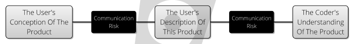

The problem here is that this is a very _protracted feedback loop_.  This is mitigated by prototyping, because that's all about shortening the feedback loop as far as possible:  
 - By working together, you mitigate [Communication Risk](Communication-Risk).
 - By focusing on one or two elements (such as UI design), you can minimize [Schedule Risk](Schedule-Risk).
 - By having a tight feedback loop, you can focus on _iteration_, try lots of ideas, and work through [Conceptual Integrity Risk](Feature-Risk). 
 
One assumption of Prototyping is that **Users** can iterate towards **The Perfect Product**.  But it might not be so:   the Conceptual gap between their own ideas and what they really _need_ might prove too great.  

After all, bridging this gap is the job of the [Designer](Design):

> “It's really hard to design products by focus groups. A lot of times, people don't know what they want until you show it to them.” — Steve Jobs 

### SkunkWorks

The [SkunkWorks](https://en.wikipedia.org/wiki/Skunk_Works) approach is one small step up from **Prototyping**.  Wikipedia describes this as:

>  A group within an organization given a high degree of autonomy and unhampered by bureaucracy, with the task of working on advanced or secret projects

The idea here is _again_ to minimize the length of the feedback loop, and focus on [Design](Design) to combat [Conceptual Integrity Risk](Feature-Risk).  It was in this kind of small, secret team that the [iPhone was invented](https://www.networkworld.com/article/2159873/smartphones/apple-s-iphone--the-untold-story.html).  

To give some idea of the [Conceptual Integrity Risk](Feature-Risk) involved, initially, the team were building a _tablet_ using the multi-touch technology that the iPhone introduced to the world, but pivoted towards the phones after the failure of the "Apple Phone" collaboration with Motorola.

Scott Forstall picked a small, secret team from within the ranks of Apple.  By doing this, he mitigated [Communication Risk](Communication-Risk) and [Coordiation Risk](Coordiation-Risk) _within his team_, but having fewer people in the room meant more [Throughput Risk](Schedule-Risk).

By having more people involved, the feedback loop will be longer than the two-man prototyping team, but that's the tradeoff you get for mitigating those other risks.

### Specialization

One of the problems with a **SkunkWorks** approach is that you end up with more [Coordination Risk](Coordination-Risk) than you'd like, as your different skunk-teams end up with different [Internal Models](Internal-Model) and different [Goals](Goal-In-Mind).  

In large companies, this is called [Silo Mentality](https://en.wikipedia.org/wiki/Information_silo) - the tendency for lines of business to stop communicating and sharing with one another.  As you can imagine, this leads to a more [Complex](Complexity-Risk) and [bureaucratic](Bureaucratic-Risk) structure than would be optimal.

But this can happen within a single coding team, too:  by splitting up and working on different pieces of functionality within a project, the team _specialises_ and becomes expert in the parts it has worked on.  This means the team members have different [Internal Models](Internal-Model) of the codebase.

This is _perfectly normal_:  we _need_ people to have different opinions and points-of-view.  We _need_ specialisation, it's how humanity has [ended up on top](https://en.wikipedia.org/wiki/Division_of_labour).  It's better to have a team who, between them all, know a codebase really well, than a group of people who know it poorly.   

The reason for this is explained again by the first diagram in this section:  the closer our [Internal Model](Internal-Model) matches [Reality](Meet-Reality), the fewer [Hidden Risks](Risk) we will meet, and the easier we'll have it.

The downside of specialization is [Coordination Risk](Coordination-Risk):  
 - If your payroll expert is off ill for a week, progress on that stops. 
 - Work is rarely evenly spread out amongst the different components of a project for long. 
 - If work temporarily dries up on a specific component, what do the component owners do in the meantime? 
 - What if the developer of a particular component makes _the wrong assumptions_ about other parts of the system or tool-set?

### Pair Programming / Mob Programming

In the main, [Review](Review) is the main way to mitigate [Coordination Risk](Coordination-Risk). For example:
 - [Code Reviews](Review)
 - [Stand Up Meetings](Review)
 - [Presentations & Demos](Review)
 - [Training](Review)
 
**Pair Programming** however _combines_ the review with the process of coding: there are now two heads at each terminal.  What does this achieve?  
 - Clearly, we mitigate [Key-Man Risk](Coordination-Risk) as we've got two people doing every job.  
 - Knowledge is transferred at the same time, too, mitigating [Specialist Risk](Coordination-Risk).  
 - Proponents also argue that this mitigates [Complexity Risk](Complexity-Risk), as the software will be better quality.
 - Since the pair spend _so much time together_, the communication is very _high bandwidth_, so this mitigates [Communication Risk](Communication-Risk)
 
But, conversely, there is a cost to **Pair Programming**:
 - Having two people doing the job _one person could do_ intimates [Schedule Risk](Schedule-Risk).
 - Could the same [Complexity Risk](Complexity-Risk) be mitigated just with more regular [Code Reviews](Review)?
 - Sometimes, asking members of a team to work so closely together is a recipe for disaster.  [Team Risk](Coordination-Risk)
 - Not every pair programmer "shares" the keyboard time evenly, especially if ability levels aren't the same.
 - There is only one **Feedback loop**, so despite the fact you have two people, you can only [Meet Reality](Meeting-Reality) serially.  
   
 **Mob Programming** goes one stage further and suggests that we can write better software with _even more people around the keyboard_.  So, what's the right number?  Clearly, the usual trade-off applies:  are you _mitigating_ more risk than you're _gaining_?   
 
### Offshoring / Remote Teams

**Pairing** and **Mobbing** as mitigations to [Coordination Risk](Coordination-Risk) are easiest when developers are together in the same room.  But it doesn't always work out like this.   Teams spread in different locations and timezones naturally don't have the same [communication bandwidth](Communication-Risk) and you _will_ have more issues with [Coordination Risk](Coordination-Risk).  

In the extreme, I've seen situations where the team at one location has decided to "suck up" the extra development effort themselves rather than spend time trying to bring a new remote team up-to-speed.  More common is for one location to do the development, while another gets the [Support](Support) duties.  

When this happens, it's because somehow the team feel that [Coordination Risk](Coordination-Risk) is more unmanageable than [Schedule Risk](Schedule-Risk).

There are some mitigations here:  video-chat, moving staff from location-to-location for face-time, frequent [show-and-tell](Review), or simply modularizing accross geographic boundaries, in respect of [Conway's Law](Coordination-Risk):

> "organizations which design systems ... are constrained to produce designs which are copies of the communication structures of these organizations."  - _[M. Conway](https://en.wikipedia.org/wiki/Conway%27s_law)_

When we add **Outsourcing** into the mix, we also have to consider [Agency Risk](Agency-Risk):  the consultancy you've hired is _definitely_ more interested in keeping themselves solvent than solving your business problems.

### Team Size

As team sizes grow, [Coordination Risk](Coordination-Risk) grows fast.  

To see this, let's consider a made-up situation where all the developers are equal, and we can mitigate [Coordination Risk](Coordination-Risk) at the cost of a 1-hour presentation each per week.  

How many man-hours of presentations do we need?

|Team Size|Hours Of Presentations|Man-Hours In Presentations|
|---------|----------------------|--------------------------|
|1        |0                     |0                         |  
|2        |2                     |4                         |
|3        |3                     |9                         |
|4        |4                     |16                        |
|5        |5                     |25                        |
|6        |6                     |36                        |
|7        |7                     |49                        |

Adding the 7th person to the team (ceteris paribus) does absolutely _nothing_ for productivity, it makes matters worse.  Assuming everyone works a 40-hour week, we're now 9 hours worse off than before.   

This is a _toy example_, but is it better or worse than this in reality?  If the new developers are arriving on an existing project, then 1 hour-per-week of training by the existing team members might be conservative.  

This is why we get [Brooks' Law](https://en.wikipedia.org/wiki/Brooks%27s_law): 

> "adding human resources to a late software project makes it later".  - [Fred Brooks, _The Mythical Man-Month_](https://en.wikipedia.org/wiki/Brooks%27s_law)

You can see that this law is founded in an appreciation of [Coordination Risk](Coordination-Risk).  But the argument from [Coordination Risk](Coordination-Risk) _adds nuance_, and explains when this is true and when it isn't.

### Too Many Cooks

Sometimes, you have _too many developers_ on a project.  This is not a blessing.   As with [Student Syndrome](Schedule-Risk), having too many resources means that: 

> "Work expands so as to fill the time available for it's completion" - [Parkinson's Law]()

One of the reasons for this is that _Developers love to develop_ and it is, after all, their job.  If they _aren't_ developing, then are they still needed?  This is [Agency Risk](Agency-Risk):  people who are worried about their jobs will often try to _look busy_, and if that means creating some drama on the project, then so be it.

Sadly, this usually occurs when a successful project is nearing delivery.  Ideally, you want to be _decreasing_ the amount of change on a project as it gets closer to key [Delivery Dates](Coordination-Risk).  This is because the risk of [Missing the Date](Coordination-Risk) is greater than the risk of [some features not being ready](Feature-Risk).

In the past, I've found it helpful to down-size the team by temporarily moving developers into other less-fortunate teams, reducing both [Coordination Risk](Coordination-Risk) and [Agency Risk](Agency-Risk) at the same time.  

This can require some guts to do:  you have to overcome your own ego (wanting to run a big team) for the sake of your project.

 
### Automating

One of the key ways to measure whether your team is doing _useful work_ is to look at whether, in fact, it can be automated.  And this is the spirit of [DevOps](DevOps) - the idea that people in general are poor at repeatable tasks, and anything people do repeatedly _should_ be automated.  

Repetitive work of any kind is a [Process Risk](Process-Risk), and can be mitigated at the expense of attendant [Complexity Risk](Complexity-Risk) and [Schedule Risk](Schedule-Risk).

Since this is a trade-off, you have to be careful about how you _weigh_ the [Process Risk](Process-Risk):  clearly, it exists _into the future_.  

You are making a bet that acting now will pay off in decreased [Process Risk](Process-Risk) over the lifetime of the project.  This is a hard thing to judge:
 - How much [Process Risk](Process-Risk) are we carrying, week-to-week?  (A good way to answer this is to look at past failures).
 - How much [Complexity Risk](Complexity-Risk) will we pick up?
 - How much [Schedule Risk](Schedule-Risk) (in spent developer effort) will we pick up?
 - How long will the mitigation last before the process changes again?

### Tool Use
 
In general, unless the problem is somehow _specific to your circumstances_ it may well be better to skip direct coding and pick up some new tools to help with the job.  

Tools are a different trade off to automation.  You are mitigating [Process Risk](Process-Risk) or [Feature Risk](Feature-Risk) in return for:
 - New [Dependency Risk](Dependency-Risk) on the new tool.
 - [Communication Risk](Communication-Risk) because now the team has to understand the tool.
 - [Schedule Risk](Schedule-Risk) in the time it takes to learn and integrate the tool.
 - [Complexity Risk](Complexity-Risk) because your project necessarily becomes more complex for the addition of the tool.

Tools in general are _good_ and _worth using_ if they offer you a better risk return than you would have had from not using them.  

But, this is a low bar -  some tools offer _amazing_ returns on investment.  The [Silver Bullets](Silver-Bullets) article describes in general some of these: 
 - Assemblers
 - Compilers
 - Garbage Collection
 - Type Systems
 - Libraries
 - Build Tools
 - etc.

A _really good tool_ offers such advantages that not using it becomes _unthinkable_:  Linux is heading towards this point.   For Java developers, the JVM is there already.  

Picking new tools and libraries should be done **very carefully**:  you may be stuck with your choices for some time.  Here is a [short guide that might help](Dependency-Risk).

### Refactoring

The term "refactoring" probably stems from the mathematical concept of _(Factorization)[https://en.wikipedia.org/wiki/Factorization]_.  Factorizing _polynomial equations_ or _numbers_ means to identify and make clear their distinct components.

tbd: SoC

Most coders use the phrase "refactoring", and intuitively understand what it is.  It shouldn't have been hard to find a clear explanation for this page, but sadly it was.  There are some very woolly definitions of "refactoring" around, such as:

> "**Refactoring (n)**: a change made to the internal structure of software to make it easier to understand and cheaper to modify without changing its observable behavior""  -- [Refactoring.com](https://www.refactoring.com)

What do "easier to understand" (which makes sense) and "cheaper to modify" mean?   Let's try and be more specific.   With Refactoring, we are trying to:

- Mitigate [Communication Risk](Communication-Risk) by making the _intent_ of the software clearer. This can be done by breaking down larger functions and methods into smaller ones with helpful names, and naming elements of the program clearly, and
- Mitigate [Complexity Risk](Complexity-Risk) by employing _abstraction_ and _modularization_ to remove duplication and reduce cross-cutting concerns.   By becoming less complex, the code has less [Inertia](Complexity-Risk).

On **Refactoring**, Kent Beck says:

> "If a programmer sees a one-minute ugly way to get a test working and a ten-minute way to get it working with a simpler design, the correct choice is to spend the ten minutes. " -- Kent Beck, _Extreme Programming Explained_

This is a bold, not-necessarily-true assertion.  How does that ratio stack up when applied to _hours_ or _days_?  But you can see how it's motivated:  Kent is saying that the nine extra minutes of [Schedule Risk](Schedule-Risk) are _nothing_ compared to the carry cost of [Complexity Risk](Complexity-Risk) on the project.

## Risks Mitigated / Attendant Risks

tbdd

## Attendant Risks

tbd

## See Also

\newpage
# Design
## What Is It

Design is what you do every time you think of an action to mitigate a risk.  And **Big Design Up Front** is where you do a lot of it in one go, for example:

 - Where you think about the design of all (or a set of) the requirements in one go, in advance.
 - Where you consider a _set of [Attendant Risks](Attendant-Risk)_ all at the same time.
 
Compare with "little" design, where we consider just the _next_ requirement, or the _most pressing_ risk. 
 
Although it's fallen out of favour in Agile methodologies, there are benefits to doing this _sometimes_. 

## How It Works  

As we saw in [Meet Reality](Meeting-Reality), "Navigating the [Risk Landscape](Risk-Landscape)", meant going from a position of high risk, to a position of lower risk.  [Agile Design](Agile) is much like [Gradient Descent](): each day, one small step after another _downwards in risk_ on the [Risk Landscape](Risk-Landscape).

But the problem with this is you can get trapped in a [Local Minima](), where there are _no_ easy steps to take to get you to where you want to be.  Here is a [real life example](Tradeoffs).  This is [Dead End Risk](Dead-End-Risk).

In these cases, you have to _widen your horizon_ and look at where you want to go:  and this is the process of _design_.  You're not necessarily now taking steps on the [Risk Landscape](Risk-Landscape), but imagining a place on the [Risk Landscape](Risk-Landscape) where you want to be, and checking it against your [Internal Model](Internal-Model) for validity.

## Examples


## Feedback Loops & Mitigated Risks

The feedback loop for any design is [Review and Sign Off](Sign-Off).

### [Too Many Cooks](Too-Many-Cooks)

By allowing lots of stakeholders to review and [agree to a design](Sign-Off), or select from alternatives, we try to reconcile the needs of lots of stakeholders _early on_ in a project.

### [Visibility Risk](Visibility-Risk) 

To allow for _discussion and understanding_ of the project between multiple parties.  This may extend to design being _marketing material_ to help explain the project to potential clients or budget-holders.

### [Technical-Debt](Technical-Debt)

To ensure an overall aesthetic or architectural integrity, avoiding the [Technical-Debt](Technical-Debt) that you might accrue by building the wrong things first.

### [Dead End Risk](Dead-End-Risk)

Often, by thinking big-picture we can avoid building components that _seem_ like a good next step, but actually aren't.  

## Attendant Risks

Building architects appreciate that their _plans might change_:  Roman ruins might be discovered underneath the site, or the supporting wall might not be as sound as originally thought.  The more effort you put into a design, the more will be wasted if it's wrong.  So, how deep should you go?  The answer as usual, is keep designing while it is reducing your overall project risk.  

 - The design might itself take a long time to complete [Schedule Risk](Schedule-Risk).
 - People _stop thinking_ [once they have a design](Map-And-Territory), even when reality _obviously_ deviates from what the design assumed.  But the whole point of a plan is that it's easier to change than the thing you are doing the plan for.  
 - If your plan starts to become as detailed as the code would be (but doesn't run) then you've made the mistake of _overspecification_, and you are creating [Technical Debt](Technical-Debt).  
 
> Everyone has a great plan until they get hit in the nose - Mike Tyson
> Fail to plan and you plan to fail - Eisenhower?


Risk first design example ; building the research indexer
\newpage
# Prioritisation
## What Is It

Prioritisation is a key process in trying to focus on building _useful_ stuff first.   It could look like:

 - [A Sprint Planning Meeting](Agile): Deciding on the most important things for the team to build in a time period.
 - [Phased Delivery](Waterfall): Breaking a large project into smaller-scoped projects.
 - [A Backlog](Lean): Having tasks or stories in delivery order in a queue.
 - **Task Decomposition**:  Breaking down larger units of a task into smaller items.  Often, [Requirements](Requirements-Capture) come _bundled together_ and need to be broken down so that we work on just the most vital parts, as in
 - [Identifying the MVP](): Trying to cast out _all_ non-essential functionality.    
 
**Prioritisation** relies on not delivering all the functionality in one go.  But it tends to be a spectrum:

- **Big Bang**:  Delivering all the functionality in a single go.
- **Cycles, or Phases**:  Splitting a large project into smaller chunks.
- **Sprints**: Delivering with a fixed cadence, e.g. every month or week.
- [Continuous Delivery](Continous-Delivery): Delivering functionality one-piece-at-a-time.

Usually, risk is mitigated by **Prioritisation**.  But sometimes, it's not appropriate:  When Finland changed from driving on the right side of the road to the left, (in order to be in line with the rest of Europe) the changeover _had_ to be **Big Bang** and the whole country changed [overnight]().

## How It Works

There are several ways you can prioritise work:

- **Largest Mitigation First**:  What's the thing we can do right now to reduce our [Attendant Risk](Attendant-Risk) most?  This is sometimes hard to quantify, given [Hidden Risk](Attendant-Risk), so maybe an easier metric is...
- **Biggest Win**:  What's the best thing we can do right now to reduce [Attendant Risk](Attendant-Risk) for least additional [Schedule-Risk](Schedule-Risk)?  (i.e. simply considering how much *work* is likely to be involved)
- **Dependency Order**:  Sometimes, you can't build Feature A until Feature B is complete.   Prioritisation helps to identify and mitigate [Dependency Risk](Dependency-Risk).

By prioritising, you get to [Meet Reality](Meeting-Reality) _sooner_ and _more frequently_ and in _small chunks_.

## Feedback Loops & Risks Mitigated

### [Review](Sign-Off) 

This one way in which a particular prioritisation [Meets Reality](Meeting-Reality)

- Developers might tell you that the ordering incurs [Dependency Risk](Dependency-Risk) or [Coordination Risk](Coordination-Risk) if everyone is going to end up working on the same components.
- Product Owners might tell you that you're not tackling the right [Feature Risk](Feature-Risk).
- If you're trying to work out what the [MVP]() is, prioritisation might help your investors determine whether the project is worth [funding](Schedule-Risk).

### [Production Risk](Production-Risk)

Breaking a large delivery down into lots of small releases has an impact on [Production Risk](Production-Risk):

 - Usually, lots of small releases allows you to _practice_ the release process while the project is relatively unimportant.  This experience allows you to figure out automation and reduce the [Process Risk](Process-Risk) of releasing too.
 - Smaller, higher-cadence releases also reduce [Visibility Risk](Visibility-Risk), because users don't have large amounts of change to get accustomed to all-in-one-go.   
 
### [Schedule Risk](Schedule-Risk)

If you're able to do [Continuous Delivery](DevOps), and have de-risked the release process, then you can eliminate some [Schedule Risk](Schedule-Risk), because you'll know you can hit any date with _something_.  The risks of what you deliver on that date are then [Feature Risk] rather than [Schedule Risk](Schedule-Risk).

## Attendant Risks

### [Dependency Risk](Dependency-Risk)

The biggest risk to phased delivery is that you try and build functionality **now** that actually relies on things scheduled to be built **later**.  

### [Schedule Risk](Schedule-Risk)

Sometimes, releases have a _cost_ associated with them in terms of time and bureaucracy to perform them.   Obviously, then, the more releases you'll do, the less time you'll spend doing _other stuff_, like building functionality.   The trick to doing frequent releases is therefore to ensure they are _low cost_, and this means [automation](DevOps).   But, building automation adds schedule risk too.

### [Complexity Risk](Complexity-Risk)

If you are replacing an old system with a new one, incrementally replacing functionality is a good way to go when the system is complex.  However, this means that you're going to have two systems running at the same time, which is inevitably [more complex](Complexity-Risk) than just one system.  


### PLanning

- also  gannt chart
- critical path
- roadmap
- dependency analysis

Discuss the tool Duncan and I used to determine whether a release date was feasible.

- planning using risk

https://en.wikipedia.org/wiki/Planning_fallacy

-- estimating:  holding the risks in your hand and saying, which is heavier?


Risk first planning:  break down the goal into the biggest risks3
\newpage
# Requirements Capture
## What Is It


**Requirements Capture** is not a single technique, but a broad category of techniques such as:

- **Interviews**
- Focus Groups 
- User Stories
- Use Cases


## How It Works

Whatever exact methodology you are using, the aim is to meet **stakeholders** and try to capture their [Internal Models](Internal-Model) in written form.  This has a few effects:

- The [Internal Models](Internal-Model) of the development team can be enriched with this new information.
- You are capturing at a moment-in-time what people _thought_.  
-  As with any [Documentation](Documentation), you can to some extent reconcile the [Internal Models](Internal-Model) of a wide variety of stakeholders and implementers.


## Variations

### Structured Requirements


### Use Cases


See also: [Terms Of Reference](Terms-Of-Reference)

## Feedback Loops / Risks Mitigated

Requirements Capture is itself a process of [Meeting Reality](), and in a limited way:  rather than speculatively building a piece of software and trying it out on the world, Requirements Capture allows us, cheaply, to go and see what the world _thinks_ it wants, which is much _cheaper_, but perhaps less accurate.

### [Feature-Risk](Feature-Risk)

_Asking people what they want_ is often a way to reduce [Feature Risk](Feature-Risk) by stopping you building the wrong thing.  

### [


The feedback loop for any design is _review_.  You can also follow review with [Sign Off](Sign-Off).


## Attendant Risks

Steve Jobs - people don't know what they want until they see it.


Elizer Yodowski - what exactly is a MVP.
\newpage
# Testing

## What Is It 

Most forms of testing are about isolating a particular _characteristic_ of your system, and exploring it from a risk perspective.  It could be:

- **Performance Testing** addresses the risk of [not being able to support all the users](Production-Risk)
- **Usability Testing** tries to see whether people struggle to make sense of your software, usually because the assumptions of their [Internal Models](Internal-Model) differ from those embedded in the system, or that the system isn't adequately [transparent](Visibility-Risk) about it's own model.
- **Security Testing** addresses the risk that your software could be used against you or its users [by hackers](Production-Risk).
- **Integration Testing**:  Where we test how the software works as-a-whole, and test that it will work [with other systems](Dependency-Risk) 
- **Corridor Testing**:  Asking a few, random people to use the system-under-test, in order to see [if it confuses them, or not](Visibility-Risk).
- **User Acceptance Testing**:  Asking users to review new features, and make sure that they actually [do what is required](Feature-Risk)
- **Regression Testing**: Making sure changes in new versions of the system haven't [broken functionality](Feature-Risk)

## How It Works

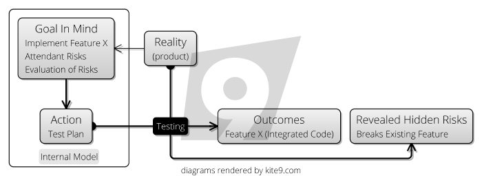

The whole purpose of testing is to [meet reality](Meeting-Reality) early, ahead of putting software in front of real users, where you face [Production Risks](Production-Risk), like reputation damage and financial penalties.

Given this, the best approach to test planning should be risk-based: consider which risks you want to mitigate, and test accordingly:

 - Identify Risks
 - Evaluate Risks
 - Prioritise Risks
 - Plan tests from the top of the priority list down.
 
## Examples
 
This should work at _every level_ within a project.  If you are building a new feature, you should consider:

- Is it going to connect to third-party systems?  If so, I should build [System Integration Tests](https://en.wikipedia.org/wiki/System_integration_testing) to cover the [Dependency Risk](Dependency-Risk) associated with this, and the chance that in the future, the interface will change. 
- Does my code do what I expect?  I probably should build a [Unit Test](https://en.wikipedia.org/wiki/Unit_testing) to mitigate [Complexity Risk](Complexity-Risk). 
- Will users understand the software I build for them?  I should probably do some [Beta Testing](https://en.wikipedia.org/wiki/Software_testing#Beta_testing) or [Corridor Testing](https://www.usability.gov/what-and-why/glossary/corridor-testing.html) to mitigate [Visiblity Risk](Visibility-Risk).
- To go live, am I going to need some piece of real-world paperwork?  Test the process ahead-of-time to expose all the [Hidden Risks](Risk) 

## Where It's Used

- [Waterfall](Waterfall) initially was conceived with a long, manual testing phase to be performed on the _whole system_ after development
- [Extreme Programming](Agile) championed the use of [Unit Tests](https://en.wikipedia.org/wiki/Unit_testing) in order to test individual subsystems, as well as having an [On-Site Customer](On-Site-Customer) to act as a testing resource when needed.

## Variations

### Automated Tests

Often, the decision of whether to automate a test will be based on whether or not it can be expressed _objectively_.  For example, checking that a REST endpoint "returns the right error code" is _objective_, and is therefore a candidate for automation.

Automated tests look roughly the same, irrespective of the scope they are trying to test.  
 - We have a **System Under Test**, which may be a single class, or a whole executable.  
 - We have some **Input Conditions** for the test, and some **Expectations**.
 - When the test is executed, we compare the actual outputs with the expected ones, giving us **The Result**.

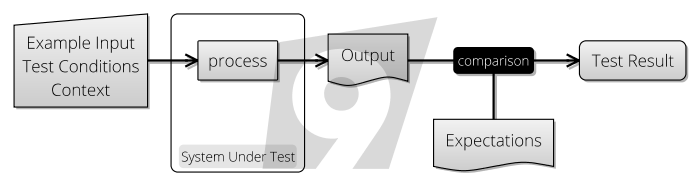

A useful way to think about automated testing is that it turns the **System Under Test** into a [Pure Function](https://en.wikipedia.org/wiki/Pure_function):  This means that for a specific set of inputs, the system will produce a specific output, reliably, every time.   

Getting complex systems to behave as pure functions can be costly, but there are techniques to help with this such as [Mocking](https://en.wikipedia.org/wiki/Mock_object).  However, if you try to devise as much of your software in a pure-functional way to start with, automated testing is much easier.

**Automated Testing** has an interesting effect on managing [Complexity Risk](Complexity-Risk):  Although you may initially write a Unit Test (say) to mitigate the risk of [having implemented a feature wrongly](Feature-Risk), you are also given insurance against future change breaking that feature.   That is to say, they are _regression tests_.  However, implementing tests like this is better than building regression tests, [as discussed here](Regression-Testing).

-- how do automated tests mitigate complexity risk?

### Manual Tests

**Manual Testing** is, at some level, essential if your product is to be used by humans.  Although UI-Automation tools such as [Selenium](https://docs.seleniumhq.org) allow you to script browser interactions, they cannot reliably catch every problem.

For example, ensuring the UI "looks ok and doesn't glitch" is entirely _subjective_:  you'll need to express this in a manual test.  Manual Tests are often described in [Test Plans](https://en.wikipedia.org/wiki/Test_plan) and [Test Scripts](https://en.wikipedia.org/wiki/Test_script) in order to ensure repeatability, and manage [Process Risk](Process-Risk).

Since manual tests carry much higher per-use cost to run, there is a tendency to want to save this cost by doing _fewer releases_.  After all, fewer releases means less manual testing, but this may increase [Process Risk](Process-Risk).

How do you decide whether to keep a test manual, or automate?  The more _automated_ a test is, the more cheaply it can be re-used.  However, the process of automation can take longer, and so adds [Schedule Risk](Schedule-Risk).  Whether or not it's worth automating is to some extend going to depend on how much you [value future time](Risk-Theory).

### White-Box and Black-Box Testing

In the initial conception, [Black-Box Testing](https://en.wikipedia.org/wiki/Black-box_testing) ignores the _implementation details_ of a component and tests the interface only.

White-box testing however considers the components within the box, and how they interact with one another in order to define the tests.  This is _fair enough_ if, for some reason, you are unable to test the components individually for some reason:  knowing how something is implemented gives you an insight into _where the bugs will hide_, and therefore, where the risks lie.   

### Testing Level 

However, if possible, it's better to break open the white box and test the components _themselves_.  This means you end up having "higher" and "lower" level tests, depending on the scope of the **System Under Test**.   There are several advantages to this:

 - First, tests become less "brittle":   the smaller the **System Under Test**, the less **Context** it needs to operate, therefore the more insulated it is to changes in other parts of the system.   As a counter-example, if _all_ of your tests run over the whole system, and the authentication system changes, does that break all the tests?   This is an argument from [Complexity-Risk](Complexity-Risk).
 - Tests at the "whole system" level are usually longer-running since they require starting up the whole system, and also require more data and context to run.  This is an argument both from [Complexity-Risk](Complexity-Risk) and [Process Risk](Process-Risk).

Expanding on this then, the [Testing Pyramid](https://martinfowler.com/bliki/TestPyramid.html) idea is that lower level, automated tests which run quickly should be common, while there should be fewer of the more expensive "whole system" level tests.  

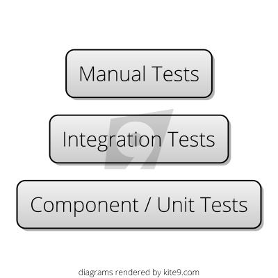

Finally, since manual tests are run by people (who are comparatively slow and costly), these should be the _rarest_ kind of test.

### Testing Team

Sometimes, testing is handled by external teams (possibly in other locales).  This is often done as a [cost-saving measure](Schedule-Risk), but comes with some penalties such as:
 - Increased [Bureacratic Risk](Bureaucratic-Risk) in terms of having to engage with an external company.
 - [Agency Risk](Agency-Risk) because the testing team are a _business in their own right_, who might be more interested in the goal of making money from you than shipping your product.
 - Obvious [Coordination Risk](Coordination-Risk) in trying to arrange work in other teams, buildings, timezones or countries, and not having control on exactly which staff are dealing with your product.
 - [Visibility Risk](Visibility-Risk) because at some level, the testing team need to understand _what your software is for_.

### Test-Driven Development

Also called test-first development, the idea here (from [Extreme Programming](Extreme-Programming)) is that you write the tests before the code, in order that you think up-front about the requirements of the software you are writing.  The aim of this is to minimize [Complexity Risk](Complexity-Risk) via preventing developers from [Gold Plating](https://en.wikipedia.org/wiki/Gold_plating_(software_engineering)), and getting them to do [The Simplest Thing That Can Possibly Work](Meeting-Reality).

Additionally, by having test _fail_ before they _pass_, you mitigate the risk of writing a "null" test (see below).

### Code Coverage

Code Coverage tools are a useful way of showing you which parts of your software might contain bugs due to lack of testing, which is really useful in the **Risk Evaluation** phase of test-planning.  

Sometimes code coverage spawns its own [Map And Territory Risks](Map-And-Territory-Risk) though, where people forget that the goal should be mitigating overall project risk (via delivering functionality and so forth) and start to believe that the goal is delivering 100% code coverage.  Writing tests to cover every `get()` method is a fools' errand which increases the overall [codebase complexity](Complexity-Risk) for no real reduction in [Feature Risk](Feature-Risk).

Worse still is that having 100% code coverage does not guarantee an absence of bugs, or that the code will do what the users wanted it to do.  [Feature Risk](Feature-Risk) is always there.

## Risks Mitigated

There are so many different types of testing and this guide is not meant to be exhaustive.  Instead, here is a table covering some of the main types of testing and the risks they mitigate:

|Risk|Mitigation|
|----|----------|
|[Boundary Risk](Boundary-Risk)             |System Integration Testing<br />CI Deployment<br />User Acceptance Testing|
|[Dependency Risk](Dependency-Risk)|Integration Testing<br />System Integration Testing|
|[Production Risk](Production-Risk)  |Performance Testing / Load Testing<br />Non-Functional Testing<br />Disaster Recovery Testing<br />Security esting<br />Smoke / Sanity Testing|
|[Software Risk](Software-Risk)|Unit Testing<br />Component Testing<br />End-To-End Testing<br />Functional Testing|
|[Feature Risk](Feature-Risk)|Browser-Based Testing<br />Accessibility Testing<br />Acceptance Testing (UAT)<br />Beta Testing|
|[Visibility Risk](Visibility-Risk)|Usability Testing<br />Corridor Testing|
|[Complexity Risk](Complexity-Risk)|Unit Testing<br />Automated Acceptance testing<br />Integration Testing|

## Attendant Risks

Firstly, it can be easy to fool yourself with tests:  just because your tests pass does _not_ mean your code is perfect.  Vigilance is required against [Map And Territory Risk](Map-And-Territory-Risk):

- Do the tests explore the behaviour of the system the same way the users will?
- Can you be sure you haven't written a "null test", one that passes when it should fail?
- Have you covered the "cracks" between the different parts of the system?  Just because all the _components_ of a bicycle are fine, it doesn't mean that the _bike itself will work_.

Second, Testing is a double-edged sword.  While it allows you to mitigate various [Feature Risks](Feature-Risk), by adding test-code to your project you are necessarily increasing the [complexity](Complexity-Risk).  Maintaining tests is hard work, and if you're not careful, _running_ tests can take time and slow down builds and add delay through [Process Risk](Process-Risk). 

Third, if you are [exploring functionality](Prototyping) in order to flush out requirements, understand user behaviour or figure out performance characteristics, then there is _no point in building tests_ yet: what you are doing is exploratory at best and the extra code will [slow you down](Complexity-Risk).

For these reasons, focus on writing the _smallest number of tests that mitigates the risks_.  

## See Also

[Risk Based Agile Testing](https://www.amazon.co.uk/Risk-Driven-Agile-Testing-risk-based-effective-ebook/dp/B06XGL4CDL/ref=sr_1_1?ie=UTF8&qid=1521908627&sr=8-1&keywords=risk+based+agile+testing) by Martin Ivison, which covers a lot of this ground in much more detail. 

\part{Methodologies}

\newpage
# Methodologies

Thinking is hard.  And worrying about Risk constantly would be _exhausting_.

Life is too short to go around considering Risk Management over everything you do.  

Luckily, our brains do it for us automatically and subconsiously:  Sometimes a voice inside will cry out Wait! before we walk out into a road or try to pick up a hot teapot.   

## Habit and Experience

These subconsious reactions are borne of two things:  **habit** (we drill our children from an early age in crossing the road to embed road safety) and **experience**  (after picking up lots of too-hot kitchenware, you don't do it again).

In this section (on Methodology), we're going to focus on how **habit** can help us short-cut the Risk Management process, whilst in the next we'll look at **experience**.

When it sticks, a methodology embeds a set of practices in a team to such an extent that they become _habit_:  the team following the methodology from feature to feature or release to release without question.

## A Pattern Language

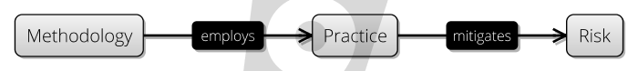

It stands to reason that if [all software is about risk management](All-Risk-Management), then we can examine methodologies 
_themselves_ in terms of how their practices mitigate risk, and change the balance of risk on projects.  

With that in mind, we are going to examine several methodologies, and break them down into their key _practices_.  For each practice, we will look at which [attendant risks](Attendant-Risk) it mitigates, and what [attendant risks](Attendant-Risk) it incurs.

!Show similarity between pattern and practice


So _Methodology_ exists as a way 

ceremony
practices
bureacratic overhead

a point of religion.

The questions we want to ask in this section are as follows:

 -How do frameworks change the risk landscape?

What are the risks in choosing a framework?

How does choosing a framework (at all) modify our risk landscape?

How should we choose a framework, then?

Evolution of software

There are more methodologies than stars in the sky, and it's not useful to look at all of them.  Instead, we're going to pick
a few _archetypes_ and leave it at that.  

So, let's start at the beginning then, with [Waterfall](Waterfall).


### It's the same steps, but it's Sizing those steps:

Agile is per-feature delivery,
Waterfall is a bunch of features.

But, a lot of the practices end up being the same.


\newpage
# Waterfall

[Waterfall](https://en.wikipedia.org/wiki/Waterfall_model) is a linear, stepwise approach to the processes involved in delivering a software system, and it really represents a family of methodologies, such as [RUP](https://en.wikipedia.org/wiki/Rational_Unified_Process) or [SSADM](https://en.wikipedia.org/wiki/Structured_systems_analysis_and_design_method).

## Major Practices

The specifics differ from one formulation to another, but generally speaking the process looks something like this:

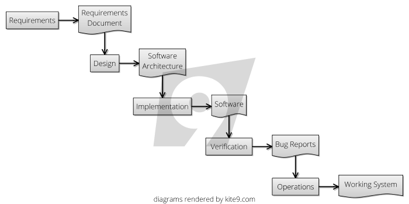

As shown in the diagram above, the software process is broken into distinct stages, usually including:

- [Requirements Capture](Requirements-Capture)
- [Design](Big-Design-Up-Front)
- [Implementation](Development)
- [Verification](Testing)
- [Delivery](Delivery) and [Operations](Support)
- [Sign Offs](Sign-Off) at each stage

### Variations

- [Prototyping](Prototyping):  Picking a particularly high-risk part of the project (such as UI elements) and delivering it first.  
- [Business Case](Analysis): Adding a stage in the at the start of the project to perform some benefits calculations.
- [Cycles](Prioritisation): Delivering in multiple, incremental stages.

## Risks Mitigated

### 1.  [Cost Of Implementation](Schedule-Risk)

It's likely that the Waterfall-Style methodologies were inspired by the construction industry, wherein we try to [Design Up Front](Design) in order to avoid the cost of re-work:  once concrete is poured, it's expensive to change it again, compared to the cost of updating the design in a diagram.   

Also, when Waterfall was originally conceived, automated testing techniques were not well established.  If you expect to perform a large [manual testing cycle](Testing) for each release, then clearly, doing fewer releases looks cheaper on paper.  

But, while _in principle_, Waterfall aims to _contain_ the cost of implementation.  However, in practice, because of [Requirements Drift](Feature-Risk), [Student Syndrome](Schedule-Risk) and [Complexity Risk](Complexity-Risk), the schedules get more inaccurate the larger the project.

### 2.  [Lots Of Stakeholders](Coordination-Risk)

In any construction project, there are likely to be lots of stakeholders - landowners, neighbours, government, clients and so on.   

Waterfall tries to mitigate this risk by getting [Sign-Offs](Sign-Off) as it goes along.

Additionally, by putting in the work at the planning and design stage, hopefully this means lots of staff can work together and not interfere with each other when the time for construction comes.

### 4.  [Agency Risk](Agency-Risk)

Because of it's step-wise delivery and reduction in visibility risk, Waterfall documentation can be used as the basis for [contracted delivery](Contract), and this is useful in situations where you are employing 3rd parties or putting work to tender.  

This is very different from the way [Agency Risk](Agency-Risk) is mitigated in, say [Scrum](Scrum), which relies on the [On Site Customer](On-Site-Customer) to police the implementation team.

### 5.  [Bureaucratic Risk](Bureaucratic-Risk)

Where projects can get tied up in lots of red tape, a Waterfall process can supply enough gravitas in the form of documentation and ceremony in order to appease bureaucracy, in a way that [Lean](Lean) or [Agile](Agile) methods do not.    

Additionally, because a [plan](Delivery-Plan) can be based on the [Design](Design), you can include bureaucratically-onerous tasks in the plan and work on these in parallel.

## Attendant Risks

### 1. [Complexity Risk](Complexity-Risk)

One of the biggest problems in sticking to a [Design](Design), rather than letting the design evolve, is that you are not going to be practicing [Refactoring](Refactoring) in order to keep down 

### 2.  [Production Risk](Production-Risk)

The fewer different [phases or cycles](Prioritisation) in your project, the fewer times you will [Meet Reality](Meet-Reality) 


