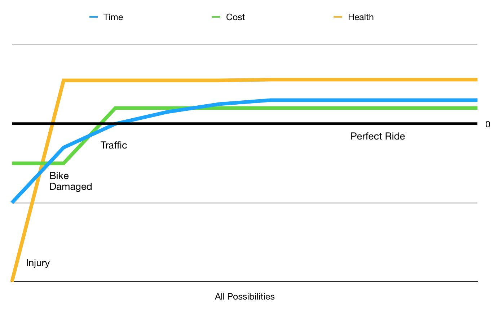

---
title: The Purpose of the Development Team
description: Making sense of contradictory definitions.
url: https://riskfirst.org/Purpose-Development-Team
image: /images/generated/titles/Purpose-Development-Team.png
---

## Case 1

A manager I used to work with, Kevin, used to say that the purpose of the Development Team was "Sustainably deliver value quickly.”  Deliver software that works correctly and quickly.  It always seemed to me to be approximately right.  

Do X and Y: implies that there is a balance to be achieved - what happens when you are forced to choose between A and B? How do you choose?  What about C…

Cars aren’t optimised for energy efficiency and speed, it’s a trade-off between the two.  Runners are either fast over short distances or long distances - it’s not both.  My laptop makes trade-offs between battery life and weight: either extreme is bad, somewhere in the middle is useful.

This is all very well, but how does one resolve these apparently contradictory demands?  Why do we need contradictory demands?  Can’t we restate the goal of the development team without recourse to tbd

## Case 2

On a project not so long ago, we chose to use [Scrum](https://en.wikipedia.org/wiki/Scrum), which advocates development being broken into "sprints" of maybe a few weeks long, commencing with planning and ending in a release. This worked out pretty well for a while, until one day there was a major outage in a critical piece of our infrastructure.  We could have washed our hands of it, because there was a specific team for managing the infrastructure, but it seemed much more sensible that we abandon the sprint we were on and roll up our sleeves to help.   After all, our product was dead-in-the-water without the infrastructure, and this was impacting our user-base.

Had we stuck to Scrum religiously (following the rules, but not in an agile way), we might have waited until the end of the sprint, and then considered whether to help the infrastructure team during the planning phase of the next sprint.   But of course, that would be a crazy interpretation of what it means to be agile.

Scrum's rule about working-to-a-sprint is well-meaning, but not always applicable.  How do we decide when to follow it, and when not to?

## Case 3

The first statement of the Agile Manifesto is:

> "Individuals and Interactions over Processes and Tools." - [Agile Manifesto](https://agilemanifesto.org)

What does this mean?   I don't think it means "Individuals and Interactions are always more important than Processes and Tools” and it certainly doesn’t mean “throw away all your tools”.  It is basically saying “previously, we’ve steered too much towards the right.  We should steer a bit more towards the left”.  

Is this helpful?  Is such a relative statement telling us anything we previously didn't know?  Usefully, perhaps, this describes a tautology that we may have been previously unaware of.  I might have thought, "Individuals and Interactions? Processes and Tools?  More of both, please!"  But this statement is telling me that _I can't_ have both, there is a trade-off, and I will have to choose.

But how do I choose?

## Case 4

Sometimes, I am faced with a conflict over whether to pay off [technical debt](Complexity-Risk.md#technical-debt) or build new functionality.  Sometimes the conflict will be with people in my team, or with stake-holders, but sometimes it is an internal, personal conflict.  Paying off technical debt is sometimes the right thing to do when there is lots of unnecessary complexity in the code-base, but sometimes, it can be [premature optimisation](), and the shape of the software gets changed by new functionality so much that the work I put into clearing the technical debt is wasted.

What should I do?

## A Virtue Between Two Vices

All of these definitions are problematic!  Are we missing something?

So, above I’ve given several cases of contradictory tensions within development.  You can probably think of some more.  In all of these, we are forced to use our common sense to try and steer a path between unreasonable extremes - a “virtue between the vices” as the [Greeks](tbd) termed it.  But could there be a “general theory” somehow that avoids these contradictions? What would it look like?  I am going to suggest one here:

> "The purpose of the development team is to improve the balance of risk for the business as much as possible."

Now clearly, the troublesome clause in this statement is “balance of risk”.  So, before we apply this razor to the cases above, let’s cover that concept in some detail, by exploring three toy examples: the roulette table, buying stocks, and cycling to work. 

## Example 1: The Roulette Table

Let’s talk about “risk” for a bit.  First, we’re going to consider the game “roulette”.  If you bet a chip on a number (say, 12) in roulette and win, you win 35 chips (plus you get back your original chip).  However, there are 37 places the ball can stop in roulette, and any of the other 36 will result in a complete loss.  

 

The above graph shows the distribution of returns for this bet.  Which hole the ball lands in (entirely randomly) is the independent variable on the x-axis.  The return is on the y-axis.   Most of the time, it’s a small loss, but there’s that one big win on the 12.  For clarity, in all the graphs, I’ve arranged the x-axis in order of “worst outcome” to “best outcome”, but it doesn’t necessarily have to be arranged like this.

In roulette, then, the balance of risk is against us:  if we integrate to find the area under this graph, it comes out -1 chips.   You could get lucky, but over time the house wins, and it’s (fairly) transparent that this is the case when you enter the game, so people are clearly not playing roulette with the rational goal of maximising chips.

## Example 2: Buying Stocks

In real-life, the distribution of returns differs in two key ways from roulette.  

First, a roulette table presents us with a set of very discrete outcomes.  Real life isn’t like that so much: there’s usually a sliding scale from “complete success” to “complete failure”, with a large middle-ground of so-so performance. 

The chart above shows the returns-per-quarter of Ford and Berkshire Hathaway stocks over a number of years, with worst-performing quarters on the left and best-performing on the right.   

Second, while you know ahead-of-time the chances of winning at roulette, you can only guess at the balance of risk for owning Berkshire Hathaway stock for the next quarter, even if you are armed with the above graph.  That’s because past performance is no indication of future performance. 

That means that when we consider buying a stock, we are going to build a model of the balance of risks (perhaps on a spreadsheet, or in our heads).  This will be dependent on our own preferences and experience (our [Internal Model](Glossary.md#internal-model) if you will).

## Example 3: Cycling To Work

Although gambling is all about chips, and buying stock is all about money, that’s just a way of keeping score.  In reality, our actions have a trade off, some things get better while others get worse. 

  
In the above graph, we have three different scores - Time, Cost and Health of cycling to work.  There are times when cycling could work out more expensive than the bus:  maybe the bike breaks and you end up with a costly bill to fix it.  If you cycle in a busy city, the chances are you’re often getting into scrapes with other road users, which might impact your health. 

It seems like it’s human nature to over-estimate the likelihood of the bad things happening, while under-estimating the good.  Probably in reality, accidents are much less likely than the above graph implies.  But it’s human nature to be cautious, probably something baked into us by evolution.

The risks to time, cost and health have to be weighed against each other. Whether you are time-poor or cash-poor is likely to factor into this.  Everyone is going to have a different view on the aggregate return profile.

Getting rid of the numbers.

## Back To Software

A decision over whether to cycle to work or not changes the Balance Of Risks.  So it goes in software development:

 - If I decide to suspend the current sprint to fix an outage, then that’s because I’ve decided that the risk of lost business, or the damage to reputation is greater than the risk that customers will walk away because we didn’t complete the implementation of feature X.  tbd balance of risk
- When the Agile Manifesto stresses _Individuals and Interactions_ over _Processes and Tools_, it’s because it's view is that focusing on processes and tools leads to more risk.  Specifically, agile is about _responding to change_ and trying to avoid building the wrong product ([Feature-Fit Risk](Feature-Risk.md#feature-fit-risk)).  They are therefore sacrificing straight-line speed and efficiency in order to try and build the _right_ thing.  
- When we argue for fixing technical debt against shipping a new feature, what we are really doing is expressing differences in our models of the balance of risks from taking these actions.   My boss and I might both be trying to minimise the risk of customers defecting to another product, but he might believe this is best achieved by [adding new features](Feature-Risk.md) in the short term, whilst I might believe that clearing technical debt allows us to get features delivered faster in the long term.
- How do we optimise Kevin's example tbd.

## Zooming Out

In a way, this is not just about development teams.  The development team are experts in improving the balance of technical risks, but other teams have other specialities:
 
 - The finance team are there to ensure that you don't run out of money ([Funding Risk](Scarcity-Risks.md#funding-risk) and that the bills get paid (avoiding [Legal Risks](Operational-Risk.md)).
 - The Human Resources team are there to make sure staff are hired on, managed and leave properly.  Doing this avoids [Reputation Damage](), [Morale Issues](Agency-Risk.md#morale) and [Legal Risks](Operational-Risk.md).
 - The best doctors are the ones with the 
 - Part of [Operations Management](Operational-Risk.md#operations-management) is to ensure that the organisation is aware of its internal state, and the world around it, to ensure they are aware of the balance of risks.

Any time a person is added to an organisation, the hope is that it will improve the balance of risk for that organisation.  The way to do this is to try and _improve the balance of risks_:  encouraging the upside risks while preventing the downside risks.  The most useful change agents are therefore the ones with the best [Internal Models](Glossary.md#internal-model), since they can both _diagnose_ the current balance of risk, and know the best levers to pull to improve it.

- explain balance of risks - probably lose, probably win. & integration.   after example 2.
- bring our skills to bear whatever the risk.
- cf. with evolution.
- and people:  people are naturally risk-averse.

How does this help?

 - with debugging
 - with planning work
 - with development

