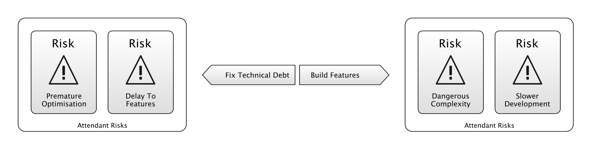

---
title: The Purpose of the Development Team
description: Making sense of contradictory objectives.
url: https://riskfirst.org/Purpose-Development-Team
image: /images/generated/titles/Purpose-Development-Team.png
---

## Case 1: Lean

A manager I used to work with, Kevin, used to say that the purpose of the Development Team was "Sustainably Deliver Value Quickly."  Which apparently he got from a Lean handbook (maybe something like [this one](https://leankit.com/learn/lean/lean-business-development/)). It always seemed to me to be _approximately right_, except it bugged me and eventually, I was able to put my finger on _why_.

- **First, "sustainably" and "quickly" are somewhat at odds with each other.** Much like cars aren’t optimised for both "energy efficiency" and "speed", it’s a trade-off between the two.  Runners are either fast over short distances or long distances - it’s not both.  My laptop makes trade-offs between battery life and weight: either extreme is bad, somewhere in the middle is useful.  So "sustainably" and "quickly" implies that there is a balance to be achieved - what happens when you are forced to choose between the two? How do you choose?  

- **Second, my conception of value is that it is something you can sell.** Producing a product that customers value (at say £100-per-year) means that we can sell it for somewhere less than that (say £80-per-year), and the development cost must come in at somewhere less than (say £50-per-year) that to allow the company to make a profit.  But again, _value_ didn't seem like the whole story either.  Aren't there things to worry about _besides_ value?

## Case 2: Scrum

On a project not so long ago, we chose to use [Scrum](https://en.wikipedia.org/wiki/Scrum), which advocates development being broken into "sprints" of maybe a few weeks long, commencing with planning and ending in a release. This worked out pretty well for a while, until one day there was a major outage in a critical piece of our infrastructure.  

We could have washed our hands of it, because there was a specific team for managing the infrastructure, but it seemed much more sensible that we abandon the sprint we were on and roll up our sleeves to help.   After all, our product was dead-in-the-water without the infrastructure, and this was impacting our users.

Had we stuck to Scrum religiously (following the _rules_, but not in an agile way), we might have waited until the end of the sprint, and then considered whether to help the infrastructure team during the planning phase of the next sprint.   But of course, that would be a crazy interpretation of what it means to be agile.

Scrum's rule about working-to-a-sprint is well-meaning, but not always applicable.  How do we decide when to follow it, and when not to?

## Case 3: Agile Manifesto

The first statement of the Agile Manifesto is:

> "Individuals and Interactions over Processes and Tools." - [Agile Manifesto](https://agilemanifesto.org)

What does this mean?   I don't think it means "Individuals and Interactions are always more important than Processes and Tools” and it certainly doesn’t mean “throw away all your tools”.  It is basically saying “previously, we’ve steered too much towards the right.  We should steer a bit more towards the left”.  

Is this helpful?  Is such a relative statement telling us anything we previously didn't know?  Usefully, perhaps, this describes a tautology that we may have been previously unaware of.  I might have thought, "Individuals and Interactions? Processes and Tools?  More of both, please!"  But this statement is telling me that _I can't_ have both, there is a trade-off, and I will have to choose.

But how do I choose?

## Case 4: Technical Debt

Sometimes, I am faced with a conflict over whether to pay off [technical debt](Complexity-Risk.md#technical-debt) or build new functionality.  Sometimes the conflict will be with people in my team, or with stake-holders, but sometimes it is an internal, personal conflict.  

As the above diagram shows, paying off technical debt is sometimes the right thing to do when there is lots of unnecessary complexity in the code-base, but sometimes, it can be [premature optimisation](https://en.wikipedia.org/wiki/Program_optimization#When_to_optimize), and the shape of the software gets changed by new functionality so much that the work I put into clearing the technical debt is wasted.

What should I do?

## A Virtue Between Two Vices

All of these definitions are problematic!  Are we missing something?

So, above I’ve given several cases of contradictory tensions within development.  You can probably think of some more.  In all of these, we are forced to use our common sense to try and steer a path between unreasonable extremes - a “virtue between the vices” as Aristotle termed it:  

> "In ancient Greek philosophy, especially that of Aristotle, the golden mean or golden middle way is the desirable middle between two extremes, one of excess and the other of deficiency." - [Golden Mean, _Wikipedia_](https://en.wikipedia.org/wiki/Golden_mean(philosophy))

But could there be a “general theory” somehow that avoids these contradictions? What would it look like?  I am going to suggest one here:

> "The purpose of the development team is to improve the [balance of risk](Glossary.md#balance-of-risk) for achieving business goals as much as possible."

Now clearly, the troublesome clause in this statement is “[balance of risk](Glossary.md#balance-of-risk)”.  So, before we apply this razor to the cases above, let’s cover that concept in some detail, by exploring three toy examples: the roulette table, buying stocks, and cycling to work. 

## Example 1: The Roulette Table

Let’s talk about “risk” for a bit.  First, we’re going to consider the game “roulette”.  If you bet a chip on a number (say, 12) in roulette and win, you win 35 chips (plus you get back your original chip).  However, there are 37 places the ball can stop in roulette, and any of the other 36 will result in a complete loss.  

 

The above chart shows the distribution of returns for this bet.  Which hole the ball lands in (entirely randomly) is the independent variable on the x-axis.  The return is on the y-axis.   Most of the time, it’s a small loss, but there’s that one big win on the 12.  For clarity, in all the charts, I’ve arranged the x-axis in order of “worst outcome” to “best outcome”, but it doesn’t necessarily have to be arranged like this.

In roulette, then, the [balance of risk](Glossary.md#balance-of-risk) is against us:  if we integrate to find the area under this chart, it comes out -1 chips.   You could get lucky, but over time the house wins, and it’s (fairly) transparent that this is the case when you enter the game, so people are clearly not playing roulette with the rational goal of maximising chips.

## Example 2: Buying Stocks

In real-life, the distribution of returns differs in two key ways from roulette.  

First, a roulette table presents us with a set of very discrete outcomes.  Real life isn’t like that so much: there’s usually a sliding scale from “complete success” to “complete failure”, with a large middle-ground of so-so performance. 

The chart above shows the returns-per-quarter of Ford and Berkshire Hathaway stocks over a number of years, with worst-performing quarters on the left and best-performing on the right.   

Second, while you know ahead-of-time the chances of winning at roulette, you can only guess at the [balance of risk](Glossary.md#balance-of-risk) for owning Berkshire Hathaway stock for the next quarter, even if you are armed with the above chart.  Generally, owning shares has a net-positive [balance of risk](Glossary.md#balance-of-risk), especially over the long run.   You're more likely to make money than lose money.  But it's not guaranteed - past performance is no indication of future performance. 

Another question relating to this graph might be:  which firm is generating the most value?  Certainly, the area under the Berkshire Hathaway curve is more, but there is a bigger downside too.  Is it possible that Berkshire Hathaway generates more value while taking on more risk?

When we consider buying a stock, we are going to build a model of the [balance of risks](Glossary.md#balance-of-risk) (perhaps on a spreadsheet, or in our heads).  This will be dependent on our own preferences and experience (our [Internal Model](Glossary.md#internal-model) if you will).

## Example 3: Cycling To Work

Gambling is all about winning _chips_, and buying stock is all about winning _money_. Those are just ways of keeping score.   But often, there is no exact score.  Let's look at an example of that.

In the above chart, we have two risk profiles for cycling to work.  On the left, we have the time taken.  There's a very objective measure of time, and after a few week's cycling, we can probably start to build up a good [Internal Model](Glossary.md#internal-model) of what this distribution looks like.   On the right, we have _health_.  There probably _isn't_ an objective measure for this.  We might look at our weight, or resting heart-rate or something, or just generally have a good feeling that cycling is making us fitter.  But, there's probably a worry about having an accident built into this, and again, there is no objective measure for judging how badly that might come off.

So we have two issues:  it's hard to judge exactly how likely an accident is (the width of the bar) and also how costly it will be (the depth of the bar).  Everyone judges this differently, and there's lots of evidence to suggest even the same person will judge this differently at different _ages_.

If we want to reduce the time it takes to get to work, maybe by cycling faster, or going by a busier route, it's probably going to have a knock-on effect on the health risks.  Whether this is worth it will depend on your appetite for health risks, against wanting to save time.  

So, we've gone from the Roulette Table example (where the whole risk profile is known in advance) to the Cycling example, where the risk profile is hidden from us.  Regardless, we will have our own [Internal Model](Glossary.md#internal-model) of the distribution of risks which we use to make judgement calls.

## Back To Software

A decision over how or whether to cycle to work changes the [balance of risk](Glossary.md#balance-of-risk), and the actions and decisions we make in software development have the same quality.  

The difference is, while the above example was chosen to be quite _finely balanced_, in software development we should be looking for actions to take where the upside _considerably_ defeats the downside.  That is, improving the [balance of risk](Glossary.md#balance-of-risk) _as much as possible_.   We don't want to just do work that merely shifts us from having one big risk to another, we want to do work that swaps out a large risk for maybe a couple of tiny ones.   

Let's go back to our original cases:

 - If I decide to suspend the current sprint to fix an outage, then that’s because I’ve decided that the risk of lost business, or the damage to reputation is much greater than the risk of customers walking because we didn’t complete feature X.  
- When the Agile Manifesto stresses _Individuals and Interactions_ over _Processes and Tools_, it’s because it's view is that focusing on processes and tools leads to much greater risk.  Specifically, agile is about _responding to change_ and trying to avoid building the wrong product ([Feature-Fit Risk](Feature-Risk.md#feature-fit-risk)).  They are therefore sacrificing straight-line speed and efficiency in order to try and build the _right_ thing.  Agile is a statement that the gre
- When we argue for fixing technical debt against shipping a new feature, what we are really doing is expressing differences in our models of the [balance of risk](Glossary.md#balance-of-risk) from taking these actions.   My boss and I might both be trying to minimise the risk of customers defecting to another product, but he might believe this is best achieved by [adding new features](Feature-Risk.md) in the short term, whilst I might believe that clearing technical debt allows us to get features delivered faster in the long term.
- How do we optimise Kevin's example tbd.

## Zooming Out

In a way, this is not just about development teams.  The development team are experts in improving the balance of technical risks, but other teams have other specialities:
 
 - The finance team are there to ensure that you don't run out of money ([Funding Risk](Scarcity-Risks.md#funding-risk) and that the bills get paid (avoiding [Legal Risks](Operational-Risk.md)).
 - The Human Resources team are there to make sure staff are hired on, managed and leave properly.  Doing this avoids [Reputation Damage](), [Morale Issues](Agency-Risk.md#morale) and [Legal Risks](Operational-Risk.md).
 - The best doctors are the ones with the 
 - Part of [Operations Management](Operational-Risk.md#operations-management) is to ensure that the organisation is aware of its internal state, and the world around it, to ensure they are aware of the [balance of risk](Glossary.md#balance-of-risk).

Any time a person is added to an organisation, the hope is that it will improve the balance of risk for that organisation.  The way to do this is to try and _improve the balance of risks_:  encouraging the upside risks while preventing the downside risks.  The most useful change agents are therefore the ones with the best [Internal Models](Glossary.md#internal-model), since they can both _diagnose_ the current balance of risk, and know the best levers to pull to improve it.

- explain balance of risks - probably lose, probably win. & integration.   after example 2.
- bring our skills to bear whatever the risk.
- cf. with evolution.
- and people:  people are naturally risk-averse.
- investment banking, kelly bets
- development bets

How does this help?

 - with debugging
 - with planning work
 - with development

real options
