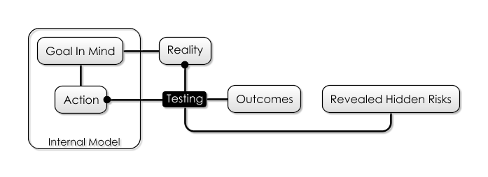
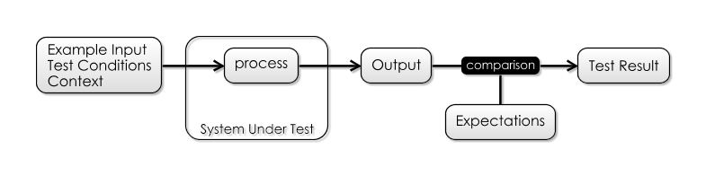
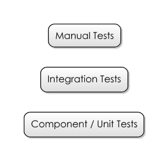

## What Is It 

Most forms of testing are about isolating a particular _characteristic_ of your system, and exploring it from a risk perspective.  It could be:

- **Performance Testing** addresses the risk of [not being able to support all the users](Production-Risk)
- **Usability Testing** tries to see whether people struggle to make sense of your software, usually because the assumptions of their [Internal Models](Glossary#Internal-Model) differ from those embedded in the system, or that the system isn't adequately [transparent](Visibility-Risk) about it's own model.
- **Security Testing** addresses the risk that your software could be used against you or its users [by hackers](Production-Risk).
- **Integration Testing**:  Where we test how the software works as-a-whole, and test that it will work [with other systems](Dependency-Risk.md) 
- **Corridor Testing**:  Asking a few, random people to use the system-under-test, in order to see [if it confuses them, or not](Visibility-Risk).
- **User Acceptance Testing**:  Asking users to review new features, and make sure that they actually [do what is required](Feature-Risk)
- **Regression Testing**: Making sure changes in new versions of the system haven't [broken functionality](Feature-Risk)

## How It Works

The whole purpose of testing is to [meet reality](Meeting-Reality) early, ahead of putting software in front of real users, where you face [Production Risks](Production-Risk), like reputation damage and financial penalties.

Given this, the best approach to test planning should be risk-based: consider which risks you want to mitigate, and test accordingly:

 - Identify Risks
 - Evaluate Risks
 - Prioritise Risks
 - Plan tests from the top of the priority list down.
 
## Examples
 
This should work at _every level_ within a project.  If you are building a new feature, you should consider:

- Is it going to connect to third-party systems?  If so, I should build [System Integration Tests](https://en.wikipedia.org/wiki/System_integration_testing) to cover the [Dependency Risk](Dependency-Risk.md) associated with this, and the chance that in the future, the interface will change. 
- Does my code do what I expect?  I probably should build a [Unit Test](https://en.wikipedia.org/wiki/Unit_testing) to mitigate [Complexity Risk](Complexity-Risk.md). 
- Will users understand the software I build for them?  I should probably do some [Beta Testing](https://en.wikipedia.org/wiki/Software_testing#Beta_testing) or [Corridor Testing](https://www.usability.gov/what-and-why/glossary/corridor-testing.html) to mitigate [Visiblity Risk](Visibility-Risk).
- To go live, am I going to need some piece of real-world paperwork?  Test the process ahead-of-time to expose all the [Hidden Risks](Glossary#hidden-risk) 

## Where It's Used

- [Waterfall](Waterfall) initially was conceived with a long, manual testing phase to be performed on the _whole system_ after development
- [Extreme Programming](Agile) championed the use of [Unit Tests](https://en.wikipedia.org/wiki/Unit_testing) in order to test individual subsystems, as well as having an [On-Site Customer](On-Site-Customer) to act as a testing resource when needed.

## Variations

### Automated Tests

Often, the decision of whether to automate a test will be based on whether or not it can be expressed _objectively_.  For example, checking that a REST endpoint "returns the right error code" is _objective_, and is therefore a candidate for automation.

Automated tests look roughly the same, irrespective of the scope they are trying to test.  
 - We have a **System Under Test**, which may be a single class, or a whole executable.  
 - We have some **Input Conditions** for the test, and some **Expectations**.
 - When the test is executed, we compare the actual outputs with the expected ones, giving us **The Result**.

A useful way to think about automated testing is that it turns the **System Under Test** into a [Pure Function](https://en.wikipedia.org/wiki/Pure_function):  This means that for a specific set of inputs, the system will produce a specific output, reliably, every time.   

Getting complex systems to behave as pure functions can be costly, but there are techniques to help with this such as [Mocking](https://en.wikipedia.org/wiki/Mock_object).  However, if you try to devise as much of your software in a pure-functional way to start with, automated testing is much easier.

**Automated Testing** has an interesting effect on managing [Complexity Risk](Complexity-Risk.md):  Although you may initially write a Unit Test (say) to mitigate the risk of [having implemented a feature wrongly](Feature-Risk), you are also given insurance against future change breaking that feature.   That is to say, they are _regression tests_.  However, implementing tests like this is better than building regression tests, [as discussed here](Regression-Testing).

-- how do automated tests mitigate complexity risk? tbd

### Manual Tests

**Manual Testing** is, at some level, essential if your product is to be used by humans.  Although UI-Automation tools such as [Selenium](https://docs.seleniumhq.org) allow you to script browser interactions, they cannot reliably catch every problem.

For example, ensuring the UI "looks ok and doesn't glitch" is entirely _subjective_:  you'll need to express this in a manual test.  Manual Tests are often described in [Test Plans](https://en.wikipedia.org/wiki/Test_plan) and [Test Scripts](https://en.wikipedia.org/wiki/Test_script) in order to ensure repeatability, and manage [Process Risk](Process-Risk).

Since manual tests carry much higher per-use cost to run, there is a tendency to want to save this cost by doing _fewer releases_.  After all, fewer releases means less manual testing, but this may increase [Process Risk](Process-Risk).

How do you decide whether to keep a test manual, or automate?  The more _automated_ a test is, the more cheaply it can be re-used.  However, the process of automation can take longer, and so adds [Schedule Risk](Scarcity-Risk#schedule-risk).  Whether or not it's worth automating is to some extend going to depend on how much you [value future time](Evaluating-Risk).

### White-Box and Black-Box Testing

In the initial conception, [Black-Box Testing](https://en.wikipedia.org/wiki/Black-box_testing) ignores the _implementation details_ of a component and tests the interface only.

White-box testing however considers the components within the box, and how they interact with one another in order to define the tests.  This is _fair enough_ if, for some reason, you are unable to test the components individually for some reason:  knowing how something is implemented gives you an insight into _where the bugs will hide_, and therefore, where the risks lie.   

### Testing Level 

However, if possible, it's better to break open the white box and test the components _themselves_.  This means you end up having "higher" and "lower" level tests, depending on the scope of the **System Under Test**.   There are several advantages to this:

 - First, tests become less "brittle":   the smaller the **System Under Test**, the less **Context** it needs to operate, therefore the more insulated it is to changes in other parts of the system.   As a counter-example, if _all_ of your tests run over the whole system, and the authentication system changes, does that break all the tests?   This is an argument from [Complexity-Risk](Complexity-Risk.md).
 - Tests at the "whole system" level are usually longer-running since they require starting up the whole system, and also require more data and context to run.  This is an argument both from [Complexity-Risk](Complexity-Risk.md) and [Process Risk](Process-Risk).

Expanding on this then, the [Testing Pyramid](https://martinfowler.com/bliki/TestPyramid.html) idea is that lower level, automated tests which run quickly should be common, while there should be fewer of the more expensive "whole system" level tests.  

Finally, since manual tests are run by people (who are comparatively slow and costly), these should be the _rarest_ kind of test.

### Testing Team

Sometimes, testing is handled by external teams (possibly in other locales).  This is often done as a [cost-saving measure](Scarcity-Risk#schedule-risk), but comes with some penalties such as:
 - Increased [Bureacratic Risk](Bureaucratic-Risk) in terms of having to engage with an external company.
 - [Agency Risk](Agency-Risk.md) because the testing team are a _business in their own right_, who might be more interested in the goal of making money from you than shipping your product.
 - Obvious [Coordination Risk](Coordination-Risk) in trying to arrange work in other teams, buildings, timezones or countries, and not having control on exactly which staff are dealing with your product.
 - [Visibility Risk](Visibility-Risk) because at some level, the testing team need to understand _what your software is for_.

### Test-Driven Development

Also called test-first development, the idea here (from [Extreme Programming](Extreme-Programming)) is that you write the tests before the code, in order that you think up-front about the requirements of the software you are writing.  The aim of this is to minimize [Complexity Risk](Complexity-Risk.md) via preventing developers from [Gold Plating](https://en.wikipedia.org/wiki/Gold_plating_(software_engineering)), and getting them to do [The Simplest Thing That Can Possibly Work](Meeting-Reality).

Additionally, by having test _fail_ before they _pass_, you mitigate the risk of writing a "null" test (see below).

### Code Coverage

Code Coverage tools are a useful way of showing you which parts of your software might contain bugs due to lack of testing, which is really useful in the **Risk Evaluation** phase of test-planning.  

Sometimes code coverage spawns its own [Map And Territory Risks](Map-And-Territory-Risk) though, where people forget that the goal should be mitigating overall project risk (via delivering functionality and so forth) and start to believe that the goal is delivering 100% code coverage.  Writing tests to cover every `get()` method is a fools' errand which increases the overall [codebase complexity](Complexity-Risk.md) for no real reduction in [Feature Risk](Feature-Risk).

Worse still is that having 100% code coverage does not guarantee an absence of bugs, or that the code will do what the users wanted it to do.  [Feature Risk](Feature-Risk) is always there.

## Risks Mitigated

There are so many different types of testing and this guide is not meant to be exhaustive.  Instead, here is a table covering some of the main types of testing and the risks they mitigate:

|Risk|Mitigation|
|----|----------|
|[Boundary Risk](Boundary-Risk)             |System Integration Testing CI Deployment User Acceptance Testing|
|[Dependency Risk](Dependency-Risk.md)|Integration Testing System Integration Testing|
|[Production Risk](Production-Risk)  |Performance Testing / Load Testing Non-Functional Testing Disaster Recovery Testing Security esting Smoke / Sanity Testing|
|[Software Risk](Software-Risk)|Unit Testing Component Testing End-To-End Testing Functional Testing|
|[Feature Risk](Feature-Risk)|Browser-Based Testing Accessibility Testing Acceptance Testing (UAT) Beta Testing|
|[Visibility Risk](Visibility-Risk)|Usability Testing Corridor Testing|
|[Complexity Risk](Complexity-Risk.md)|Unit Testing Automated Acceptance testing Integration Testing|

## Attendant Risks

Firstly, it can be easy to fool yourself with tests:  just because your tests pass does _not_ mean your code is perfect.  Vigilance is required against [Map And Territory Risk](Map-And-Territory-Risk):

- Do the tests explore the behaviour of the system the same way the users will?
- Can you be sure you haven't written a "null test", one that passes when it should fail?
- Have you covered the "cracks" between the different parts of the system?  Just because all the _components_ of a bicycle are fine, it doesn't mean that the _bike itself will work_.

Second, Testing is a double-edged sword.  While it allows you to mitigate various [Feature Risks](Feature-Risk), by adding test-code to your project you are necessarily increasing the [complexity](Complexity-Risk.md).  Maintaining tests is hard work, and if you're not careful, _running_ tests can take time and slow down builds and add delay through [Process Risk](Process-Risk). 

Third, if you are [exploring functionality](Prototyping) in order to flush out requirements, understand user behaviour or figure out performance characteristics, then there is _no point in building tests_ yet: what you are doing is exploratory at best and the extra code will [slow you down](Complexity-Risk.md).

For these reasons, focus on writing the _smallest number of tests that mitigates the risks_.  

## See Also

[Risk Based Agile Testing](https://www.amazon.co.uk/Risk-Driven-Agile-Testing-risk-based-effective-ebook/dp/B06XGL4CDL/ref=sr_1_1?ie=UTF8&qid=1521908627&sr=8-1&keywords=risk+based+agile+testing) by Martin Ivison, which covers a lot of this ground in much more detail. 

## Continuous Integration

referred to.