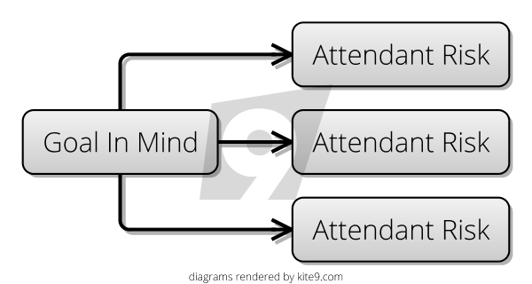

Hi.  Welcome to the Risk-First Wiki.  

I've started this website because, on my career journey, I've noticed that the way I do things doesn't seem to match up with the way the books _say_ it should be done.  And, I found this odd and wanted to explore it further.   Hopefully, you, the reader, will find something of use in this. 

## A Really Short Overview

I've worked on lots of different projects, using various different "methodologies" over the years: waterfall, XP, Scrum, Lean, and mixtures of all kinds in between.  You can learn things from all of them - they all have something valuable to offer.   

## A Synthesis

Lets for a moment forget about software completely, and think about _any endeavour at all_ in life.  It could be passing a test, mowing the lawn or going on holiday.  Choose something now.   I'll discuss from the point of view of "cooking a meal for some friends", but you can play along with your own example.  

Now, in this endeavour, we want to be successful.  That is to say, we have a [Goal In Mind](goal_in_mind.md):  we want our friends to go home satisfied after a decent meal, and not to feel hungry.   As a bonus, we might also want to spend time talking with them before and during the meal.  So, now to achieve our [Goal In Mind](goal_in_mind.md) we *probably* have to do some tasks.  

If we do nothing, our friends will turn up and maybe there's nothing in the house for them to eat.   Or maybe, the thing that you're going to cook is going to take hours and they'll have to sit around and wait for you to cook it and they'll leave before it's ready.  Maybe you'll be some ingredients short, or maybe you're not confident of the steps to prepare the meal and you're worried about messing it all up.  

These _nagging doubts_ that are going through your head I'll call the [Attendant Risks](attendant_risk.md) of the project:  they're the ones that will occur to you as you start to think about what will happen. 

 

## Back To Software

In this website, we're going to look at 

