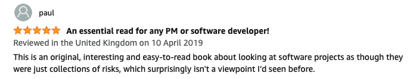
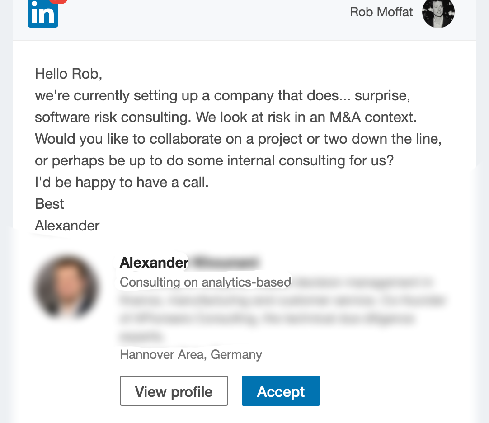

# Encouragement 

Working on Risk-First has been really encouraging!  Although this is kind of an "undiscovered gem", lots of people really 
appreciate what I am trying to do here.  

I would rather let the work speak for itself, so I'll keep this brief.  Here are some highlights.

## On Amazon

To begin with, Risk-First started out as a project to self-publish a book, so I was really pleased when I started to get good reviews on Amazon.   

I'm always surprised when people order the book, because I'm very up-front about the fact that all the content is available free on this site!

## GitHub

Somehow, people find this project on GitHub, and they star it, and then join the Risk-First team!  The Risk-First team is a place on GitHub for announcing and discussing the articles.  

This image is from January 2022.  New people find the project all the time. 

## Google!

For several results, Risk-First is now the authority (i.e. first result) on that topic.  This leads to some interesting email, as you can see!

## On LinkedIn

Although not my day-job, Risk-First does seem to generate leads and work opportunities...  Or at the very least dinner invites!  

> " Hi Rob ... My colleagues and I are interested in learning more about your work on Risk-first software development, and we wondered if you would be interested to speak about that at our conference if you are available at the time? "

> "... I found the book by way of Hacker News, and was amazed to see there's a whole book about the ideas I've been playing with recently! You've probably saved me a couple years worth of learning the hard way, so thanks!  ... Anyway, I noticed you're in the UK and I'm flying over to spend some time in our London office next week, so if you have the time and inclination I'd love to buy you lunch, coffee or beers and hear your thoughts on "real world" software development."

OK, enough for now, I need to go code! 
