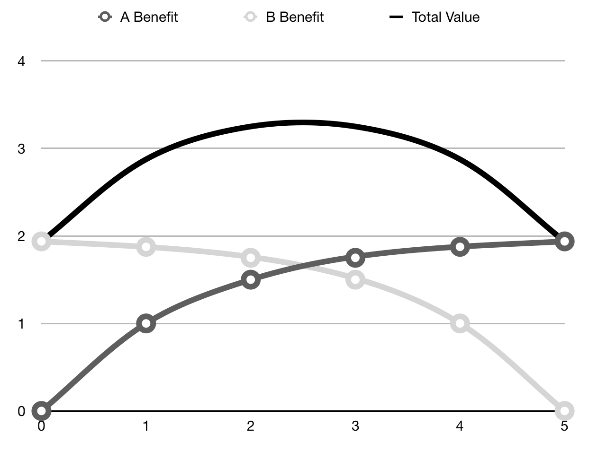
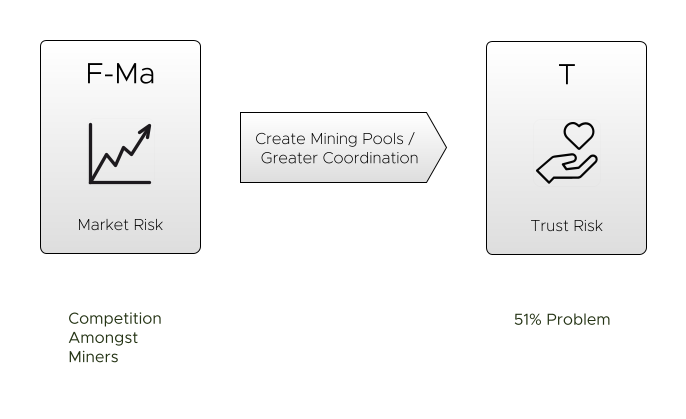

# Web3

For web3 to be successful (or avoid just being Web 2.0 all over again) it needs to solve one huge, currently unsolved problem.

That is the problem of _aggregator-wins_.  

Let's look at some key examples:

- **Amazon aggregating online shopping.**  Amazon are the most popular online retailer.  They aggregate other retailers and bring customers together.
- **Linux Distros aggregating open-source software.**  Although the distributions are open-source, and consist almost entirely of open-source software, it's the distros that make the money (through support / licensing agreements etc), whereas the guy who maintains `grep` is probably doing it for the love of it.
- **Social networks aggregate audience.**  This is a well-understood problem:  the biggest social networks are the most profitable.   
- **Google + Facebook aggregate online advertising.** They have built out a common aggregation platform so they don't need to [compete with each other](https://archive.md/wI14a).
- **AWS "owning" ElasticSearch (et al.)**  Although ElasticSearch is a viable product, they're seeing their profits bleed away as Amazon are able to offer ElasticSearch as a SaaS option within AWS.  The aggregator wins again.

Arguably, this is exactly the problem Web3 is trying to solve.  So, why doesn't it solve it?  

To understand this, we need to understand why it happens in the first place.   There are two forces at play:   **The Virtuous Circle of Evolution** and **Coordination Trumping Competition**.

## The Virtuous Circle of Evolution

Study the following model.  This is how the big get bigger.

Successful platforms beget success.   This is why we see a power-law distribution of wealth in the world, and also why platforms like Wordpress are orders of magnitude more successful than its rivals like Drupal.  As we discussed in Boundary Risk:

> "Did WordPress gain this march because it was always _better_ than Drupal?  That's arguable.  Certainly, they're not different enough that WordPress is 16x better.  That it's this way round could be _entirely accidental_, and a result of the Network Effect." - [Boundary Risk, _Risk First_](../risks/Boundary-Risk.md)

## Coordination Trumps Competition

Secondly, _Coordination beats Competition_.  Why is this?   Because of the law of diminishing returns:  sharing out a bag of candy means a higher total utility than one person scoffing the lot and feeling ill.  The first candy is really nice, the second is OK but eventually you're worse off from eating them.

We can see this in the chart above.  Let's say A and B compete over a resource, of which there are 5 units available.  For every extra A takes, B loses one.  The X axis shows A's consumption of the resource. While the biggest benefit to A is in taking _all_ of the resources, the greatest _increase_ in benefit comes from the consumption of the first unit. 

As you can see, by _sharing_, it's possible that the _total benefit_ is greater than it can be for either individual.  But sharing requires coordination.  Further, the more competitors involved, the _worse_ a winner-take-all outcome is for total benefit. 

But, you might say, "this is exactly what decentralised block-chains and so on are designed to prevent!"  But currently, Cryptocurrency doesn't solve _aggregator-wins_.  Here's why:

**Anyone can mine crypto.** However, the problem is, as a crypto-miner, you compete with everyone else.  This is a problem, because it means that multiple parties are racing with you to mine the same blocks.    This is _pure competition_.  

**However, competition is not efficient.**   Efficiency relies on _Coordination_.  By coordinating the use of scarce resources, you can achieve much better average outcomes than by competing over them, which ends up with a winner-takes-all outcome.  

So it goes with crypto:  this is why we have mining pools, where everyone coordinates rather than competes.  The problem is that coordination is (or should be) capped at 50%, because if a mining consortium owns a majority of the compute power, they can literally say anything happened on the network.  

## Where We Go Next

The Internet has enabled people and organisations to coordinate like never before, so it's not surprising that we would see today's mega-corporations of people coordinating together and avoiding the costs of competition.  Also, we can't expect to replace these highly coordinated entities with less-efficient competition: that virtuous circle is bringing innovation (even if it is in walled gardens).

Perhaps we need to look more closely at why we think decentralisation / competition is a desirable characteristic, or whether there are better models we can aspire to.  (more to come on this).

