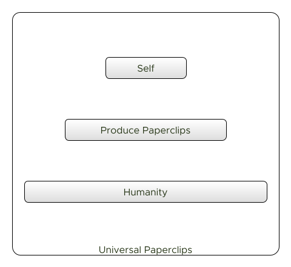
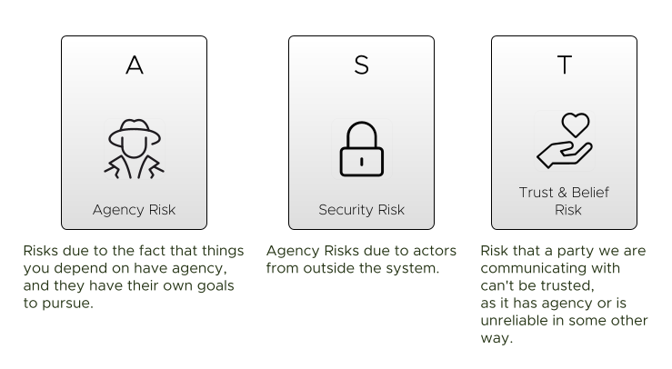
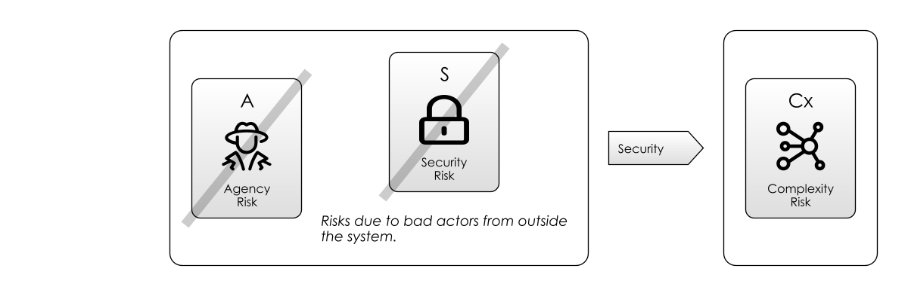

# Agency Risk

Coordinating a team is difficult enough when everyone on the team has a single [Goal](../thinking/Glossary.md#Goal-In-Mind).  But people have their own goals too.  Sometimes their goals harmlessly co-exist with the team's goal, other times they don't. 

This is [Agency Risk](Agency-Risk.md). 

In this section, we are going to take a closer look at how [Agency Risk](Agency-Risk.md) arises, in particular we will:

  - apply the concept of [Agency Risk](Agency-Risk.md) in software development
  - define a model for understanding [Agency Risk](Agency-Risk.md)
  - look at some common issues in software development, and analyse how they have their roots in [Agency Risk](Agency-Risk.md)
  - look at how [Agency Risk](Agency-Risk.md) applies to not just to people, but _whole teams_ and _software agents_
  - look at the various ways to mitigate [Agency Risk](Agency-Risk.md), irrespective of what type of agent we are looking at.  (We'll specifically consider _software agents_, _humans_ and _cells in the body_.)
  
## Agency In Software Development

To introduce [Agency Risk](Agency-Risk.md), let's first look at the **Principal-Agent Dilemma**.  This term comes from finance and refers to the situation where you (the "principal") entrust your money to someone (the "agent") in order to invest it, but they don't necessarily have your best interests at heart.  They may instead elect to invest the money in ways that help them, or outright steal it.  

> "This dilemma exists in circumstances where agents are motivated to act in their own best interests, which are contrary to those of their principals, and is an example of moral hazard." - [Principal-Agent Problem, _Wikipedia_](https://en.wikipedia.org/wiki/Principal–agent_problem)

The less visibility you have of the agent's activities, the bigger the risk.  However, the _whole point_ of giving the money to the agent was that you would have to spend less time and effort managing it, hence the dilemma.  

In software development, we're not lending each other money, but we _are_ being paid by the project sponsor, so they are assuming [Agency Risk](Agency-Risk.md) by employing us.  

[Agency Risk](Agency-Risk.md) doesn't just apply to people: it can apply to _running software_ or _whole teams_  - anything which has agency over its actions.  

> "Agency is the capacity of an actor to act in a given environment... Agency may either be classified as unconscious, involuntary behaviour, or purposeful, goal directed activity (intentional action). " - [Agency, _Wikipedia_](https://en.wikipedia.org/wiki/Agency_(philosophy)) 
  
## A Model For Agency Risk  
  

Although the definition of [Agency Risk](Agency-Risk.md) above pertains to looking after other people's money, this is just a single example of a wider issue which is best understood by appreciating that humans have a _hierarchy of concern_ with respect to their goals, as shown in the diagram above.  This hierarchy has arisen from millennia of evolution and helps us prioritise competing goals, generally in favour of _preserving our genes_.  

The model above helps us explain the principal-agent problem:  when faced with the dilemma of self-interest (perhaps protecting their family) vs. their employer, they will choose their family.  But it goes further - this model explains a lot of human behaviour.  It explains why some people:

 - will help their friends and colleagues every day, but perhaps fail to give to charities helping people in far worse conditions.
 - love their pets (who they consider in the _immediate family_ group) but eat other animals (somewhere off the bottom).
 - why people can be fiercely _nationalistic_ and tribal (supporting the goals of the third level) and also be against _immigration_ (helping people in the fourth level).

[Agency Risk](Agency-Risk.md) clearly includes the behaviour of [Bad Actors](https://en.wiktionary.org/wiki/bad_actor) but is not limited to them:  there are various "shades of grey" involved.  We can often understand and sympathise with the decisions agents make based on an understanding of this hierarchy.   

**NB:** Don't get hung up on the fact the diagram only has four levels.  You might want to add other levels in their depending on your personal circumstances.  The take-away is that there is a hierarchy at all, and that at the top, the people/things we care about _most_ are few in number.

## Agency Risk In Software Development

We shouldn't expect people on a project to sacrifice their personal lives for the success of the project, right?  Except that ["Crunch Time"](https://en.wikipedia.org/wiki/Video_game_developer#"Crunch_time") is exactly how some software companies work:

> "Game development... requires long working hours and dedication...  Some video game developers (such as Electronic Arts) have been accused of the excessive invocation of 'crunch time'.  'Crunch time' is the point at which the team is thought to be failing to achieve milestones needed to launch a game on schedule. " - [Crunch Time, _Wikipedia_](https://en.wikipedia.org/wiki/Video_game_developer#"Crunch_time")

People taking time off, going to funerals, looking after sick relatives and so on are all acceptable forms of [Agency Risk](Agency-Risk.md). They are the a risk of having _staff_ rather than _slaves_.

Where an agent _excessively_ prioritises their own goals over the group we term this selfishness or perhaps nepotism.  Conversely, putting the tribe's or the team's needs over your own is _heroism_.

### The Hero

> "The one who stays later than the others is a hero. " - [Hero Culture, _Ward's Wiki_](https://wiki.c2.com/?HeroCulture)

Heroes put in more hours and try to rescue projects single-handedly, often cutting corners like team communication and process in order to get there.   

Sometimes projects don't get done without heroes.  But other times, the hero has an alternative agenda to just getting the project done:

- A need for control and for their own vision.
- A preference to work alone.
- A desire for recognition and acclaim from colleagues.
- For the job security of being a [Key Person](https://en.wikipedia.org/wiki/Key_person_insurance).

A team _can_ make use of heroism but it's a double-edged sword.  The hero can become [a bottleneck](Coordination-Risk.md) to work getting done and because they want to solve all the problems themselves, they [under-communicate](Communication-Risk.md).  

### CV Building

CV Building is when someone decides that the project needs a dose of "Some Technology X", but in actual fact, this is either completely unhelpful to the project (incurring large amounts of [Complexity Risk](Complexity-Risk.md)), or merely a poor alternative to something else.  

It's very easy to spot CV building:  look for choices of technology that are incongruently complex compared to the problem they solve and then challenge by suggesting a simpler alternative.

### Devil Makes Work

Heroes can be useful, but _underused_ project members are a nightmare.   The problem is, people who are not fully occupied begin to worry that actually the team would be better off without them, and then wonder if their jobs are at risk.

Even if they don't worry about their jobs, sometimes they need ways to stave off _boredom_.  The solution to this is "busy-work":  finding tasks that, at first sight, look useful, and then delivering them in an over-elaborate way that'll keep them occupied.  This is also known as [_Gold Plating_](https://en.wikipedia.org/wiki/Gold_plating_(software_engineering)).  This will leave you with more [Complexity Risk](Complexity-Risk.md) than you had in the first place. 

### Pet Projects

> "A project, activity or goal pursued as a personal favourite, rather than because it is generally accepted as necessary or important."  - [Pet Project, _Wiktionary_](https://www.wordnik.com/words/pet%20project)

Sometimes budget-holders have projects they value more than others without reference to the value placed on them by the business.  Perhaps the project has a goal that aligns closely with the budget holder's passions, or it's related to work they were previously responsible for.  

Working on a pet project usually means you get lots of attention (and more than enough budget), but it can fall apart very quickly under scrutiny.

### Morale Failure

> "Morale, also known as Esprit de Corps, is the capacity of a group's members to retain belief in an institution or goal, particularly in the face of opposition or hardship" - [Morale, _Wikipedia_](https://en.wikipedia.org/wiki/Morale) 

Sometimes the morale of the team or individuals within it dips, leading to lack of motivation.  Losing morale is a kind of [Agency Risk](Agency-Risk.md) because it really means that a team member or the whole team isn't committed to the [Goal](../thinking/Glossary.md#Goal-In-Mind) and may decide their efforts are best spent elsewhere.  [Morale Risk](Agency-Risk.md#morale-risk) might be caused by:

 - **External Factors**:  perhaps the employee's dog has died, or they're simply tired of the industry, or are not feeling challenged.
 - **The goal feels unachievable**:  in this case people won't commit their full effort to it.  This might be due to a difference in the evaluation of the risks on the project between the team members and the leader.  In military science, a second meaning of morale is how well supplied and equipped a unit is.  This would also seem like a useful reference point for IT projects.  If teams are under-staffed or under-equipped, it will impact on motivation too.
 - **The goal isn't sufficiently worthy**, or the team doesn't feel sufficiently valued.

## Agency Elsewhere

In the examples above, we've looked at hierarchy of goals for _most people_.  It doesn't always play out like this and the structure is quite fluid.  Some examples:

 - In 2018, a 15-year-old [Greta Thunberg](https://en.wikipedia.org/wiki/Greta_Thunberg) gave up her education goals to campaign outside parliament in Sweden.  She is now widely recognised as a key figure in climate activism. 
 - Steve Jobs, despite designing amazing hardware at Apple Computers, was a self-confessed [terrible father](https://en.wikipedia.org/wiki/Steve_Jobs#Family) and [failed to look after himself when diagnosed with cancer](https://en.wikipedia.org/wiki/Steve_Jobs#Health_problems).
 - Less specifically, soldiers often form very close bonds due to their reliance on each other for survival, akin to family members (_brothers in arms_).  

### Animals

Given the fluidity of the goal hierarchy for people, we shouldn't be surprised that other animals don't have the same priorities.  For example, [Colobopsis Saundersi](https://en.wikipedia.org/wiki/Colobopsis_saundersi) is a species of ant that can explode suicidally and aggressively as an ultimate act of defence.  Given that individual ants are not capable of reproduction, it seems to make sense that they would sacrifice themselves for the good of the colony:  to _not_ do so would reduce the colony's chance of surviving and reproducing. 

### Software Processes

 

Compared to humans, most software has a simple goal hierarchy, as shown in the diagram above.  Nevertheless, there is significant [Agency Risk](Agency-Risk.md) in running software _at all_.  Since computer systems follow rules we set for them, we shouldn't be surprised when those rules have exceptions that lead to disaster.  For example:

 - A process continually writing log files until the disks fill up, crashing the system.
 - Bugs causing data to get corrupted, causing financial loss.
 - Malware exploiting weaknesses in a system, exposing sensitive data.
 
### Paperclips

Building software systems that try to optimise for a hierarchy of goals (like humans do) is still a research project.  But it is something AI researchers such as [Nick Bostrom](https://en.wikipedia.org/wiki/Nick_Bostrom) worry about.  Consider his AI thought experiment:

> "If you give an artificial intelligence an explicit goal – like maximizing the number of paper clips in the world – and that artificial intelligence has gotten smart enough to the point where it is capable of inventing its own super-technologies and building its own manufacturing plants, then, well, be careful what you wish for." -- [Nick Bostrom, _Wikipedia_](https://en.wikipedia.org/wiki/Universal_Paperclips#Themes)

Bostrom worries that humanity would be steamrollered accidentally whilst trying to maximise the paperclip goal.  The AI need not be malevolent - it's enough that it just requres the resources that keep us alive!

This problem may be a long way off.  In any case it's not really in our interests to build AI systems that prioritise their own survival.  As humans, we have inherited the survival goal through evolution: an AI wouldn't necessarily have this goal unless we subjected AI development to some kind of evolutionary survival-of-the-fittest process too.

### Teams

[Agency Risk](Agency-Risk.md) applies to _whole teams_ too.  It's perfectly possible that a team within an organisation develops [Goals](../thinking/Glossary.md#Goal-In-Mind) that don't align with those of the overall organisation.  For example:

 - A team introduces excessive [Bureaucracy](Process-Risk.md#bureaucracy) in order to avoid work it doesn't like.
 - A team gets obsessed with a particular technology, or their own internal process improvement, at the expense of delivering business value.
 - A marginalised team forces their services on other teams in the name of "consistency".   (This can happen a lot with "Architecture", "Branding" and "Testing" teams, sometimes for the better, sometimes for the worse.)

When you work with an external consultancy, there is *always* more [Agency Risk](Agency-Risk.md) than with a direct employee.  This is because as well as your goals and the employee's goals, there is also the consultancy's goals.  

This is a good argument for avoiding consultancies, but sometimes the technical expertise they bring can outweigh this risk. 

## Mitigating Agency Risk

Let's look at three common ways to mitigate [Agency Risk](Agency-Risk.md):  [Monitoring](#monitoring), [Security](#security) and [Goal Alignment](#goal-alignment).  Let's start with Monitoring.

### Monitoring

A the core of the Principal-Agent Problem is the issue that we _want_ our agents to do work for us so we don't have the responsibility of doing it ourselves.  However, we pick up the second-order responsibility of managing the agents instead.  

As a result (and as shown in the above diagram), we need to _Monitor_ the agents.  The price of mitigating [Agency Risk](Agency-Risk.md) this way is that we have to spend time doing the monitoring ([Schedule Risk](Scarcity-Risk.md#schedule-risk)) and we have to understand what the agents are doing ([Complexity Risk](Complexity-Risk.md)).  

Monitoring of _software process_ agents is an important part of designing reliable systems and it makes perfect sense that this would also apply to _human_ agents too.  But for people, the _knowledge of being monitored_ can instil corrective behaviour.  This is known as the Hawthorne Effect:

> "The Hawthorne effect (also referred to as the observer effect) is a type of reactivity in which individuals modify an aspect of their behaviour in response to their awareness of being observed." - [Hawthorne Effect, _Wikipedia_](https://en.wikipedia.org/wiki/Hawthorne_effect)

### Security

Security is all about _setting limits_ on agency - both within and outside a system, so when we talk about "Security Risk" we are really talking about a failure to limit agency.

_Within_ a system we may wish to prevent our agents from causing accidental (or deliberate) harm but we also have [Agency Risk](Agency-Risk.md) from unwanted agents _outside_ the system.  So security is also about ensuring that the environment we work in is _safe_ for the good actors to operate in while keeping out the bad actors.

Interestingly, security is handled in very similar ways in all kinds of systems, whether biological, human or institutional: 

- **Walls**: defences _around_ the system, to protect its parts from the external environment.  
- **Doors**: ways to get _in_ and _out_ of the system, possibly with _locks_.
- **Guards**: to make sure only the right things go in and out.  (i.e. to try and keep out _bad actors_).
- **Police**: to defend from _within_ the system against internal [Agency Risk](Agency-Risk.md).
- **Subterfuge**: hiding, camouflage, disguises, pretending to be something else.

These work at various levels in **our own bodies**:  our _cells_ have _cell walls_ around them, and _cell membranes_ that act as the guards to allow things in and out.  Our _bodies_ have _skin_ to keep the world out, and we have _mouths_, _eyes_, _pores_ and so on to allow things in and out.  We have an _immune system_ to act as the police.

**Our societies** work in similar ways: in medieval times, a city would have walls, guards and gates to keep out intruders.  Nowadays, we have customs control, borders and passports.

We're waking up to the realisation that our software systems need to work the same way:  we have [Firewalls](https://en.wikipedia.org/wiki/Firewall_(computing)) and we lock down _ports_ on servers to ensure there are the minimum number of _doors_ to guard,  we _police_ the servers with monitoring tools, and we _guard_ access using passwords and other identification approaches. 

[Agency Risk](Agency-Risk.md) and [Security Risk](Agency-Risk.md#security) thrive on complexity:  the more complex the systems we create, the more opportunities there are for bad actors to insert themselves and extract their own value.  The dilemma is, _increasing security_ also means increasing [Complexity Risk](Complexity-Risk.md), because secure systems are necessarily more complex than insecure ones.

### Goal Alignment

As we stated at the beginning, [Agency Risk](Agency-Risk.md) at any level comes down to differences of [Goals](../thinking/Glossary.md#goal-in-mind) between the different agents, whether they are _people_, _teams_ or _software_. 

#### Skin In The Game 

If you can _align the goals_ of the agents involved, you can mitigate [Agency Risk](Agency-Risk.md).  Nassim Nicholas Taleb calls this "skin in the game": that is, the agent is exposed to the same risks as the principal.

> "Which brings us to the largest fragilizer of society, and greatest generator of crises, absence of 'skin in the game.' Some become antifragile at the expense of others by getting the upside (or gains) from volatility, variations, and disorder and exposing others to the downside risks of losses or harm." - [Nassim Nicholas Taleb, _Antifragile_](https://a.co/d/07LfBTI)

Mafia bosses understand this theory well:  in order to engender _complete loyalty_ in your soldiers, you threaten their families.  Follow the rules or your family gets whacked! 

Another example of this is [The Code of Hammurabi](https://en.wikipedia.org/wiki/Code_of_Hammurabi), a Babylonian legal text composed c. 1755–1750 BC.  One law states:

> "The death of a homeowner in a house collapse necessitates the death of the house's builder... if the homeowner's son died, the builder's son must die also." - [Code of Hammurabi, _Wikipedia_](https://en.wikipedia.org/wiki/Code_of_Hammurabi#Theories_of_purpose)

Luckily, these kinds of exposure aren't very common on software projects!  [Fixed Price Contracts](../thinking/One-Size-Fits-No-One.md#waterfall) and [Employee Stock Options](https://en.wikipedia.org/wiki/Employee_stock_option) are two exceptions.

#### Needs Theory

David McClelland's Needs Theory suggests that there are two types of skin-in-the-game: the _intrinsic_ interest in the work being done and _extrinsic_ factors such as the recognition, achievement, or personal growth derived from it.   

> "Need theory... proposed by psychologist David McClelland, is a motivational model that attempts to explain how the needs for achievement, power, and affiliation affect the actions of people from a managerial context... McClelland stated that we all have these three types of motivation regardless of age, sex, race, or culture. The type of motivation by which each individual is driven derives from their life experiences and the opinions of their culture. " - [Need Theory, _Wikipedia_](https://en.wikipedia.org/wiki/Need_theory)

So one mitigation for [Agency Risk](Agency-Risk.md) is therefore to employ these extrinsic factors.  For example, by making individuals responsible and rewarded for the success or failure of projects, we can align their personal motivations with those of the project.  

> "One key to success in a mission is establishing clear lines of blame." - [Henshaw's Law, _Akin's Laws Of Spacecraft Design_](https://spacecraft.ssl.umd.edu/akins_laws.html)

But _extrinsic motivation_ is a complex, difficult-to-apply tool.  In [Map And Territory Risk](Map-And-Territory-Risk.md) we will come back to this and look at the various ways in which it can go awry.

Tools like [Pair Programming](https://en.wikipedia.org/wiki/Pair_programming) and [Collective Code Ownership](https://en.wikipedia.org/wiki/Collective_ownership) are about mitigating [Staff Risks](Scarcity-Risk.md#staff-risk) like [Key Person Risk](https://en.wikipedia.org/wiki/Key_person_insurance#Key_person_definition) and [Learning Curve Risk](Communication-Risk.md#learning-curve-risk), but these push in the opposite direction to _individual responsibility_.   

This is an important consideration:  in adopting _those_ tools, you are necessarily setting aside certain _other_ tools to manage [Agency Risk](Agency-Risk.md) as a result.

## Wrapping Up

We've looked at various different shades of [Agency Risk](Agency-Risk.md) and three different mitigations for it. [Agency Risk](Agency-Risk.md) is a concern at the level of _individual agents_, whether they are processes, people, systems or teams.  

So having looked at agents _individually_, it's time to look more closely at [Goals](../thinking/Glossary.md#goal-in-mind), and the [Attendant Risks](../thinking/Glossary.md#attendant-risk) when aligning them amongst multiple agents. 

On to [Coordination Risk](Coordination-Risk.md)...

 