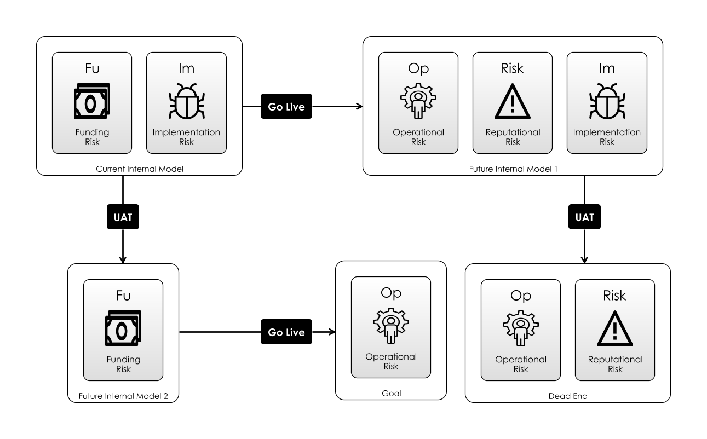

# Consider Payoff

How do you choose what to work on next?

Sometimes, there will be multiple _actions_ you could take on a project and you have to choose the best one: 

- There's the risk you'll decide wrongly.
- And, making a decision takes time, which could add risk to your schedule.
- And what's the risk if the decision doesn't get made?

We can't know in advance how well any action we take will work out.  Therefore, [Taking Action](../thinking/Glossary.md#taking-action) is a lot like placing a bet.  

[Payoff](../thinking/Glossary.md#payoff) then is our judgement about whether we expect an action to be worthwhile:  are the risks we escape _worth_ the attendant risks we will encounter?  We should be able to _weigh these separate risks in our hands_ and judge whether the [Payoff](../thinking/Glossary.md#payoff) makes a given [Action](../thinking/Glossary.md#taking-action) worthwhile.  

The fruits of this gambling are revealed when we [meet reality](../thinking/Glossary.md#meet-reality) and we can see whether our bets were worthwhile. 

## Considering Payoff: Examples

### Example 1: YAGNI 

As a flavour of what's to come, let's look at YAGNI, an acronym for "You Aren't Gonna Need It":

> YAGNI originally is an acronym that stands for "You Aren't Gonna Need It". It is a mantra from Extreme Programming that's often used generally in agile software teams. It's a statement that some capability we presume our software needs in the future should not be built now because "you aren't gonna need it".  - [YAGNI, _Martin Fowler_](https://www.martinfowler.com/bliki/Yagni.html)

The idea makes sense:  if you take on extra work that you don't need, _of course_ you'll be accreting risk - you're taking time away from sorting out the real problems!

But, there is always the opposite opinion:  [You _Are_ Gonna Need It](http://wiki.c2.com/?YouAreGonnaNeedIt).  As a simple example, we often add log statements in our code as we write it (so we can trace what happened when things go wrong), though following YAGNI strictly says we shouldn't.  

#### Which is right?

Now, we can say:  do the work _if there is a worthwhile [Payoff](../thinking/Glossary.md#payoff)_.  

 - Logging statements are _good_, because otherwise, you're increasing the risk that in production, no one will be able to understand _how the software went wrong_.
 - However, adding them takes time, which might introduce [Schedule Risk](../risks/Scarcity-Risk.md#schedule-risk).
 - Also, we have to manage larger log files on our production systems.
 
So, it's a trade-off: continue adding logging statements so long as you feel that overall, the activity [pays off](../thinking/Glossary.md#payoff) reducing overall risk.

### Example 2: Do The Simplest Thing That Could Possibly Work

Another mantra from Kent Beck (originator of the [Extreme Programming](https://en.wikipedia.org/wiki/Extreme_programming) methodology), is "Do The Simplest Thing That Could Possibly Work", which is closely related to YAGNI and is an excellent razor for avoiding over-engineering.  

At the same time, by adding "Could Possibly", Kent is encouraging us to go beyond straightforward iteration and use our brains to pick apart the simple solutions, avoiding them if we can logically determine when they would fail. 

Our risk-centric view of this strategy would be:

- Every action you take on a project has its own [Attendant Risks](../thinking/Glossary.md#attendant-risk).
- The bigger or more complex the action, the more [Attendant Risk](../thinking/Glossary.md#attendant-risk) it'll have.
- The reason you're taking action _at all_ is because you're trying to reduce risk elsewhere on the project.
- Therefore, the biggest [Payoff](../thinking/Glossary.md#payoff) is likely to be the one with the least [Attendant Risk](../thinking/Glossary.md#attendant-risk).
- So, usually this is going to be the simplest thing.

So, "Do The Simplest Thing That Could Possibly Work" is really a helpful guideline for Navigating the [Risk Landscape](../risks/Risk-Landscape.md), but this analysis shows clearly where it's left wanting:

 - _Don't_ do the simplest thing if there are other things with a better [Payoff](../thinking/Glossary.md#payoff) available.  
 
### Example 3: Continue Testing or Release?

You're on a project and you're faced with the decision - release now or do more testing?  

Obviously, in the ideal world, we want to get to the place on the [Risk Landscape](../thinking/Glossary.md#risk-landscape) where we have a tested, bug-free system in production.  But we're not there yet, and we have funding pressure to get the software into the hands of some paying customers.  The table below shows an example: 

|Risk Managed          |Action               |Attendant Risk                           |Payoff             | 
|----------------------|---------------------|-----------------------------------------|-------------------|
|Funding Risk          |Go Live              |Reputational Risk, Operational Risk      |MEDIUM             |
|Implementation Risk   |User Acceptance Test |Worse Funding Risk, Operational Risk     |LOW                |

This is (a simplification of) the dilemma of lots of software projects - _test further_, to reduce the risk of users discovering bugs ([Implementation Risk](../risks/Feature-Risk.md#implementation-risk)) which would cause us reputational damage, or _get the release done_ and reduce our [Funding Risk](../risks/Scarcity-Risk.md#funding-risk) by getting paying clients sooner. 

In the above table, it _appears_ to be better to do the "Go Live" action, as there is a greater [Payoff](../thinking/Glossary.md#payoff).  The problem is, actions are not _commutative_, i.e. the order you do them in counts.

The diagram above shows our decision as _moves on the [Risk Landscape](../thinking/Glossary.md#risk-landscape)_.  Whether you "Go Live" first, or "UAT" first makes a difference to where you will end up.  Is there a further action you can take to get you from the "Dead End" to the "Goal"?  Perhaps. 
 
## What To Do?

As a concept, payoff is made more tricky because often the actions you take might depend on each other, and the payoff might not be immediate.  

So, first things first, you need to make sure you're [Tracking Risk](Track-Risk.md) properly.
